# Run Case Workflow

These flow charts are grounded in the current implementations in:

- `src/utilities/run_tools.jl`
- `src/load_inputs/load_stages_data.jl`
- `src/model/case.jl`
- `src/config/case_settings.jl`
- `src/load_inputs/generate_system.jl`
- `src/model/solver.jl`
- `src/model/generate_model.jl`
- `src/model/myopic.jl`
- `src/model/benders/planning.jl`
- `src/model/problems/build.jl`

## Notes

- `run_case` wraps the main work in `try/catch/finally`, and also registers `atexit(case_cleanup)`.
- `_run_case_impl` does not have a `!` in the current code.
- `create_optimizer` is used for `Monolithic` and `Myopic`.
- `create_optimizer_benders` is used for `Benders`.
- output writing is skipped for `Myopic` in `_run_case_impl`, because Myopic writes during iteration.
- distributed workers are only started and removed for distributed Benders runs.
- `ProblemInstance` creation happens below `solve_case`, not during `load_case`.
- the public APIs still look `Case`/`System`-based, but model construction now largely routes through `StaticSystem` + `ProblemSpec` + `ProblemInstance`.

---
## `run_case`
---

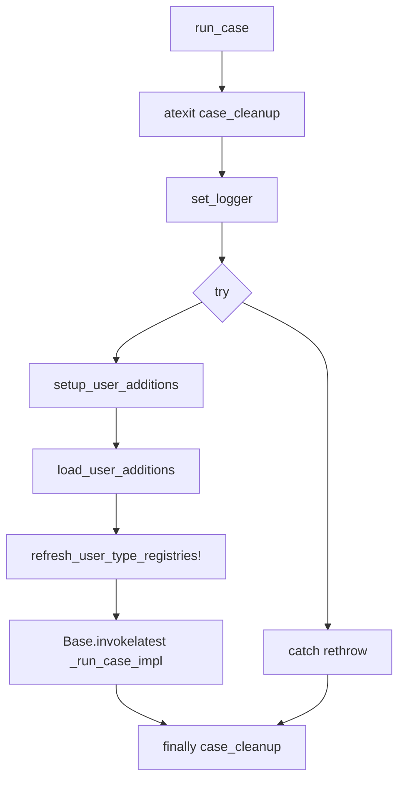

---

## `_run_case_impl`
---

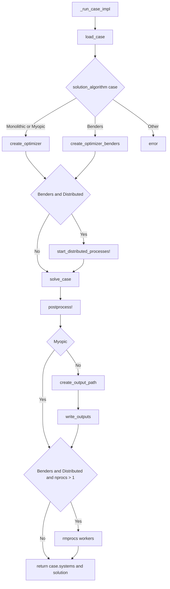

---

## `solve_case`
---

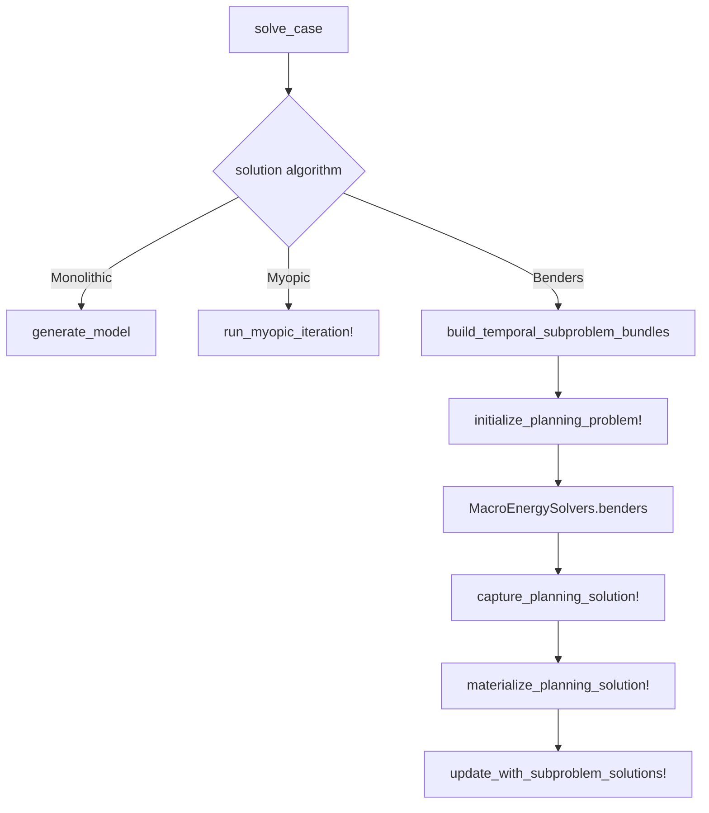

---

## `load_case`
---

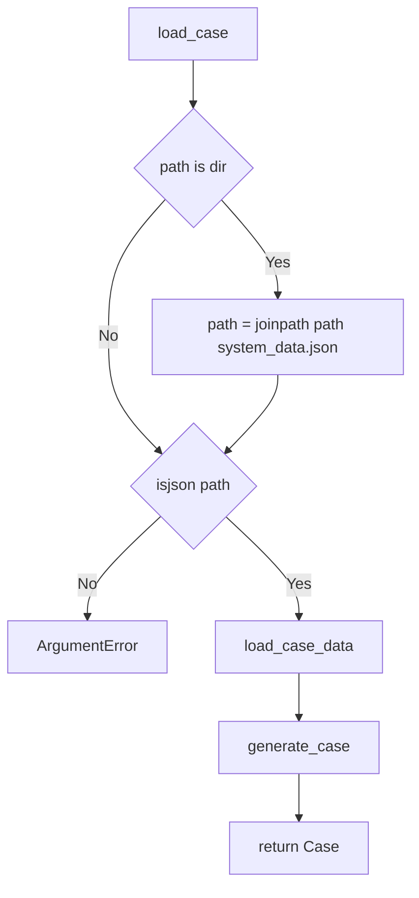

---

## `load_case_data`
---

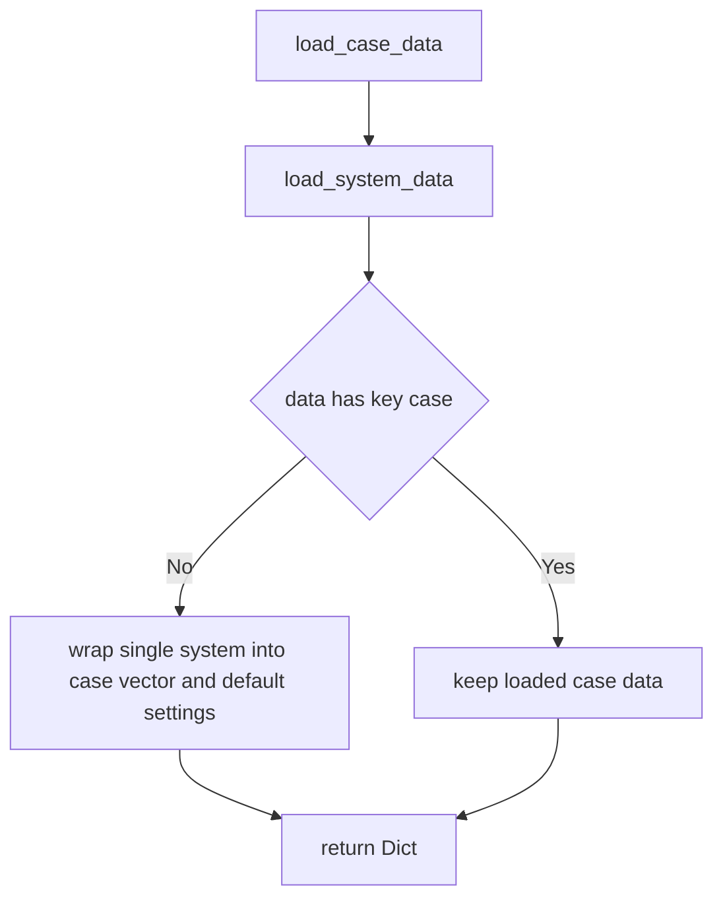

---

## `generate_case`
---

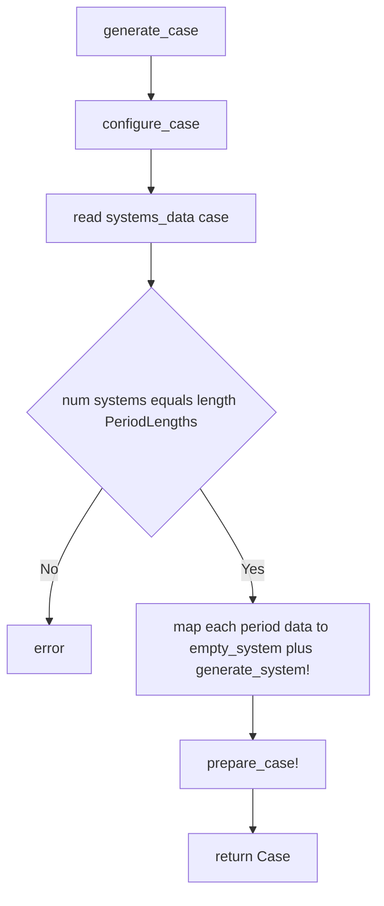

---

## `configure_case`
---

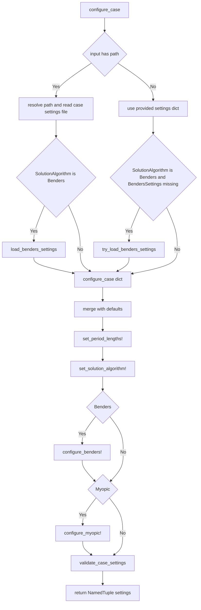

---

## `generate_system!`
---

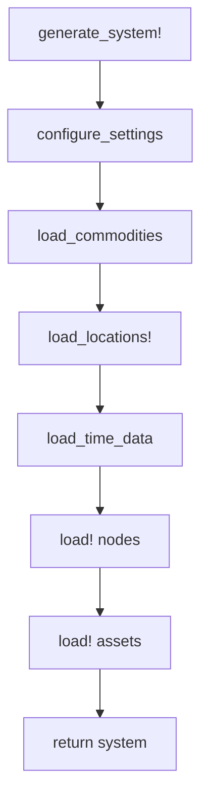

---

## `prepare_case!`
---

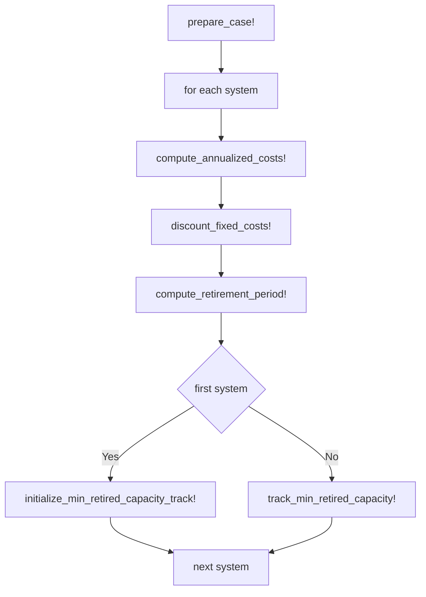

---
## ProblemInstances
---

This section traces where `ProblemInstance`s are actually created in the current refactor.

- `load_case` and `generate_case` still produce a `Case` containing legacy `System`s.
- `ProblemInstance` creation begins only when we start building optimization problems.
- the common pattern is:
  `System -> StaticSystem -> ProblemSpec -> ProblemInstance -> populate_*_problem!`

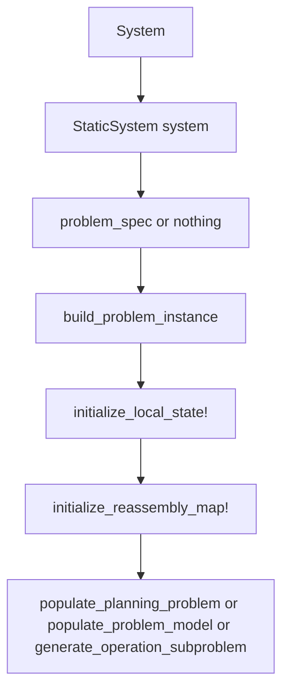

---

## ProblemInstances For Monolithic
---

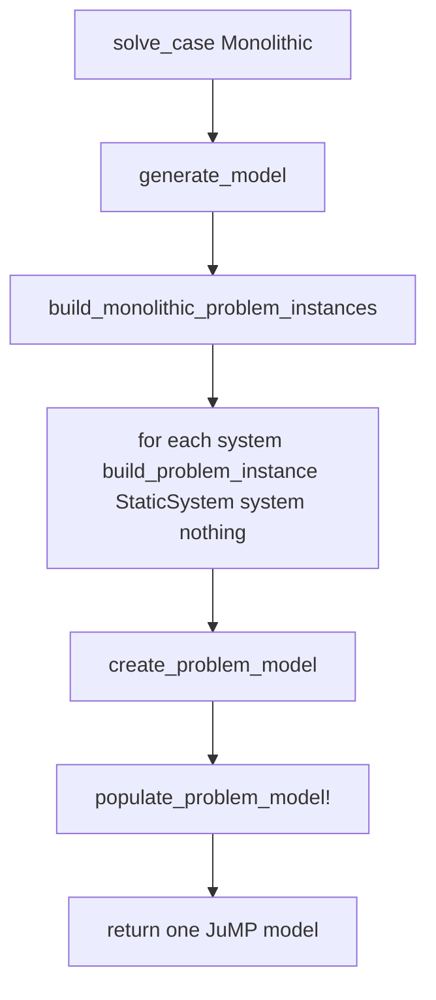

Monolithic uses the default/full problem spec internally:

- `spec = nothing`
- interpreted as all components, all times, no decomposition boundary

---

## ProblemInstances For Myopic
---

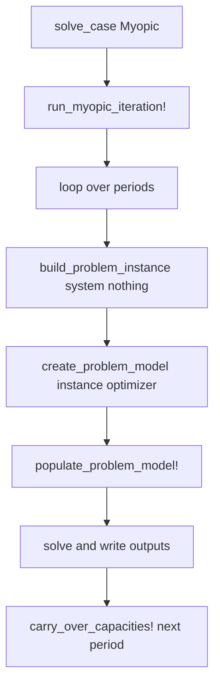

Myopic currently creates one fresh `ProblemInstance` per period iteration.

---

## ProblemInstances For Benders
---

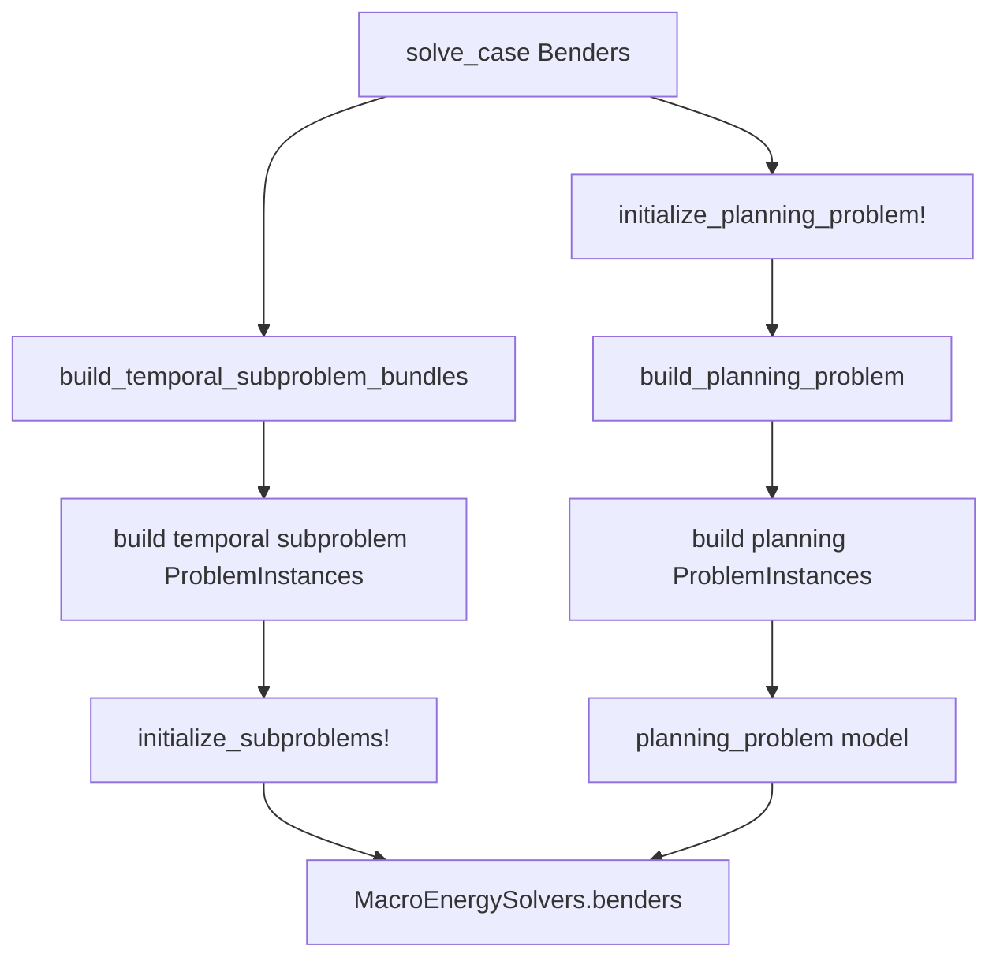

Benders currently creates two families of `ProblemInstance`s:

- planning-period instances:
  one per period, used to build the master/planning problem
- temporal subproblem instances:
  one per temporal subproblem, used to build persistent operational subproblems

After the Benders loop:

- planning solution values are captured onto planning `ProblemInstance`s
- final subproblem solves capture operational values onto subproblem `ProblemInstance`s
- output writing increasingly reads from those instances and their `StaticSystem` / local state

---

## `build_problem_instance`
---

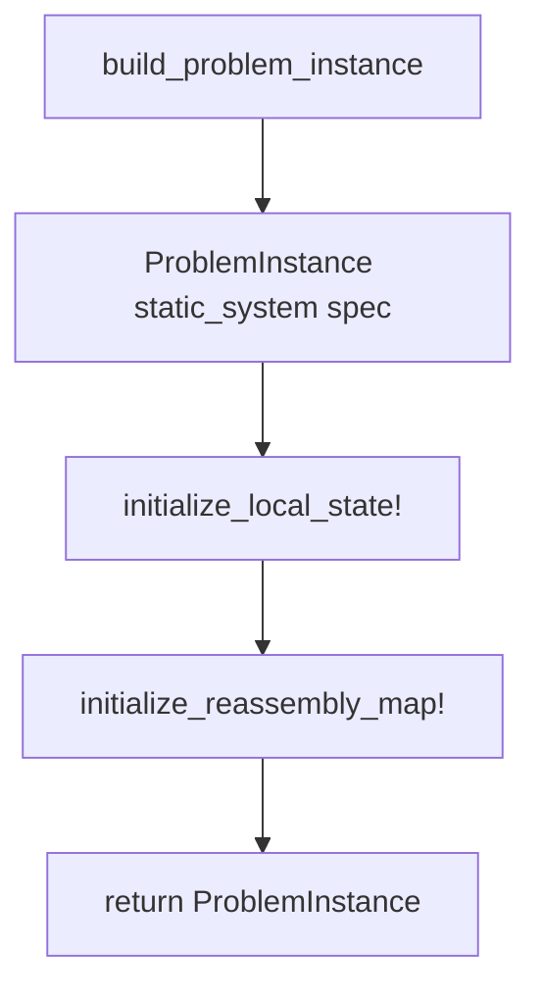

`build_problem_instance` does not populate a JuMP model by itself.

It creates the persistent container that owns:

- `static_system`
- `spec`
- `model`
- local state dictionaries like `node_state` and `edge_state`
- `update_map`
- `reassembly_map`

---

## `build_monolithic_problem_instances`
---

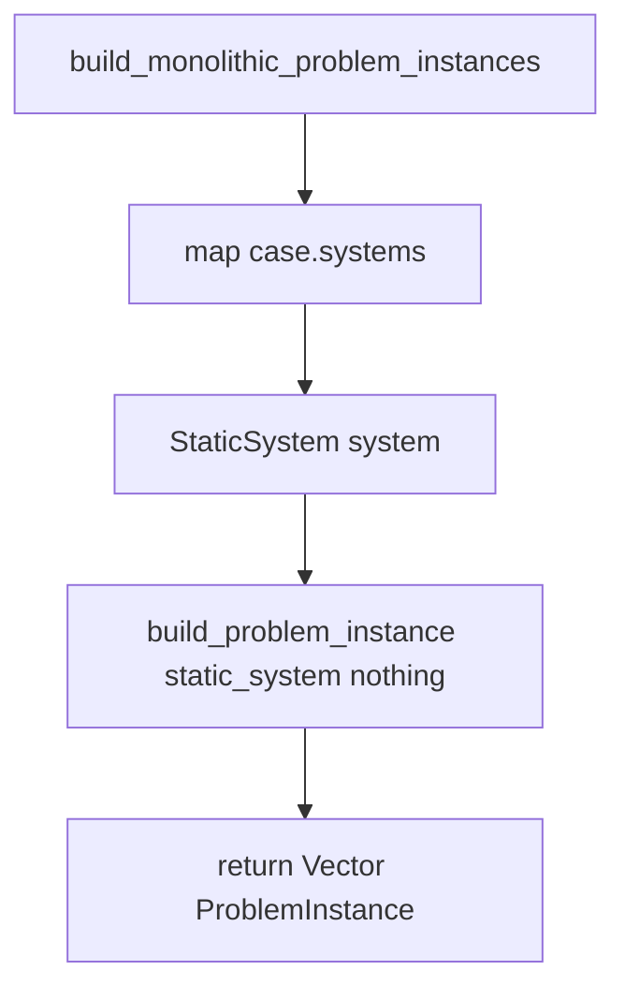

---

## `build_planning_problem`
---

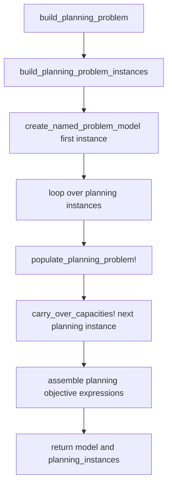

---

## `build_planning_problem_instances`
---

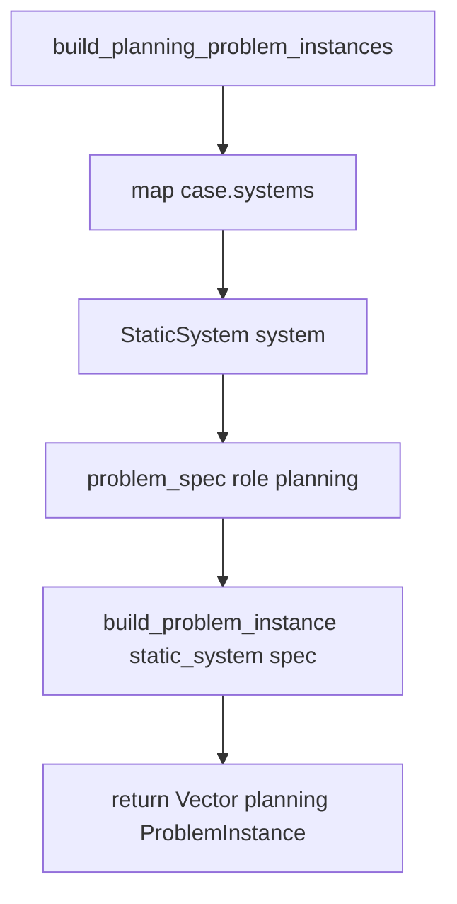

---

## `build_temporal_subproblem_bundles`
---

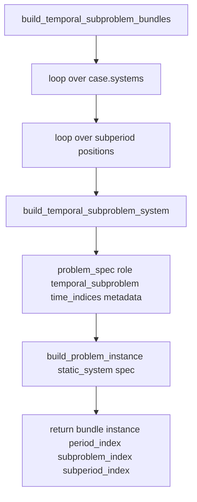

This is the current place where temporal Benders subproblem instances are created.

Each returned bundle holds:

- `instance`
- `period_index`
- `subproblem_index`
- `subperiod_index`

The active Benders flow then converts those bundles into persistent subproblem models.

---

## `load_system_data`
---

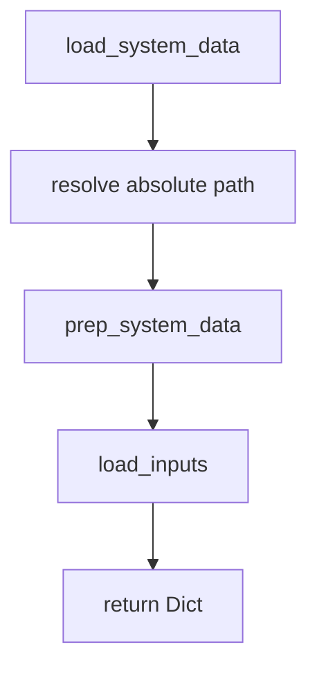
