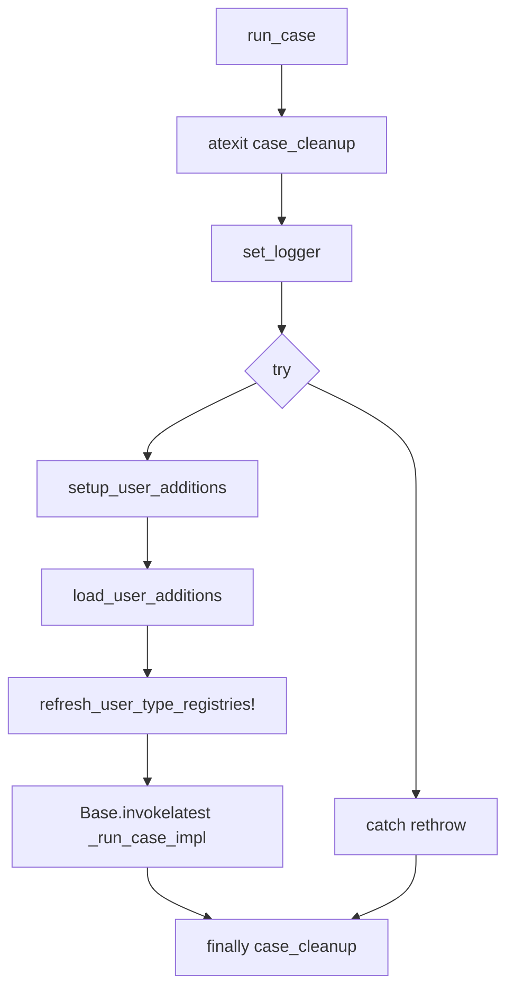
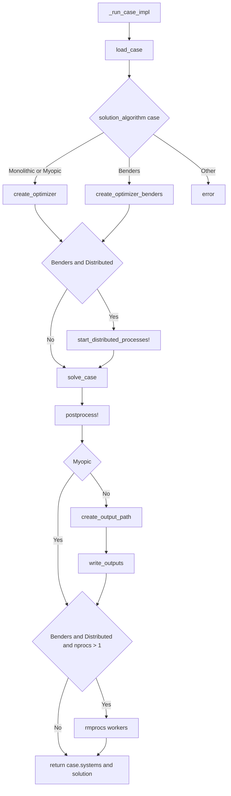
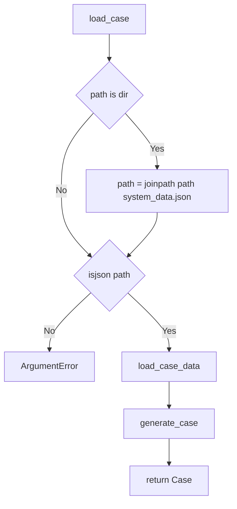
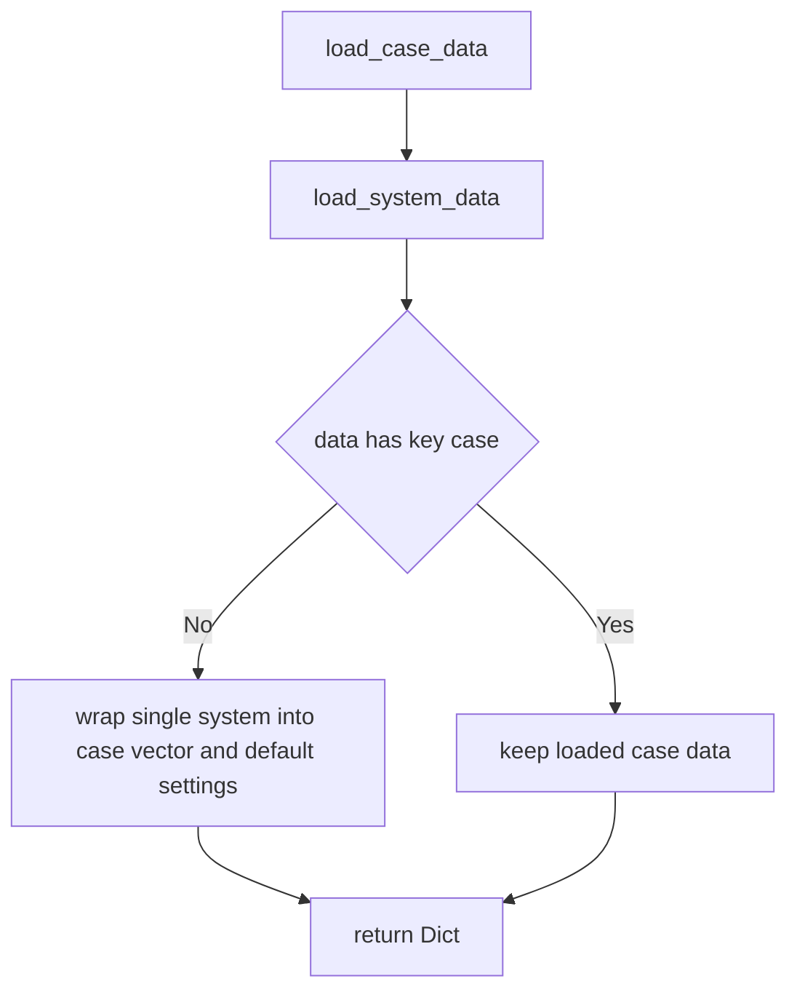
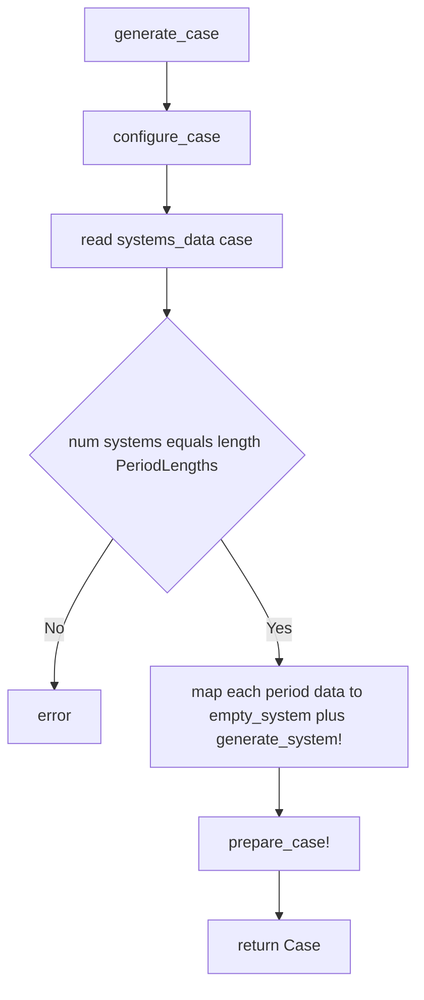
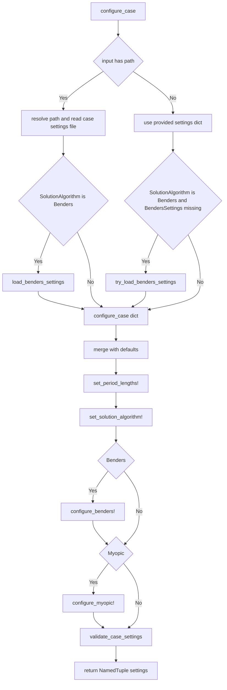
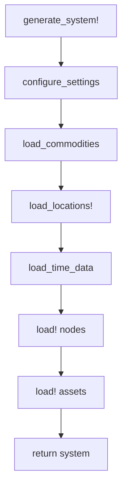
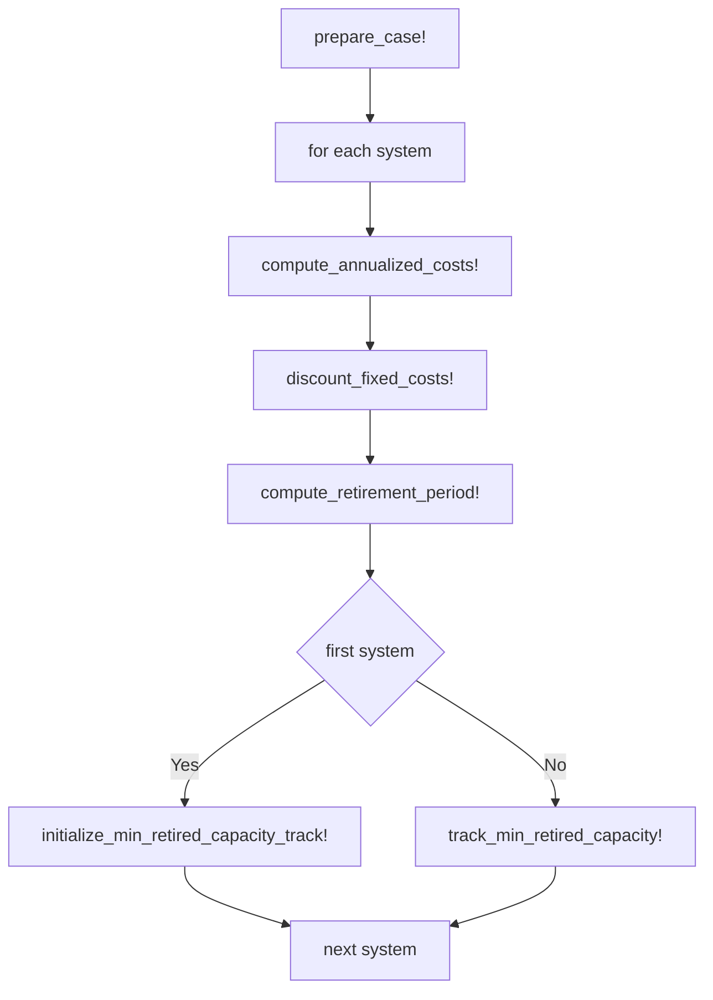
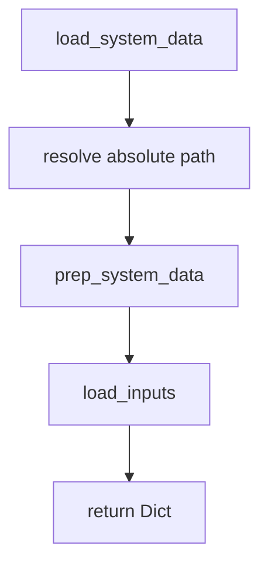

# Run Case Workflow

These flow charts are grounded in the current implementations in:

- `src/utilities/run_tools.jl`
- `src/load_inputs/load_stages_data.jl`
- `src/model/case.jl`
- `src/config/case_settings.jl`
- `src/load_inputs/generate_system.jl`

## Notes

- `run_case` wraps the main work in `try/catch/finally`, and also registers `atexit(case_cleanup)`.
- `_run_case_impl` does not have a `!` in the current code.
- `create_optimizer` is used for `Monolithic` and `Myopic`.
- `create_optimizer_benders` is used for `Benders`.
- output writing is skipped for `Myopic` in `_run_case_impl`, because Myopic writes during iteration.
- distributed workers are only started and removed for distributed Benders runs.

---
## `run_case`
---

---

## `_run_case_impl`
---

---

## `load_case`
---

---

## `load_case_data`
---

---

## `generate_case`
---

---

## `configure_case`
---

---

## `generate_system!`
---

---

## `prepare_case!`
---

---

## `load_system_data`
---

