# Assets

## Overview

Macro is designed to be a flexible and modular model that can adapt to various energy system representations. The model provides a rich library of pre-defined assets, enabling a "plug-and-play" approach for users building their own energy system.

Each asset is defined by a **combination of transformations, edges, and storage units** that represent the physical and operational characteristics of a technology. These assets can be combined to create a detailed representation of the energy system, capturing the interactions between technologies and sectors.

In the following sections, we will introduce each asset type and show the **attributes** that can be set for each of them as well as the **equations** that define the conversion processes. We will also provide a **graphical representation** of the asset in terms of transformations, edges, and storages to help the user understand the structure of the asset.

Each asset page follows a consistent structure with the following sections:

1. **Overview**: A brief description of what the asset represents and its role in energy systems
2. **Asset Structure**: A graphical representation showing the transformations, edges, and storages present in the asset
3. **Flow Equations** (where applicable): Mathematical relationships governing the asset's conversion processes
4. **Input File (Standard Format)**: How to create and configure the asset using JSON or CSV files
5. **Types - Asset Structure**: The Julia type definition and internal structure
6. **Constructors**: The Julia constructors for the asset
7. **Examples**: Practical examples showing different configurations and use cases
8. **Best Practices**: Guidelines for effective asset configuration and usage
9. **Input File (Advanced Format)**: Advanced configuration options and formats

## Macro Asset Library
The current library includes the following assets:

### [Battery](@ref)

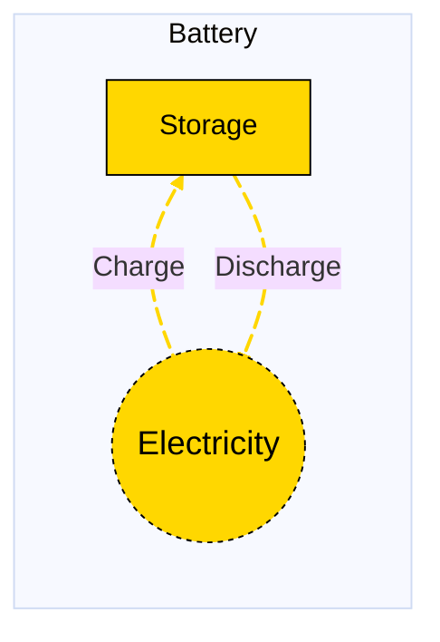
```mermaid
%%{init: {'theme': 'base', 'themeVariables': { 'background': '#D1EBDE' }}}%%
flowchart LR
  subgraph Battery
  direction BT
    A((Electricity)) e1@-->|Charge| B[Storage]
    B e2@-->|Discharge| A
    e1@{ animate: true }
    e2@{ animate: true }
 end
    style A font-size:19px,r:55px,fill:#FFD700,stroke:black,color:black,stroke-dasharray: 3,5;
    style B fill:#FFD700,stroke:black,color:black;
    linkStyle 0,1 stroke:#FFD700, stroke-width: 2px;
```

### [BECCS Electricity](@ref)

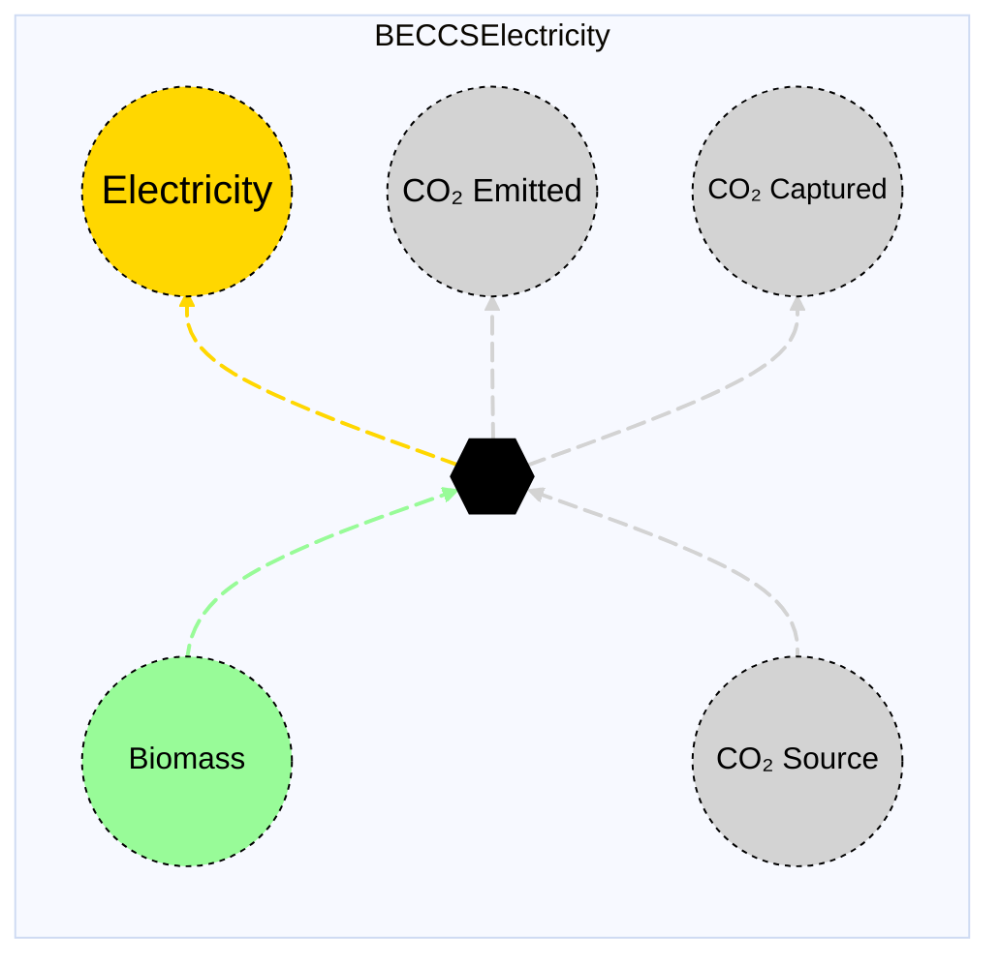
```mermaid
%%{init: {'theme': 'base', 'themeVariables': { 'background': '#D1EBDE' }}}%%
flowchart LR
  subgraph BECCSElectricity
  direction BT
    B((Biomass)) e1@--> A{{..}}
    C((CO₂ Source)) e2@--> A
    A e5@--> D((Electricity))
    A e3@--> E((CO₂ Emitted))
    A e4@--> F((CO₂ Captured))
    e1@{ animate: true }
    e2@{ animate: true }
    e3@{ animate: true }
    e4@{ animate: true }
    e5@{ animate: true }
 end
    style A fill:black,stroke:black,color:black;
    style B r:55px,fill:palegreen,stroke:black,color:black, stroke-dasharray: 3,5;
    style C r:55px,fill:lightgray,stroke:black,color:black, stroke-dasharray: 3,5;
    style D font-size:21px,r:55px,fill:#FFD700,stroke:black,color:black, stroke-dasharray: 3,5;
    style E font-size:17px,r:55px,fill:lightgray,stroke:black,color:black, stroke-dasharray: 3,5;
    style F font-size:15px,r:55px,fill:lightgray,stroke:black,color:black, stroke-dasharray: 3,5;

    linkStyle 0 stroke:palegreen, stroke-width: 2px;
    linkStyle 1,3,4 stroke:lightgray, stroke-width: 2px;
    linkStyle 2 stroke:#FFD700, stroke-width: 2px;
```

### [BECCS Hydrogen](@ref)

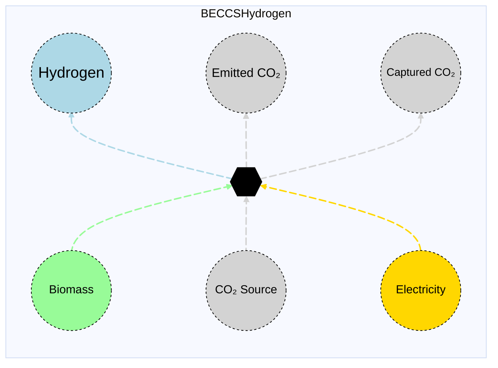
```mermaid
%%{init: {'theme': 'base', 'themeVariables': { 'background': '#D1EBDE' }}}%%
flowchart LR
  subgraph BECCSHydrogen
  direction BT
    B((Biomass)) e1@--> A{{..}}
    C((CO₂ Source)) e2@--> A
    D((Electricity)) e3@--> A
    A e4@--> E((Hydrogen))
    A e5@--> F((Emitted CO₂))
    A e6@--> G((Captured CO₂))
    e1@{ animate: true }
    e2@{ animate: true }
    e3@{ animate: true }
    e4@{ animate: true }
    e5@{ animate: true }
    e6@{ animate: true }
 end
    style A fill:black,stroke:black,color:black;
    style B r:55px,fill:palegreen,stroke:black,color:black, stroke-dasharray: 3,5;
    style C r:55px,fill:lightgray,stroke:black,color:black, stroke-dasharray: 3,5;
    style D r:55px,fill:#FFD700,stroke:black,color:black, stroke-dasharray: 3,5;
    style E font-size:21px,r:55px,fill:lightblue,stroke:black,color:black, stroke-dasharray: 3,5;
    style F font-size:17px,r:55px,fill:lightgray,stroke:black,color:black, stroke-dasharray: 3,5;
    style G font-size:15px,r:55px,fill:lightgray,stroke:black,color:black, stroke-dasharray: 3,5;

    linkStyle 0 stroke:palegreen, stroke-width: 2px;
    linkStyle 1 stroke:lightgray, stroke-width: 2px;
    linkStyle 2 stroke:#FFD700, stroke-width: 2px;
    linkStyle 3 stroke:lightblue, stroke-width: 2px;
    linkStyle 4 stroke:lightgray, stroke-width: 2px;
    linkStyle 5 stroke:lightgray, stroke-width: 2px;
```

### [Electric DAC](@ref)

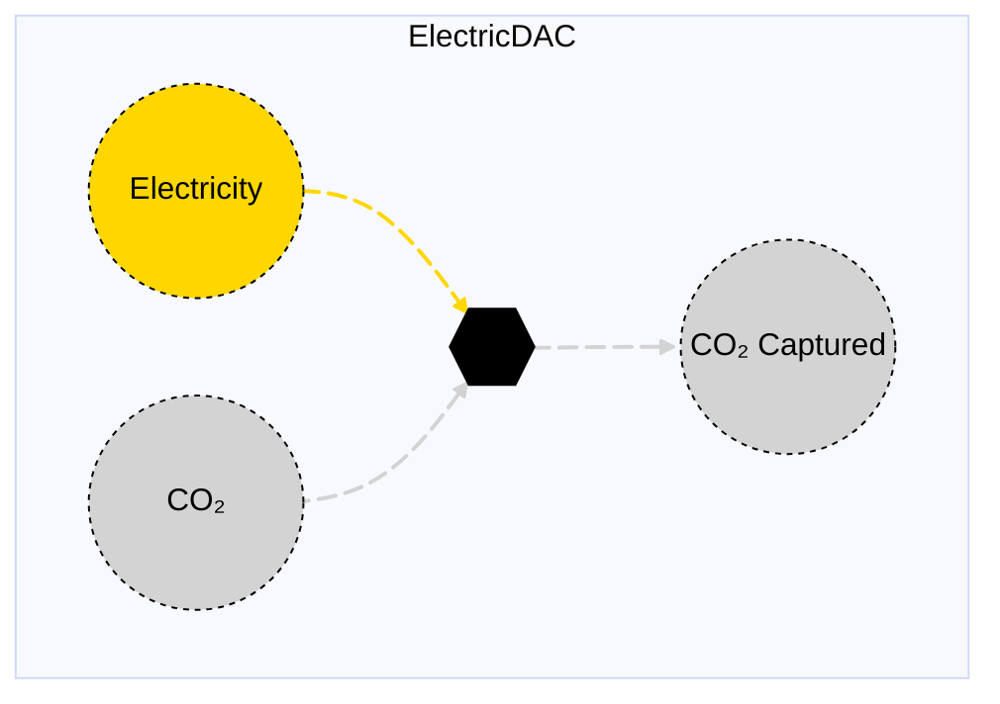
```mermaid
%%{init: {'theme': 'base', 'themeVariables': { 'background': '#D1EBDE' }}}%%
flowchart LR
  subgraph ElectricDAC
    direction LR
    A((Electricity)) e1@--> C{{..}}
    B((CO₂)) e2@--> C
    C e3@--> D((CO₂ Captured))
    e1@{ animate: true }
    e2@{ animate: true }
    e3@{ animate: true }
  end
  
  style A r:55px,fill:#FFD700,stroke:black,color:black, stroke-dasharray: 3,5;
  style B r:55px,fill:lightgray,stroke:black,color:black, stroke-dasharray: 3,5;
  style C fill:black,stroke:black,color:black;
  style D r:55px,fill:lightgray,stroke:black,color:black, stroke-dasharray: 3,5;

  linkStyle 0 stroke:#FFD700, stroke-width: 2px, stroke-dasharray: 5 5;
  linkStyle 1 stroke:lightgray, stroke-width: 2px;
  linkStyle 2 stroke:lightgray, stroke-width: 2px;
```

### [Electrolyzer](@ref)

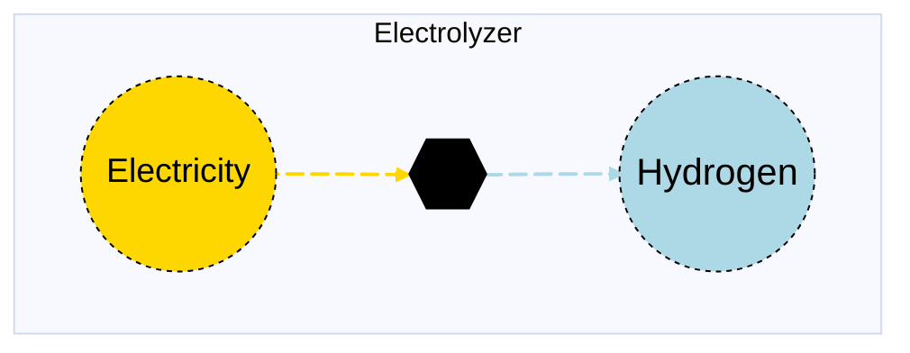
```mermaid
%%{init: {'theme': 'base', 'themeVariables': { 'background': '#D1EBDE' }}}%%
flowchart LR
  subgraph Electrolyzer
  direction LR
  A((Electricity)) e1@--> B{{..}}
  B e2@--> C((Hydrogen))
  e1@{ animate: true }
  e2@{ animate: true }
 end
    style A font-size:19px,r:55px,fill:#FFD700,stroke:black,color:black,stroke-dasharray: 3,5;
    style B fill:black,stroke:black,color:black;
    style C font-size:21px,r:55px,fill:lightblue,stroke:black,color:black,stroke-dasharray: 3,5;

    linkStyle 0 stroke:#FFD700, stroke-width: 2px, stroke-dasharray: 5 5;
    linkStyle 1 stroke:lightblue, stroke-width: 2px, stroke-dasharray: 5 5;
```

### [Fuel Cell](@ref)

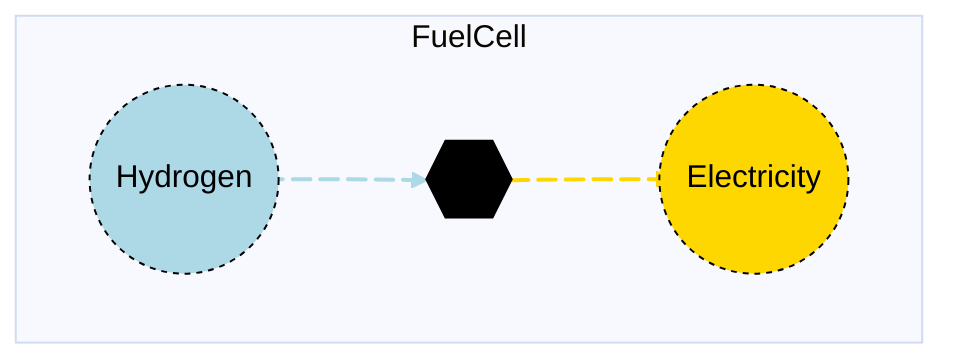
```mermaid
%%{init: {'theme': 'base', 'themeVariables': { 'background': '#D1EBDE' }}}%%
flowchart LR
  subgraph FuelCell
  direction LR
  A((Hydrogen)) e1@--> B{{..}}
  B e2@--> C((Electricity))
  e1@{ animate: true }
  e2@{ animate: true }
 end
    style A r:48px,fill:lightblue,stroke:black,color:black,stroke-dasharray: 3,5;
    style B fill:black,stroke:black,color:black;
    style C r:48px,fill:#FFD700,stroke:black,color:black,stroke-dasharray: 3,5;
    linkStyle 0 stroke:lightblue, stroke-width: 2px, stroke-dasharray: 5 5;
    linkStyle 1 stroke:#FFD700, stroke-width: 2px, stroke-dasharray: 5 5;
```

### [Gas Storage](@ref)

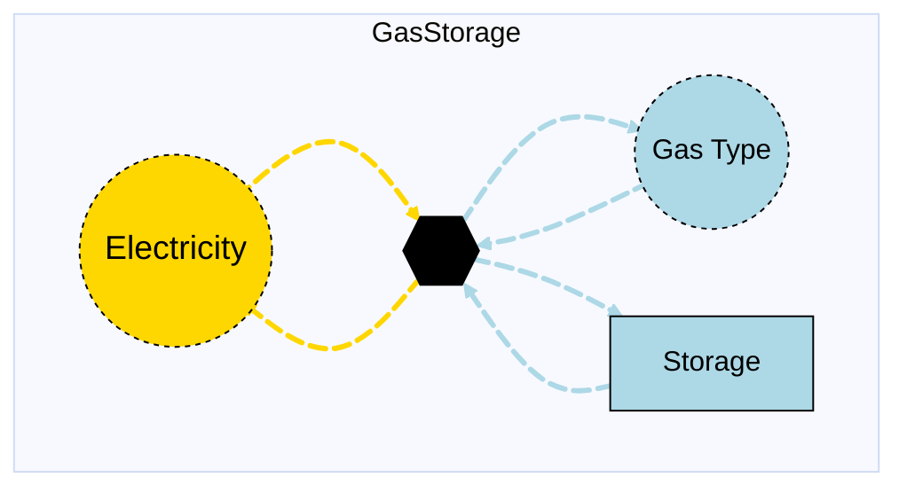
```mermaid
%%{init: {'theme': 'base', 'themeVariables': { 'background': '#D1EBDE' }}}%%
flowchart LR
  subgraph GasStorage
  direction LR
    A((Electricity)) e1@--> C{{..}} e2@--> A((Electricity))
    B((Gas Type)) e3@--> C{{..}} e4@--> B((Gas Type))
    C e5@--> D[Storage] e6@--> C
    e1@{ animate: true }
    e2@{ animate: true }
    e3@{ animate: true }
    e4@{ animate: true }
    e5@{ animate: true }
    e6@{ animate: true }
 end
    style A font-size:19px,r:55px,fill:#FFD700,stroke:black,color:black, stroke-dasharray: 3,5;
    style B r:44px,fill:lightblue,stroke:black,color:black, stroke-dasharray: 3,5;
    style C fill:black,stroke:black,color:black;
    style D fill:lightblue,stroke:black,color:black;

    linkStyle 0,1 stroke:#FFD700, stroke-width: 3px;
    linkStyle 2,3 stroke:lightblue, stroke-width: 3px;
    linkStyle 4,5 stroke:lightblue, stroke-width: 3px;
```

### [Hydro Reservoir](@ref)

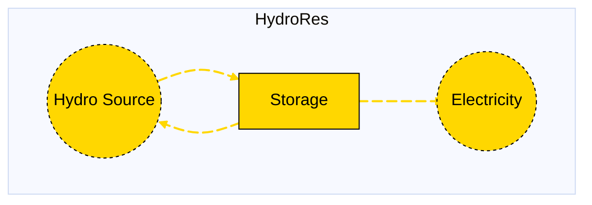
```mermaid
%%{init: {'theme': 'base', 'themeVariables': { 'background': '#D1EBDE' }}}%%
flowchart LR
  subgraph HydroRes
    direction LR
    A((Hydro Source)) e1@--> B[Storage] e2@--> C((Electricity))
    B e3@--> A
    e1@{ animate: true }
    e2@{ animate: true }
    e3@{ animate: true }
  end
  
  style A r:55px,fill:#FFD700,stroke:black,color:black,stroke-dasharray: 3,5;
  style B fill:#FFD700,stroke:black,color:black;
  style C r:48px,fill:#FFD700,stroke:black,color:black,stroke-dasharray: 3,5;

  linkStyle 0 stroke:#FFD700, stroke-width: 2px;
  linkStyle 1 stroke:#FFD700, stroke-width: 2px;
  linkStyle 2 stroke:#FFD700, stroke-width: 2px;
```

### [Integrated Blast Furnace Basic Oxygen Furnace (with and without CCS)](@ref)

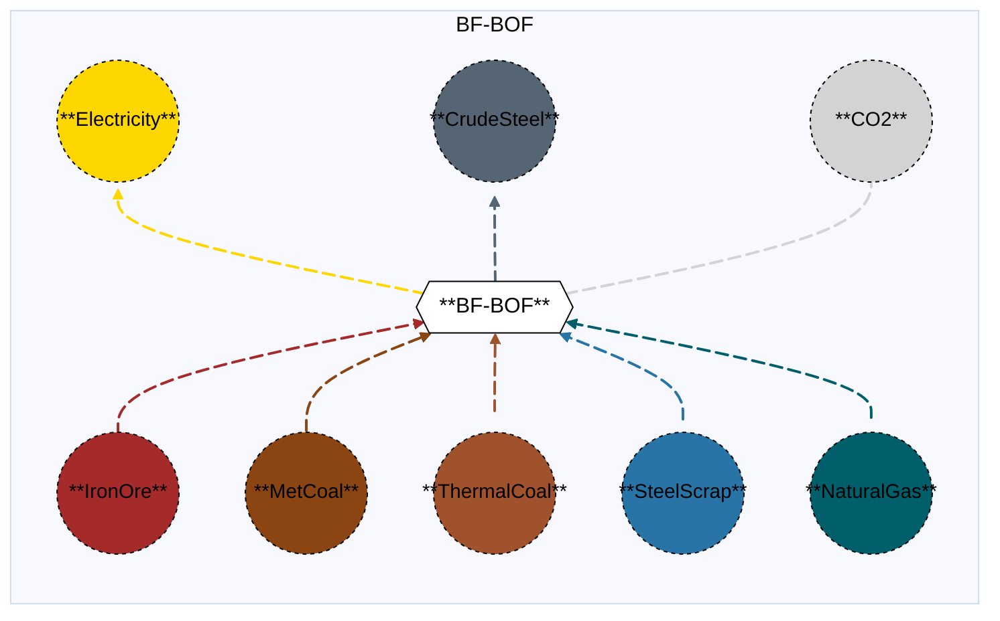
```mermaid
%%{init: {'theme': 'base', 'themeVariables': { 'background': '#D1EBDE' }}}%%
flowchart BT
  subgraph BF-BOF
  direction BT
    A1(("**IronOre**")) e1@-->B{{"**BF-BOF**"}}
    A2(("**MetCoal**")) e2@-->B{{"**BF-BOF**"}}
    A3(("**ThermalCoal**")) e3@-->B{{"**BF-BOF**"}}
    A4(("**SteelScrap**")) e4@-->B{{"**BF-BOF**"}}
    A5(("**NaturalGas**")) e5@-->B{{"**BF-BOF**"}}
    B{{"**BF-BOF**"}} e6@-->C1(("**Electricity**"))
    B{{"**BF-BOF**"}} e7@-->C2(("**CrudeSteel**"))
    B{{"**BF-BOF**"}} e8@-->C3(("**CO2**"))

    e1@{ animate: true }
    e2@{ animate: true }
    e3@{ animate: true }
    e4@{ animate: true }
    e5@{ animate: true }
    e6@{ animate: true }
    e7@{ animate: true }
    e8@{ animate: true }
 end
    style A1 font-size:15px,r:46px,fill:#A52A2A,stroke:black,color:black,stroke-dasharray: 3,5;
    style A2 font-size:15px,r:46px,fill:#8B4513,stroke:black,color:black,stroke-dasharray: 3,5;
    style A3 font-size:15px,r:46px,fill:#A0522D,stroke:black,color:black,stroke-dasharray: 3,5;
    style A4 font-size:15px,r:46px,fill:#2874A6,stroke:black,color:black,stroke-dasharray: 3,5;
    style A5 font-size:15px,r:46px,fill:#005F6A,stroke:black,color:black,stroke-dasharray: 3,5;
    style B fill:white,stroke:black,color:black;
    style C1 font-size:15px,r:46px,fill:#FFD700,stroke:black,color:black,stroke-dasharray: 3,5;
    style C2 font-size:15px,r:46px,fill:#566573,stroke:black,color:black,stroke-dasharray: 3,5;
    style C3 font-size:15px,r:46px,fill:lightgray,stroke:black,color:black,stroke-dasharray: 3,5;
    linkStyle 0 stroke:#A52A2A, stroke-width: 2px;
    linkStyle 1 stroke:#8B4513, stroke-width: 2px;
    linkStyle 2 stroke:#A0522D, stroke-width: 2px;
    linkStyle 3 stroke:#2874A6, stroke-width: 2px;
    linkStyle 4 stroke:#005F6A, stroke-width: 2px;
    linkStyle 5 stroke:#FFD700, stroke-width: 2px;
    linkStyle 6 stroke:#566573, stroke-width: 2px;
    linkStyle 7 stroke:lightgray, stroke-width: 2px;
```

### [Integrated Direct Reduction Electric Arc Furnace (with and without CCS)](@ref)
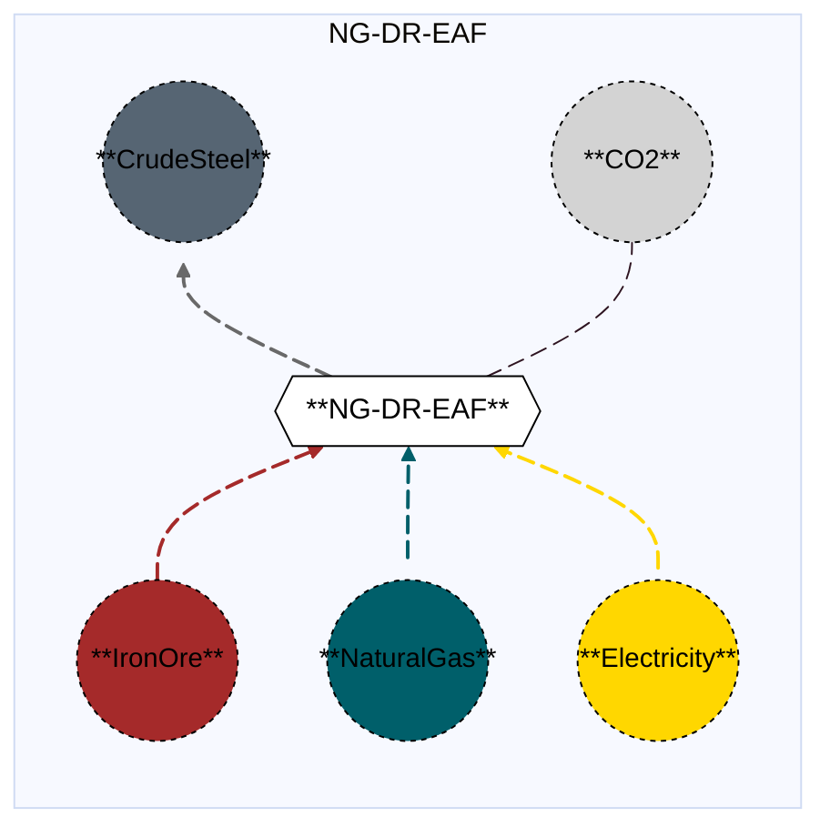
```mermaid
%%{init: {'theme': 'base', 'themeVariables': { 'background': '#D1EBDE' }}}%%
flowchart BT
  subgraph NG-DR-EAF
  direction BT
    A1(("**IronOre**")) e1@-->B{{"**NG-DR-EAF**"}}
    A2(("**NaturalGas**")) e2@-->B{{"**NG-DR-EAF**"}}
    A3(("**Electricity**")) e3@-->B{{"**NG-DR-EAF**"}}
    B{{"**NG-DR-EAF**"}} e4@-->C1(("**CrudeSteel**"))
    B{{"**NG-DR-EAF**"}} e5@-->C2(("**CO2**"))

    e1@{ animate: true }
    e2@{ animate: true }
    e3@{ animate: true }
    e4@{ animate: true }
    e5@{ animate: true }
 end
    style A1 font-size:15px,r:45px,fill:#A52A2A,stroke:black,color:black,stroke-dasharray: 3,5;
    style A2 font-size:15px,r:45px,fill:#005F6A,stroke:black,color:black,stroke-dasharray: 3,5;
    style A3 font-size:15px,r:45px,fill:#FFD700,stroke:black,color:black,stroke-dasharray: 3,5;
    style B fill:white,stroke:black,color:black;
    style C1 font-size:15px,r:45px,fill:#566573,stroke:black,color:black,stroke-dasharray: 3,5;
    style C2 font-size:15px,r:45px,fill:lightgray,stroke:black,color:black,stroke-dasharray: 3,5;

    linkStyle 0 stroke:#A52A2A, stroke-width: 2px;
    linkStyle 1 stroke:#005F6A, stroke-width: 2px;
    linkStyle 2 stroke:#FFD700, stroke-width:2px;
    linkStyle 3 stroke:#566573, stroke-width: 2px;
    linkStyle 3 stroke:#696969, color:lightgray, stroke-width: 2px;
```

### [Must Run](@ref)

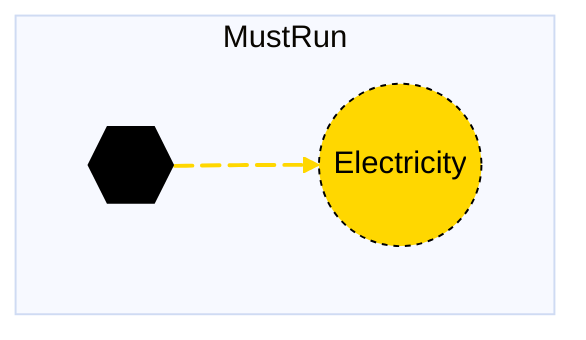
```mermaid
%%{init: {'theme': 'base', 'themeVariables': { 'background': '#D1EBDE' }}}%%
flowchart LR
  subgraph MustRun
  direction LR
  A{{..}} e1@--> B((Electricity))
  e1@{ animate: true }
 end
    style A fill:black,stroke:black,color:black;
    style B fill:#FFD700,stroke:black,color:black,stroke-dasharray: 3,5;
    
    linkStyle 0 stroke:#FFD700, stroke-width: 2px, stroke-dasharray: 5 5;
```

### [Natural Gas DAC](@ref)

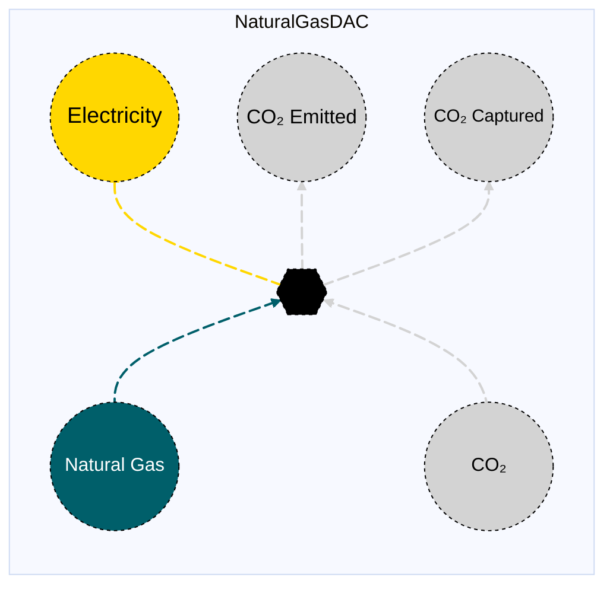
```mermaid
%%{init: {'theme': 'base', 'themeVariables': { 'background': '#D1EBDE' }}}%%
flowchart LR
  subgraph NaturalGasDAC
    direction BT
    A((Natural Gas)) e1@--> C{{..}}
    B((CO₂)) e2@--> C{{..}}
    C{{..}} e3@--> D((Electricity))
    C{{..}} e4@--> E((CO₂ Emitted))
    C{{..}} e5@--> F((CO₂ Captured))
    e1@{ animate: true }
    e2@{ animate: true }
    e3@{ animate: true }
    e4@{ animate: true }
    e5@{ animate: true }
  end
    style A r:55px,fill:#005F6A,stroke:black,color:white, stroke-dasharray: 3,5;
    style B r:55px,fill:lightgray,stroke:black,color:black, stroke-dasharray: 3,5;
    style C r:55px,fill:black,stroke:black,color:black, stroke-dasharray: 3,5;
    style D font-size:19px,r:55px,fill:#FFD700,stroke:black,color:black, stroke-dasharray: 3,5;
    style E font-size:17px,r:55px,fill:lightgray,stroke:black,color:black, stroke-dasharray: 3,5;
    style F font-size:15px,r:55px,fill:lightgray,stroke:black,color:black, stroke-dasharray: 3,5;

    linkStyle 0 stroke:#005F6A, stroke-width: 2px;
    linkStyle 1 stroke:lightgray, stroke-width: 2px;
    linkStyle 2 stroke:#FFD700, stroke-width: 2px;
    linkStyle 3 stroke:lightgray, stroke-width: 2px;
    linkStyle 4 stroke:lightgray, stroke-width: 2px;
```

### [Electric Arc Furnace](@ref)
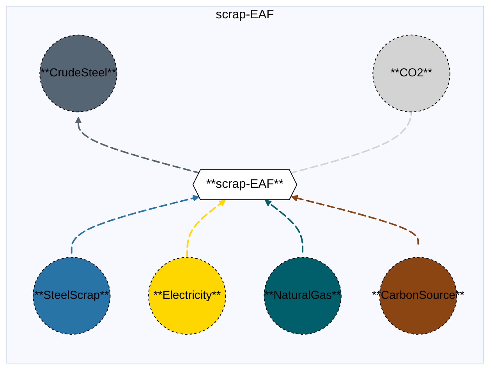
```mermaid
%%{init: {'theme': 'base', 'themeVariables': { 'background': '#D1EBDE' }}}%%
flowchart BT
  subgraph scrap-EAF
  direction BT
    A1(("**SteelScrap**")) e1@-->B{{"**scrap-EAF**"}}
    A2(("**Electricity**")) e2@-->B{{"**scrap-EAF**"}}
    A3(("**NaturalGas**")) e3@-->B{{"**scrap-EAF**"}}
    A4(("**CarbonSource**")) e4@-->B{{"**scrap-EAF**"}}
    B{{"**scrap-EAF**"}} e5@-->C1(("**CrudeSteel**"))
    B{{"**scrap-EAF**"}} e6@-->C2(("**CO2**"))

    e1@{ animate: true }
    e2@{ animate: true }
    e3@{ animate: true }
    e4@{ animate: true }
    e5@{ animate: true }
    e6@{ animate: true }
 end
    style A1 font-size:15px,r:50px,fill:#2874A6,stroke:black,color:black,stroke-dasharray: 3,5;
    style A2 font-size:15px,r:50px,fill:#FFD700,stroke:black,color:black,stroke-dasharray: 3,5;
    style A3 font-size:15px,r:50px,fill:#005F6A,stroke:black,color:black,stroke-dasharray: 3,5;
    style A4 font-size:15px,r:50px,fill:#8B4513,stroke:black,color:black,stroke-dasharray: 3,5;

    style B fill:white,stroke:black,color:black;
    style C1 font-size:15px,r:50px,fill:#566573,stroke:black,color:black,stroke-dasharray: 3,5;
    style C2 font-size:15px,r:50px,fill:lightgray,stroke:black,color:black,stroke-dasharray: 3,5;

    linkStyle 0 stroke:#2874A6, stroke-width: 2px;
    linkStyle 1 stroke:#FFD700, stroke-width: 2px;
    linkStyle 2 stroke:#005F6A, stroke-width: 2px;
    linkStyle 3 stroke:#8B4513, stroke-width: 2px;
    linkStyle 4 stroke:#566573, stroke-width: 2px;
    linkStyle 5 stroke:lightgray, stroke-width: 2px
```

### [Transmission Link](@ref)

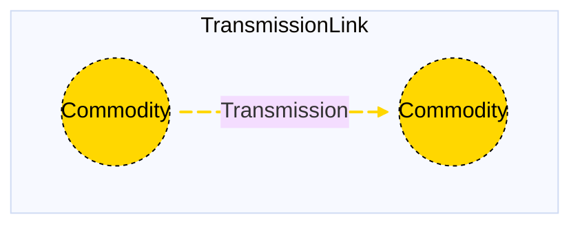
```mermaid
%%{init: {'theme': 'base', 'themeVariables': { 'background': '#D1EBDE' }}}%%
flowchart LR
  subgraph TransmissionLink
  direction LR
    A((Commodity)) e1@-->|Transmission| B((Commodity))
    e1@{ animate: true }
 end
    style A r:40,fill:#FFD700,stroke:black,color:black,stroke-dasharray: 3,5;
    style B r:40,fill:#FFD700,stroke:black,color:black,stroke-dasharray: 3,5;
    linkStyle 0 stroke:#FFD700, stroke-width: 2px;
```

### [Thermal Hydrogen Plant (with and without CCS)](@ref)

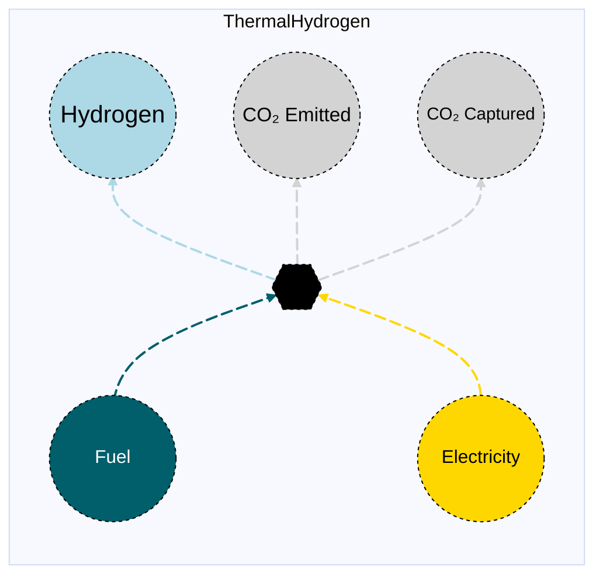
```mermaid
%%{init: {'theme': 'base', 'themeVariables': { 'background': '#D1EBDE' }}}%%
flowchart LR
  subgraph ThermalHydrogen
    direction BT
    A((Fuel)) e1@--> C{{..}}
    B((Electricity)) e2@--> C{{..}}
    C{{..}} e3@--> D((Hydrogen))
    C{{..}} e4@--> E((CO₂ Emitted))
    C{{..}} e5@--> F((CO₂ Captured))
    e1@{ animate: true }
    e2@{ animate: true }
    e3@{ animate: true }
    e4@{ animate: true }
    e5@{ animate: true }
  end
  
  style A r:55px,fill:#005F6A,stroke:black,color:white,stroke-dasharray: 3,5;
  style B r:55px,fill:#FFD700,stroke:black,color:black,stroke-dasharray: 3,5;
  style C r:55px,fill:black,stroke:black,color:black, stroke-dasharray: 3,5;
  style D font-size:21px,r:55px,fill:lightblue,stroke:black,color:black,stroke-dasharray: 3,5;
  style E font-size:17px,r:55px,fill:lightgray,stroke:black,color:black,stroke-dasharray: 3,5;
  style F font-size:15px,r:55px,fill:lightgray,stroke:black,color:black,stroke-dasharray: 3,5;

  linkStyle 0 stroke:#005F6A, stroke-width: 2px;
  linkStyle 1 stroke:#FFD700, stroke-width: 2px;
  linkStyle 2 stroke:lightblue, stroke-width: 2px;
  linkStyle 3,4 stroke:lightgray, stroke-width: 2px;
```

### [Thermal Power Plant (with and without CCS)](@ref)

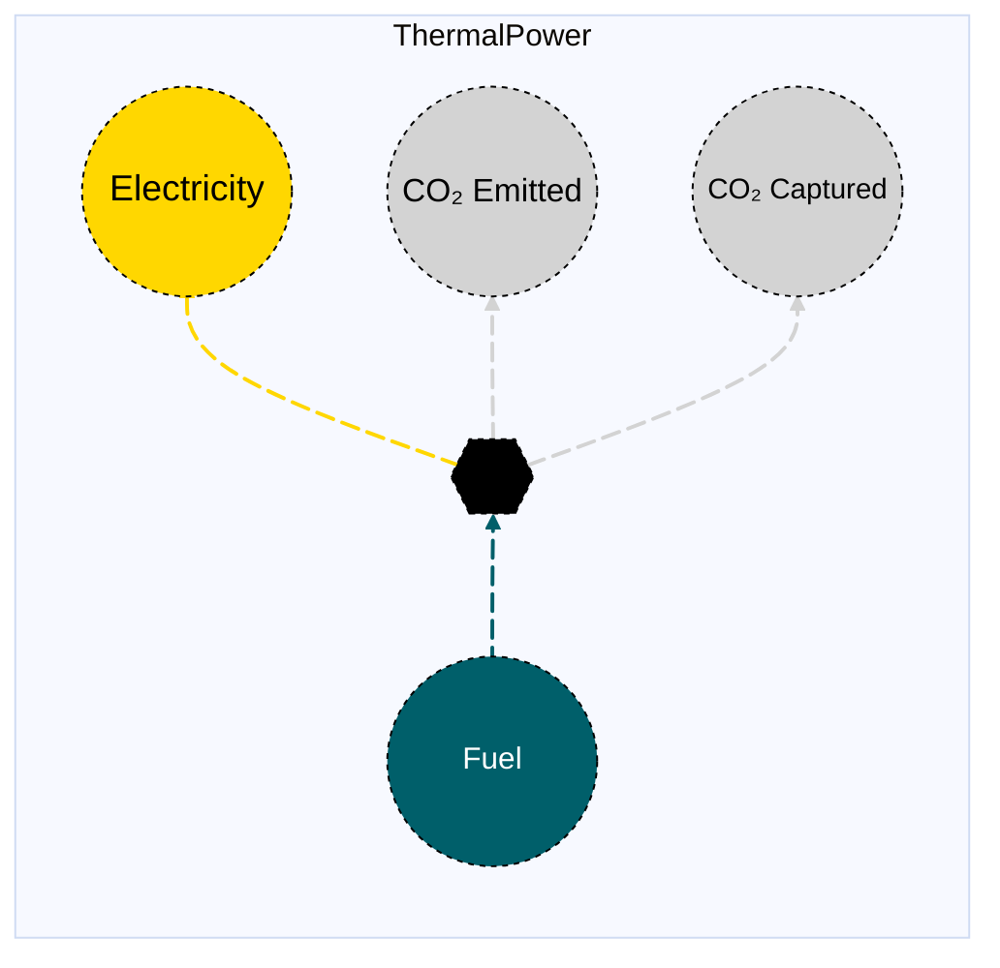
```mermaid
%%{init: {'theme': 'base', 'themeVariables': { 'background': '#D1EBDE' }}}%%
flowchart LR
  subgraph ThermalPower
  direction BT
  A((Fuel)) e1@ --> B{{..}}
  B e2@ --> C((Electricity))
  B e3@ --> D((CO₂ Emitted))
  B e4@ --> E((CO₂ Captured))
  e1@{animate: true}
  e2@{animate: true}
  e3@{animate: true}
  e4@{animate: true}
 end
    style A r:55px,fill:#005F6A,stroke:black,color:white,stroke-dasharray: 3,5;
    style B r:55px,fill:black,stroke:black,color:black,stroke-dasharray: 3,5;
    style C font-size:19px,r:55px,fill:#FFD700,stroke:black,color:black,stroke-dasharray: 3,5;
    style D font-size:17px,r:55px,fill:lightgray,stroke:black,color:black,stroke-dasharray: 3,5;
    style E font-size:15px,r:55px,fill:lightgray,stroke:black,color:black,stroke-dasharray: 3,5;

  linkStyle 0 stroke:#005F6A, stroke-width: 2px;
  linkStyle 1 stroke:#FFD700, stroke-width: 2px;
  linkStyle 2 stroke:lightgray, stroke-width: 2px;
  linkStyle 3 stroke:lightgray, stroke-width: 2px;
```

### [Thermal Ammonia (with and without CCS)](@ref)

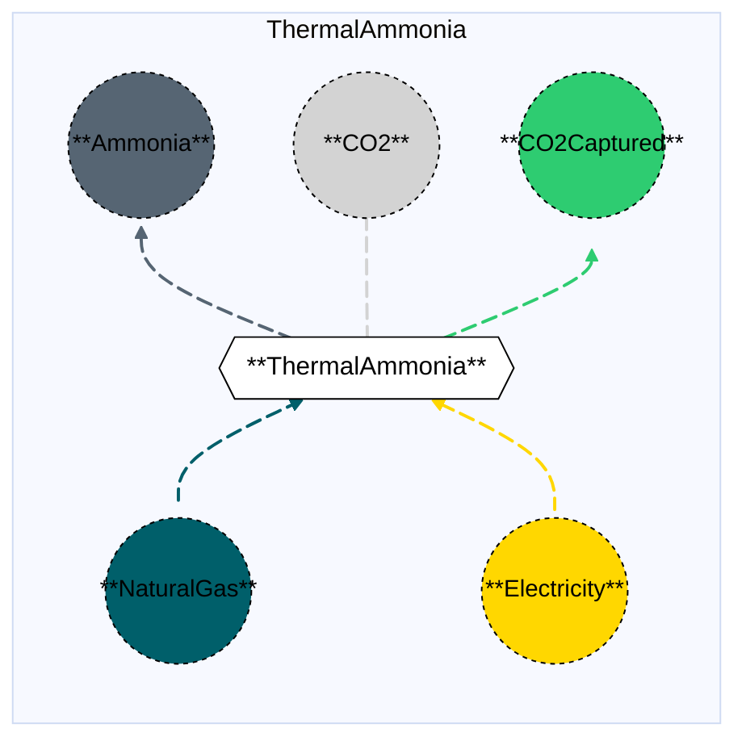
```mermaid
%%{init: {'theme': 'base', 'themeVariables': { 'background': '#D1EBDE' }}}%%
flowchart BT
  subgraph ThermalAmmonia
  direction BT
    A1(("**NaturalGas**")) e1@-->B{{"**ThermalAmmonia**"}}
    A2(("**Electricity**")) e2@-->B{{"**ThermalAmmonia**"}}
    B{{"**ThermalAmmonia**"}} e3@-->C1(("**Ammonia**"))
    B{{"**ThermalAmmonia**"}} e4@-->C2(("**CO2**"))
    B{{"**ThermalAmmonia**"}} e5@-->C3(("**CO2Captured**"))

    e1@{ animate: true }
    e2@{ animate: true }
    e3@{ animate: true }
    e4@{ animate: true }
    e5@{ animate: true }
  end
    style A1 font-size:15px,r:46px,fill:#005F6A,stroke:black,color:black,stroke-dasharray: 3,5;
    style A2 font-size:15px,r:46px,fill:#FFD700,stroke:black,color:black,stroke-dasharray: 3,5;
    style B fill:white,stroke:black,color:black;
    style C1 font-size:15px,r:46px,fill:#566573,stroke:black,color:black,stroke-dasharray: 3,5;
    style C2 font-size:15px,r:46px,fill:lightgray,stroke:black,color:black,stroke-dasharray: 3,5;
    style C3 font-size:15px,r:46px,fill:#2ECC71,stroke:black,color:black,stroke-dasharray: 3,5;
    linkStyle 0 stroke:#005F6A, stroke-width: 2px;
    linkStyle 1 stroke:#FFD700, stroke-width: 2px;
    linkStyle 2 stroke:#566573, stroke-width: 2px;
    linkStyle 3 stroke:lightgray, stroke-width: 2px;
    linkStyle 4 stroke:#2ECC71, stroke-width: 2px;
```

### [Thermal Methanol (with and without CCS)](@ref)

```mermaid
%%{init: {'theme': 'base', 'themeVariables': { 'background': '#D1EBDE' }}}%%
flowchart BT
  subgraph ThermalMethanol
  direction BT
    A1(("**NaturalGas**")) e1@-->B{{"**ThermalMethanol**"}}
    A2(("**Electricity**")) e2@-->B{{"**ThermalMethanol**"}}
    B{{"**ThermalMethanol**"}} e3@-->C1(("**Methanol**"))
    B{{"**ThermalMethanol**"}} e4@-->C2(("**CO2**"))
    B{{"**ThermalMethanol**"}} e5@-->C3(("**CO2Captured**"))

    e1@{ animate: true }
    e2@{ animate: true }
    e3@{ animate: true }
    e4@{ animate: true }
    e5@{ animate: true }
  end
    style A1 font-size:15px,r:46px,fill:#005F6A,stroke:black,color:black,stroke-dasharray: 3,5;
    style A2 font-size:15px,r:46px,fill:#FFD700,stroke:black,color:black,stroke-dasharray: 3,5;
    style B fill:white,stroke:black,color:black;
    style C1 font-size:15px,r:46px,fill:#566573,stroke:black,color:black,stroke-dasharray: 3,5;
    style C2 font-size:15px,r:46px,fill:lightgray,stroke:black,color:black,stroke-dasharray: 3,5;
    style C3 font-size:15px,r:46px,fill:#2ECC71,stroke:black,color:black,stroke-dasharray: 3,5;
    linkStyle 0 stroke:#005F6A, stroke-width: 2px;
    linkStyle 1 stroke:#FFD700, stroke-width: 2px;
    linkStyle 2 stroke:#566573, stroke-width: 2px;
    linkStyle 3 stroke:lightgray, stroke-width: 2px;
    linkStyle 4 stroke:#2ECC71, stroke-width: 2px;
```

### [Synthetic Ammonia](@ref)

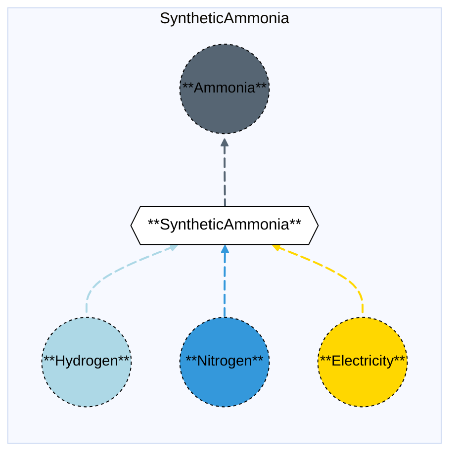
```mermaid
%%{init: {'theme': 'base', 'themeVariables': { 'background': '#D1EBDE' }}}%%
flowchart BT
  subgraph SyntheticAmmonia
  direction BT
    A1(("**Hydrogen**")) e1@-->B{{"**SyntheticAmmonia**"}}
    A2(("**Nitrogen**")) e2@-->B{{"**SyntheticAmmonia**"}}
    A3(("**Electricity**")) e3@-->B{{"**SyntheticAmmonia**"}}
    B{{"**SyntheticAmmonia**"}} e4@-->C1(("**Ammonia**"))

    e1@{ animate: true }
    e2@{ animate: true }
    e3@{ animate: true }
    e4@{ animate: true }
  end
    style A1 font-size:15px,r:46px,fill:lightblue,stroke:black,color:black,stroke-dasharray: 3,5;
    style A2 font-size:15px,r:46px,fill:#3498DB,stroke:black,color:black,stroke-dasharray: 3,5;
    style A3 font-size:15px,r:46px,fill:#FFD700,stroke:black,color:black,stroke-dasharray: 3,5;
    style B fill:white,stroke:black,color:black;
    style C1 font-size:15px,r:46px,fill:#566573,stroke:black,color:black,stroke-dasharray: 3,5;
    linkStyle 0 stroke:lightblue, stroke-width: 2px;
    linkStyle 1 stroke:#3498DB, stroke-width: 2px;
    linkStyle 2 stroke:#FFD700, stroke-width: 2px;
    linkStyle 3 stroke:#566573, stroke-width: 2px;
```

### [Synthetic Methanol](@ref)

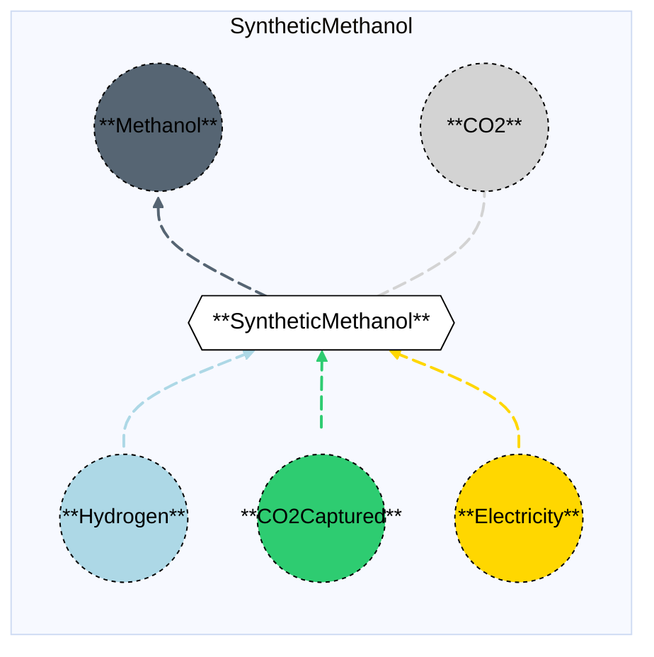
```mermaid
%%{init: {'theme': 'base', 'themeVariables': { 'background': '#D1EBDE' }}}%%
flowchart BT
  subgraph SyntheticMethanol
  direction BT
    A1(("**Hydrogen**")) e1@-->B{{"**SyntheticMethanol**"}}
    A2(("**CO2Captured**")) e2@-->B{{"**SyntheticMethanol**"}}
    A3(("**Electricity**")) e3@-->B{{"**SyntheticMethanol**"}}
    B{{"**SyntheticMethanol**"}} e4@-->C1(("**Methanol**"))
    B{{"**SyntheticMethanol**"}} e5@-->C2(("**CO2**"))

    e1@{ animate: true }
    e2@{ animate: true }
    e3@{ animate: true }
    e4@{ animate: true }
    e5@{ animate: true }
  end
    style A1 font-size:15px,r:46px,fill:lightblue,stroke:black,color:black,stroke-dasharray: 3,5;
    style A2 font-size:15px,r:46px,fill:#2ECC71,stroke:black,color:black,stroke-dasharray: 3,5;
    style A3 font-size:15px,r:46px,fill:#FFD700,stroke:black,color:black,stroke-dasharray: 3,5;
    style B fill:white,stroke:black,color:black;
    style C1 font-size:15px,r:46px,fill:#566573,stroke:black,color:black,stroke-dasharray: 3,5;
    style C2 font-size:15px,r:46px,fill:lightgray,stroke:black,color:black,stroke-dasharray: 3,5;
    linkStyle 0 stroke:lightblue, stroke-width: 2px;
    linkStyle 1 stroke:#2ECC71, stroke-width: 2px;
    linkStyle 2 stroke:#FFD700, stroke-width: 2px;
    linkStyle 3 stroke:#566573, stroke-width: 2px;
    linkStyle 4 stroke:lightgray, stroke-width: 2px;
```

### [Variable Renewable Energy resources (VRE)](@ref vre)

```mermaid
%%{init: {'theme': 'base', 'themeVariables': { 'background': '#D1EBDE' }}}%%
flowchart LR
  subgraph VRE
  direction LR
  A((Energy Source)) e1@--> B{{..}}
  B e2@--> C((Electricity))
  e1@{ animate: true }
  e2@{ animate: true }
 end
    style A r:55px,fill:#FFD700,stroke:black,color:black,stroke-dasharray: 3,5;
    style B r:55px,fill:black,stroke:black,color:black,stroke-dasharray: 3,5;
    style C font-size:20px,r:55px,fill:#FFD700,stroke:black,color:black,stroke-dasharray: 3,5;
    linkStyle 0 stroke:#FFD700, stroke-width: 2px;
    linkStyle 1 stroke:#FFD700, stroke-width: 2px;
```

### [Thermal Heating](@ref)

```mermaid
%%{init: {'theme': 'base', 'themeVariables': { 'background': '#D1EBDE' }}}%%
flowchart LR
  subgraph ThermalHeating
  direction BT
  A((Fuel)) e1@ --> B{{..}}
  B e2@ --> C((Heat))
  B e3@ --> D((CO₂ Emitted))
  e1@{animate: true}
  e2@{animate: true}
  e3@{animate: true}
 end
    style A r:55px,fill:#005F6A,stroke:black,color:white,stroke-dasharray: 3,5;
    style B r:55px,fill:black,stroke:black,color:black,stroke-dasharray: 3,5;
    style C font-size:19px,r:55px,fill:#FFA500,stroke:black,color:black,stroke-dasharray: 3,5;
    style D font-size:17px,r:55px,fill:lightgray,stroke:black,color:black,stroke-dasharray: 3,5;

  linkStyle 0 stroke:#005F6A, stroke-width: 2px;
  linkStyle 1 stroke:#FFA500, stroke-width: 2px;
  linkStyle 2 stroke:lightgray, stroke-width: 2px;
```

### [Electric Heating](@ref)

```mermaid
%%{init: {'theme': 'base', 'themeVariables': { 'background': '#E2F0FF' }}}%%
flowchart LR
  subgraph ElectricHeating
  direction BT
  A((Electricity)) e1@ --> B{{..}}
  B e2@ --> C((Heat))
  e1@{animate: true}
  e2@{animate: true}
 end
    style A r:55px,fill:#0055A4,stroke:black,color:white,stroke-dasharray: 3,5;
    style B r:55px,fill:black,stroke:black,color:black,stroke-dasharray: 3,5;
    style C font-size:19px,r:55px,fill:#FFA500,stroke:black,color:black,stroke-dasharray: 3,5;

  linkStyle 0 stroke:#0055A4, stroke-width: 2px;
  linkStyle 1 stroke:#FFA500, stroke-width: 2px;

```

### [Thermal Steam](@ref)

```mermaid
%%{init: {'theme': 'base', 'themeVariables': { 'background': '#D1EBDE' }}}%%
flowchart LR
  subgraph ThermalSteam
  direction BT
  A((Fuel)) e1@ --> B{{..}}
  B e2@ --> C((Steam))
  B e3@ --> D((Electricity))
  B e4@ --> E((CO₂ Emitted))
  e1@{animate: true}
  e2@{animate: true}
  e3@{animate: true}
  e4@{animate: true}
 end
    style A r:55px,fill:#005F6A,stroke:black,color:white,stroke-dasharray: 3,5;
    style B r:55px,fill:black,stroke:black,color:black,stroke-dasharray: 3,5;
    style C font-size:19px,r:55px,fill:#FFA500,stroke:black,color:black,stroke-dasharray: 3,5;
    style D font-size:19px,r:55px,fill:#8EC7FF,stroke:black,color:black,stroke-dasharray: 3,5;
    style E font-size:17px,r:55px,fill:lightgray,stroke:black,color:black,stroke-dasharray: 3,5;

  linkStyle 0 stroke:#005F6A, stroke-width: 2px;
  linkStyle 1 stroke:#FFA500, stroke-width: 2px;
  linkStyle 2 stroke:#8EC7FF, stroke-width: 2px;
  linkStyle 3 stroke:lightgray, stroke-width: 2px;

```

### [Electric Steam](@ref)

```mermaid
%%{init: {'theme': 'base', 'themeVariables': { 'background': '#E2F0FF' }}}%%
flowchart LR
  subgraph ElectricSteam
  direction BT
  A((Electricity)) e1@ --> B{{..}}
  B e2@ --> C((Steam))
  e1@{animate: true}
  e2@{animate: true}
 end
    style A r:55px,fill:#0055A4,stroke:black,color:white,stroke-dasharray: 3,5;
    style B r:55px,fill:black,stroke:black,color:black,stroke-dasharray: 3,5;
    style C font-size:19px,r:55px,fill:#FFA500,stroke:black,color:black,stroke-dasharray: 3,5;

  linkStyle 0 stroke:#0055A4, stroke-width: 2px;
  linkStyle 1 stroke:#FFA500, stroke-width: 2px;

```
