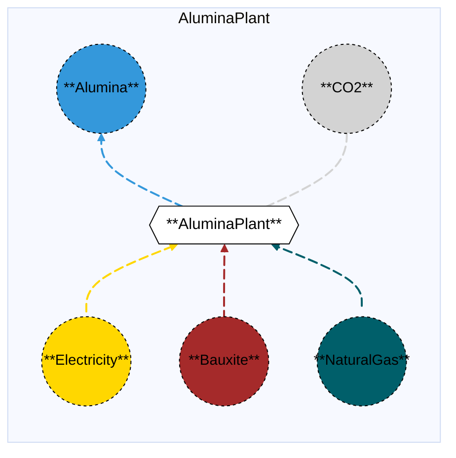

# Alumina Plant

## Contents

[Overview](@ref aluminaplant_overview) | [Asset Structure](@ref aluminaplant_asset_structure) | [Flow Equations](@ref aluminaplant_flow_equations) | [Input File (Standard Format)](@ref aluminaplant_input_file) | [Types - Asset Structure](@ref aluminaplant_type_definition) | [Constructors](@ref aluminaplant_constructors) | [Examples](@ref aluminaplant_examples)

## [Overview](@id aluminaplant_overview)

In Macro, the Alumina Plant asset represents a facility that produces alumina from bauxite using the Bayer process. This process consumes electricity, fuel (typically natural gas), and bauxite as feedstocks, and produces alumina and CO₂ emissions. The process has relatively low electricity consumption (approximately 0.15 MWh per tonne of alumina) compared to aluminum smelting.

!!! note "Secondary Importance"
    Alumina Plant is typically of **secondary importance** in energy system modeling compared to Aluminum Smelting, which is the primary energy-intensive process in aluminum production. The alumina plant's electricity consumption is relatively low, and the process is primarily thermal rather than electrical.

These assets are defined using either JSON or CSV input files placed in the `assets` directory, typically named with descriptive identifiers like `alumina_plant.json` or `alumina_plant.csv`.

## [Asset Structure](@id aluminaplant_asset_structure)

An Alumina Plant is made of the following components:
- 1 `Transformation` component, representing the alumina production process.
- 5 `Edge` components:
    - 1 **incoming** `Electricity Edge`, representing electricity consumption (approximately 0.15 MWh per tonne of alumina).
    - 1 **incoming** `Bauxite Edge`, representing bauxite supply (approximately 2.4 tonnes per tonne of alumina).
    - 1 **incoming** `Fuel Edge`, representing fuel supply (typically natural gas, approximately 2.917 MWh per tonne of alumina).
    - 1 **outgoing** `Alumina Edge`, representing alumina production.
    - 1 **outgoing** `CO₂ Edge`, representing CO₂ emissions from fuel consumption.

Here is a graphical representation of the Alumina Plant asset:



## [Flow Equations](@id aluminaplant_flow_equations)

The Alumina Plant asset follows these stoichiometric relationships:

```math
\begin{aligned}
\phi_{elec} &= \phi_{alumina} \cdot \epsilon_{elec\_alumina\_rate} \\
\phi_{bauxite} &= \phi_{alumina} \cdot \epsilon_{bauxite\_alumina\_rate} \\
\phi_{fuel} &= \phi_{alumina} \cdot \epsilon_{fuel\_alumina\_rate} \\
\phi_{co2} &= \phi_{fuel} \cdot \epsilon_{fuel\_emissions\_rate} \\
\end{aligned}
```

Where:
- ``\phi`` represents the flow of each commodity
- ``\epsilon`` represents the stoichiometric coefficients defined in the [Conversion Process Parameters](@ref aluminaplant_conversion_process_parameters) section.
- Note: Alumina and Bauxite flows are in **tonnes**, while Electricity and Fuel are in **MWh**.

## [Input File (Standard Format)](@id aluminaplant_input_file)

The easiest way to include an Alumina Plant asset in a model is to create a new file (either JSON or CSV) and place it in the `assets` directory together with the other assets. 

```
your_case/
├── assets/
│   ├── alumina_plant.json    # or alumina_plant.csv
│   ├── other_assets.json
│   └── ...
├── system/
├── settings/
└── ...
```

This file can either be created manually, or using the `template_asset` function, as shown in the [Adding an Asset to a System](@ref) section of the User Guide. The file will be automatically loaded when you run your Macro model. An example of an input JSON file is shown in the [Examples](@ref aluminaplant_examples) section.

The following tables outline the attributes that can be set for an Alumina Plant asset.

### Transform Attributes
#### Essential Attributes
| Field | Type | Description |
|--------------|---------|------------|
| `Type` | String | Asset type identifier: "AluminaPlant" |
| `id` | String | Unique identifier for the asset instance |
| `location` | String | Geographic location/node identifier |
| `timedata` | String | Time resolution for the time series data linked to the transformation |

#### [Conversion Process Parameters](@id aluminaplant_conversion_process_parameters)
| Field | Type | Description | Units | Default |
|--------------|---------|------------|----------------|----------|
| `elec_alumina_rate` | Float64 | Electricity consumption per tonne of alumina output | $MWh_{elec}/t_{Al_2O_3}$ | 0.15 |
| `bauxite_alumina_rate` | Float64 | Bauxite consumption per tonne of alumina output | $t_{bauxite}/t_{Al_2O_3}$ | 2.4 |
| `fuel_alumina_rate` | Float64 | Fuel consumption per tonne of alumina output | $MWh_{fuel}/t_{Al_2O_3}$ | 2.917 |
| `fuel_emissions_rate` | Float64 | CO₂ emissions per MWh of fuel input | $t_{CO_2}/MWh_{fuel}$ | 0.181048235160161 |

#### General Attributes

| Field | Type | Values | Default | Description |
|:--------------| :------: |:------: | :------: |:-------|
| `type` | `String` | Any Macro commodity type matching the commodity of the edge | Required | Commodity of the edge. E.g. "Electricity". |
| `start_vertex` | `String` | Any node id present in the system matching the commodity of the edge | Required | ID of the starting vertex of the edge. The node must be present in the `nodes.json` file. E.g. "elec\_node\_1". |
| `end_vertex` | `String` | Any node id present in the system matching the commodity of the edge | Required | ID of the ending vertex of the edge. The node must be present in the `nodes.json` file. E.g. "alumina\_node\_1". |
| `availability` | `Dict` | Availability file path and header | Empty | Path to the availability file and column name for the availability time series to link to the edge. E.g. `{"timeseries": {"path": "assets/availability.csv", "header": "AluminaPlant"}}`.|
| `has_capacity` | `Bool` | `Bool` | `false` | Whether capacity variables are created for the edge. |
| `integer_decisions` | `Bool` | `Bool` | `false` | Whether capacity variables are integers. |
| `unidirectional` | `Bool` | `Bool` | `false` | Whether the edge is unidirectional. |

!!! warning "Asset expansion"
    As a modeling decision, only the `Alumina` edge is allowed to expand. Therefore, both the `has_capacity` and `constraints` attributes can only be set for that edge. For all other edges, these attributes are pre-set to `false` and an empty list, respectively, to ensure the correct modeling of the asset. 

!!! warning "Unit Commitment"
    The `elec_edge` can optionally support unit commitment constraints. If `uc` is set to `true` in the edge data, the edge will be created as an `EdgeWithUC` type, and unit commitment constraints (MinUpTimeConstraint, MinDownTimeConstraint) will be automatically applied.

#### Investment Parameters
| Field | Type | Description | Units | Default |
|--------------|---------|------------|----------------|----------|
| `can_retire` | Boolean | Whether capacity can be retired | - | true |
| `can_expand` | Boolean | Whether capacity can be expanded | - | true |
| `existing_capacity` | Float64 | Initial installed capacity | t Al₂O₃ | 0.0 |

#### Economic Parameters
| Field | Type | Description | Units | Default |
|--------------|---------|------------|----------------|----------|
| `investment_cost` | Float64 | CAPEX per unit capacity | \$/MW | 3,600,000 |
| `fixed_om_cost` | Float64 | Fixed O&M costs | \$/MW-yr | 613,200 |
| `variable_om_cost` | Float64 | Variable O&M costs | \$/MWh Al₂O₃ | 30 |
| `lifetime` | Float64 | Asset lifetime | years | 20 |
| `wacc` | Float64 | Weighted average cost of capital | fraction | 0.039 |
| `capital_recovery_period` | Float64 | Capital recovery period | years | 20 |

### [Constraints Configuration](@id aluminaplant_constraints)

Alumina Plant assets can have different constraints applied to them, and the user can configure them using the following fields:

| Field | Type | Description |
|--------------|---------|------------|
| `transform_constraints` | Dict{String,Bool} | List of constraints applied to the transformation component. |
| `output_constraints` | Dict{String,Bool} | List of constraints applied to the output edge component. |

For example, if the user wants to apply the [`BalanceConstraint`](@ref balance_constraint_ref) to the transformation component and the [`CapacityConstraint`](@ref capacity_constraint_ref) to the output edge, the constraints fields should be set as follows:

```json
{
    "transform_constraints": {
        "BalanceConstraint": true
    },
    "edges":{
        "alumina_edge": {
            "constraints": {
                "CapacityConstraint": true
            }
        }
    }
}
```

Users can refer to the [Adding Asset Constraints to a System](@ref) section of the User Guide for a list of all the constraints that can be applied to the different components of an Alumina Plant asset.

#### Default constraints
To simplify the input file and the asset configuration, the following constraints are applied to the Alumina Plant asset by default:

- [Balance constraint](@ref balance_constraint_ref) (applied to the transformation component)
- [Capacity constraint](@ref capacity_constraint_ref) (applied to the output alumina edge)

## [Types - Asset Structure](@id aluminaplant_type_definition)

The Alumina Plant asset is defined as follows:

```julia
struct AluminaPlant{T} <: AbstractAsset
    id::AssetId
    aluminaplant_transform::Transformation
    elec_edge::Union{Edge{<:Electricity},EdgeWithUC{<:Electricity}}
    alumina_edge::Edge{<:Alumina}
    bauxite_edge::Edge{<:Bauxite}
    fuel_edge::Edge{<:T}
    co2_edge::Edge{<:CO2}
end
```

Where `T` is a generic type parameter that can be any `Commodity` type (typically `NaturalGas`).

## [Constructors](@id aluminaplant_constructors)

### Factory constructor
```julia
make(asset_type::Type{AluminaPlant}, data::AbstractDict{Symbol,Any}, system::System)
```

| Field | Type | Description |
|--------------|---------|------------|
| `asset_type` | `Type{AluminaPlant}` | Macro type of the asset |
| `data` | `AbstractDict{Symbol,Any}` | Dictionary containing the input data for the asset |
| `system` | `System` | System to which the asset belongs |

### Stoichiometry balance data

```julia
aluminaplant_transform.balance_data = Dict(
    :elec_to_alumina => Dict(
        elec_edge.id => 1.0,
        fuel_edge.id => 0.0,
        bauxite_edge.id => 0.0,
        alumina_edge.id => get(transform_data, :elec_alumina_rate, 0.15)
    ),
    :bauxite_to_alumina => Dict(
        elec_edge.id => 0.0,
        fuel_edge.id => 0.0,
        bauxite_edge.id => 1.0,
        alumina_edge.id => get(transform_data, :bauxite_alumina_rate, 2.4)
    ),
    :fuel_to_alumina => Dict(
        elec_edge.id => 0.0,
        fuel_edge.id => 1.0,
        bauxite_edge.id => 0.0,
        alumina_edge.id => get(transform_data, :fuel_alumina_rate, 2.917)
    ),
    :emissions => Dict(
        fuel_edge.id => get(transform_data, :fuel_emissions_rate, 0.181048235160161),
        co2_edge.id => 1.0
    )
)
```

!!! warning "Dictionary keys must match"
    In the code above, each `get` function call looks up a parameter in the `transform_data` dictionary using a symbolic key such as `:elec_alumina_rate` or `:fuel_emissions_rate`.
    These keys **must exactly match** the corresponding field names in your input asset `.json` or `.csv` files. Mismatched key names between the constructor file and the asset input will result in missing or incorrect parameter values (defaulting to the values shown above).

## [Examples](@id aluminaplant_examples)

This example illustrates a basic Alumina Plant configuration in JSON format:

```json
{
    "AluminaPlant": [
        {
            "type": "AluminaPlant",
            "global_data":{
                "nodes": {},
                "transforms": {
                    "timedata": "Alumina"
                },
                "edges":{
                    "alumina_edge": {
                        "commodity": "Alumina",
                        "unidirectional": true,
                        "has_capacity": true,
                        "can_retire": true,
                        "can_expand": true,
                        "integer_decisions": false
                    },
                    "elec_edge": {
                        "commodity": "Electricity",
                        "unidirectional": true,
                        "has_capacity": false
                    },
                    "bauxite_edge": {
                        "commodity": "Bauxite",
                        "unidirectional": true,
                        "has_capacity": false
                    },
                    "fuel_edge": {
                        "commodity": "NaturalGas",
                        "unidirectional": true,
                        "has_capacity": false
                    },
                    "co2_edge": {
                        "commodity": "CO2",
                        "unidirectional": true,
                        "has_capacity": false,
                        "end_vertex": "co2_sink"
                    }
                }
            },
            "instance_data":[
                {
                    "id": "alumina_plant_1",
                    "transforms":{
                        "elec_alumina_rate": 0.15,
                        "bauxite_alumina_rate": 2.4,
                        "fuel_alumina_rate": 2.917,
                        "fuel_emissions_rate": 0.181048235160161
                    },
                    "edges":{
                        "alumina_edge": {
                            "end_vertex": "alumina_node_1",
                            "existing_capacity": 0.0,
                            "investment_cost": 3600000,
                            "fixed_om_cost": 613200,
                            "variable_om_cost": 30
                        },
                        "elec_edge": {
                            "start_vertex": "elec_node_1"
                        },
                        "bauxite_edge": {
                            "start_vertex": "bauxite_node_1"
                        },
                        "fuel_edge": {
                            "start_vertex": "natgas_node_1"
                        },
                        "co2_edge": {
                            "end_vertex": "co2_sink"
                        }
                    }
                }
            ]
        }
    ]
}
```

## See Also

- [Edges](@ref) - Components that connect Vertices and carry flows
- [Transformations](@ref) - Processes that transform flows of several Commodities
- [Nodes](@ref) - Network nodes that allow for import and export of commodities
- [Vertices](@ref) - Network nodes that edges connect
- [Assets](@ref "Assets") - Higher-level components made from edges, nodes, storage, and transformations
- [Commodities](@ref) - Types of resources stored by Commodities
- [Time Data](@ref) - Temporal modeling framework
- [Constraints](@ref) - Additional constraints for Storage and other components
- [Aluminum Smelting](@ref aluminumsmelting_overview) - Primary energy-intensive aluminum production process
- [Aluminum Refining](@ref aluminumrefining_overview) - Aluminum refining from scrap

