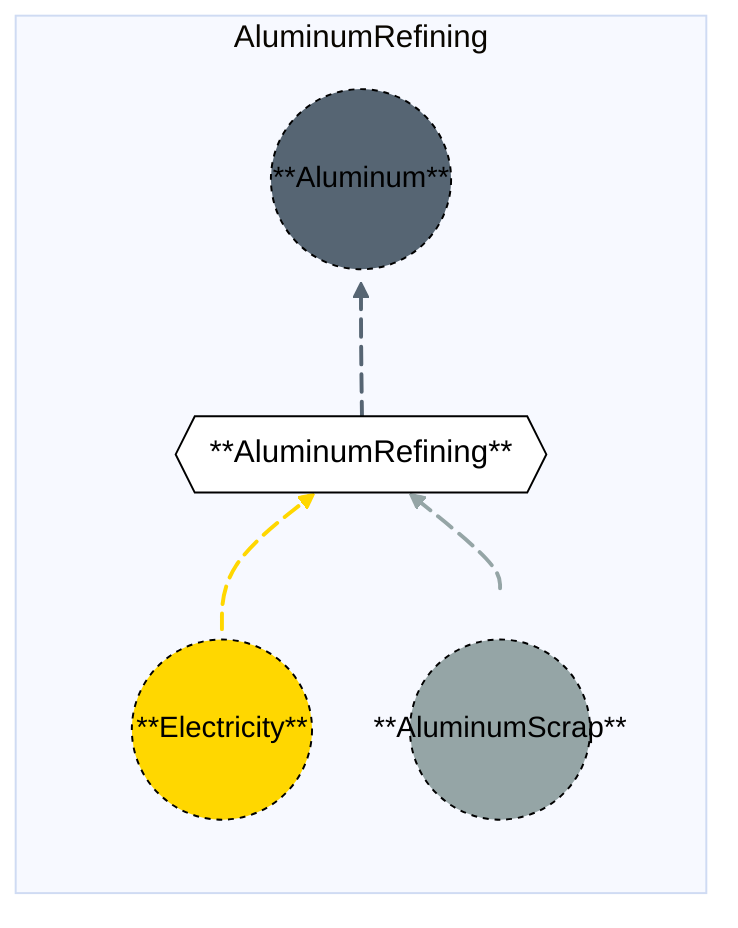

# Aluminum Refining

## Contents

[Overview](@ref aluminumrefining_overview) | [Asset Structure](@ref aluminumrefining_asset_structure) | [Flow Equations](@ref aluminumrefining_flow_equations) | [Input File (Standard Format)](@ref aluminumrefining_input_file) | [Types - Asset Structure](@ref aluminumrefining_type_definition) | [Constructors](@ref aluminumrefining_constructors) | [Examples](@ref aluminumrefining_examples)

## [Overview](@id aluminumrefining_overview)

In Macro, the Aluminum Refining asset represents a facility that transforms electricity and aluminum scrap into refined aluminum. This process is less energy-intensive than primary aluminum smelting, consuming approximately 2.0 MWh per tonne of aluminum (compared to 13.3 MWh per tonne for smelting). The process uses aluminum scrap as a feedstock and produces refined aluminum with no direct CO₂ emissions.

!!! note "Secondary Importance"
    Aluminum Refining is typically of **secondary importance** in energy system modeling compared to Aluminum Smelting, which is the primary energy-intensive process in aluminum production.

These assets are defined using either JSON or CSV input files placed in the `assets` directory, typically named with descriptive identifiers like `aluminum_refining.json` or `aluminum_refining.csv`.

## [Asset Structure](@id aluminumrefining_asset_structure)

An Aluminum Refining plant is made of the following components:
- 1 `Transformation` component, representing the aluminum refining process.
- 3 `Edge` components:
    - 1 **incoming** `Electricity Edge`, representing electricity consumption (approximately 2.0 MWh per tonne of aluminum).
    - 1 **incoming** `AluminumScrap Edge`, representing aluminum scrap supply (approximately 1.05 tonnes per tonne of aluminum, including 5% loss).
    - 1 **outgoing** `Aluminum Edge`, representing refined aluminum production.

Here is a graphical representation of the Aluminum Refining asset:



## [Flow Equations](@id aluminumrefining_flow_equations)

The Aluminum Refining asset follows these stoichiometric relationships:

```math
\begin{aligned}
\phi_{elec} &= \phi_{aluminum} \cdot \epsilon_{elec\_aluminum\_rate} \\
\phi_{aluminumscrap} &= \phi_{aluminum} \cdot \epsilon_{aluminumscrap\_aluminum\_rate} \\
\end{aligned}
```

Where:
- ``\phi`` represents the flow of each commodity
- ``\epsilon`` represents the stoichiometric coefficients defined in the [Conversion Process Parameters](@ref aluminumrefining_conversion_process_parameters) section.
- Note: Aluminum and AluminumScrap flows are in **tonnes**, while Electricity is in **MWh**.

## [Input File (Standard Format)](@id aluminumrefining_input_file)

The easiest way to include an Aluminum Refining asset in a model is to create a new file (either JSON or CSV) and place it in the `assets` directory together with the other assets. 

```
your_case/
├── assets/
│   ├── aluminum_refining.json    # or aluminum_refining.csv
│   ├── other_assets.json
│   └── ...
├── system/
├── settings/
└── ...
```

This file can either be created manually, or using the `template_asset` function, as shown in the [Adding an Asset to a System](@ref) section of the User Guide. The file will be automatically loaded when you run your Macro model. An example of an input JSON file is shown in the [Examples](@ref aluminumrefining_examples) section.

The following tables outline the attributes that can be set for an Aluminum Refining asset.

### Transform Attributes
#### Essential Attributes
| Field | Type | Description |
|--------------|---------|------------|
| `Type` | String | Asset type identifier: "AluminumRefining" |
| `id` | String | Unique identifier for the asset instance |
| `location` | String | Geographic location/node identifier |
| `timedata` | String | Time resolution for the time series data linked to the transformation |

#### [Conversion Process Parameters](@id aluminumrefining_conversion_process_parameters)
| Field | Type | Description | Units | Default |
|--------------|---------|------------|----------------|----------|
| `elec_aluminum_rate` | Float64 | Electricity consumption per tonne of aluminum output | $MWh_{elec}/t_{Al}$ | 0.0 |
| `aluminumscrap_aluminum_rate` | Float64 | Aluminum scrap consumption per tonne of aluminum output (includes 5% loss) | $t_{scrap}/t_{Al}$ | 0.0 |

#### General Attributes

| Field | Type | Values | Default | Description |
|:--------------| :------: |:------: | :------: |:-------|
| `type` | `String` | Any Macro commodity type matching the commodity of the edge | Required | Commodity of the edge. E.g. "Electricity". |
| `start_vertex` | `String` | Any node id present in the system matching the commodity of the edge | Required | ID of the starting vertex of the edge. The node must be present in the `nodes.json` file. E.g. "elec\_node\_1". |
| `end_vertex` | `String` | Any node id present in the system matching the commodity of the edge | Required | ID of the ending vertex of the edge. The node must be present in the `nodes.json` file. E.g. "aluminum\_node\_1". |
| `availability` | `Dict` | Availability file path and header | Empty | Path to the availability file and column name for the availability time series to link to the edge. E.g. `{"timeseries": {"path": "assets/availability.csv", "header": "AluminumRefining"}}`.|
| `has_capacity` | `Bool` | `Bool` | `false` | Whether capacity variables are created for the edge. |
| `integer_decisions` | `Bool` | `Bool` | `false` | Whether capacity variables are integers. |
| `unidirectional` | `Bool` | `Bool` | `false` | Whether the edge is unidirectional. |

!!! warning "Asset expansion"
    As a modeling decision, only the `Aluminum` edge is allowed to expand. Therefore, both the `has_capacity` and `constraints` attributes can only be set for that edge. For all other edges, these attributes are pre-set to `false` and an empty list, respectively, to ensure the correct modeling of the asset. 

#### Investment Parameters
| Field | Type | Description | Units | Default |
|--------------|---------|------------|----------------|----------|
| `can_retire` | Boolean | Whether capacity can be retired | - | true |
| `can_expand` | Boolean | Whether capacity can be expanded | - | true |
| `existing_capacity` | Float64 | Initial installed capacity | t Al | 0.0 |

#### Economic Parameters
| Field | Type | Description | Units | Default |
|--------------|---------|------------|----------------|----------|
| `investment_cost` | Float64 | CAPEX per unit capacity | \$/MW | 0.0 |
| `fixed_om_cost` | Float64 | Fixed O&M costs | \$/MW-yr | 0.0 |
| `variable_om_cost` | Float64 | Variable O&M costs | \$/MWh Al | 0.0 |

### [Constraints Configuration](@id aluminumrefining_constraints)

Aluminum Refining assets can have different constraints applied to them, and the user can configure them using the following fields:

| Field | Type | Description |
|--------------|---------|------------|
| `transform_constraints` | Dict{String,Bool} | List of constraints applied to the transformation component. |
| `output_constraints` | Dict{String,Bool} | List of constraints applied to the output edge component. |

For example, if the user wants to apply the [`BalanceConstraint`](@ref balance_constraint_ref) to the transformation component and the [`CapacityConstraint`](@ref capacity_constraint_ref) to the output edge, the constraints fields should be set as follows:

```json
{
    "transform_constraints": {
        "BalanceConstraint": true
    },
    "edges":{
        "aluminum_edge": {
            "constraints": {
                "CapacityConstraint": true
            }
        }
    }
}
```

Users can refer to the [Adding Asset Constraints to a System](@ref) section of the User Guide for a list of all the constraints that can be applied to the different components of an Aluminum Refining asset.

#### Default constraints
To simplify the input file and the asset configuration, the following constraints are applied to the Aluminum Refining asset by default:

- [Balance constraint](@ref balance_constraint_ref) (applied to the transformation component)
- [Capacity constraint](@ref capacity_constraint_ref) (applied to the output aluminum edge)

## [Types - Asset Structure](@id aluminumrefining_type_definition)

The Aluminum Refining asset is defined as follows:

```julia
struct AluminumRefining <: AbstractAsset
    id::AssetId
    aluminum_transform::Transformation
    elec_edge::Edge{<:Electricity}
    aluminumscrap_edge::Edge{<:AluminumScrap}
    aluminum_edge::Edge{<:Aluminum}
end
```

## [Constructors](@id aluminumrefining_constructors)

### Factory constructor
```julia
make(asset_type::Type{AluminumRefining}, data::AbstractDict{Symbol,Any}, system::System)
```

| Field | Type | Description |
|--------------|---------|------------|
| `asset_type` | `Type{AluminumRefining}` | Macro type of the asset |
| `data` | `AbstractDict{Symbol,Any}` | Dictionary containing the input data for the asset |
| `system` | `System` | System to which the asset belongs |

### Stoichiometry balance data

```julia
aluminumrefining_transform.balance_data = Dict(
    :elec_to_aluminum => Dict(
        elec_edge.id => 1.0,
        aluminumscrap_edge.id => 0.0,
        aluminum_edge.id => get(transform_data, :elec_aluminum_rate, 0.0)
        ),
        :aluminumscrap_to_aluminum => Dict(
            elec_edge.id => 0.0,
            aluminumscrap_edge.id => 1.0,
            aluminum_edge.id => get(transform_data, :aluminumscrap_aluminum_rate, 0.0)
    )
)
```

!!! warning "Dictionary keys must match"
    In the code above, each `get` function call looks up a parameter in the `transform_data` dictionary using a symbolic key such as `:elec_aluminum_rate` or `:aluminumscrap_aluminum_rate`.
    These keys **must exactly match** the corresponding field names in your input asset `.json` or `.csv` files. Mismatched key names between the constructor file and the asset input will result in missing or incorrect parameter values (defaulting to the values shown above).

## [Examples](@id aluminumrefining_examples)

This example illustrates a basic Aluminum Refining configuration in JSON format:

```json
{
    "AluminumRefining": [
        {
            "type": "AluminumRefining",
            "global_data":{
                "nodes": {},
                "transforms": {
                    "timedata": "Aluminum"
                },
                "edges":{
                    "aluminum_edge": {
                        "commodity": "Aluminum",
                        "unidirectional": true,
                        "has_capacity": true,
                        "can_retire": true,
                        "can_expand": true,
                        "integer_decisions": false
                    },
                    "elec_edge": {
                        "commodity": "Electricity",
                        "unidirectional": true,
                        "has_capacity": false
                    },
                    "aluminumscrap_edge": {
                        "commodity": "AluminumScrap",
                        "unidirectional": true,
                        "has_capacity": false
                    }
                }
            },
            "instance_data":[
                {
                    "id": "aluminum_refining_1",
                    "transforms":{
                        "elec_aluminum_rate": 2.0,
                        "aluminumscrap_aluminum_rate": 1.05
                    },
                    "edges":{
                        "aluminum_edge": {
                            "end_vertex": "aluminum_node_1",
                            "existing_capacity": 0.0,
                            "investment_cost": 2400000,
                            "fixed_om_cost": 420000,
                            "variable_om_cost": 123
                        },
                        "elec_edge": {
                            "start_vertex": "elec_node_1"
                        },
                        "aluminumscrap_edge": {
                            "start_vertex": "aluminumscrap_node_1"
                        }
                    }
                }
            ]
        }
    ]
}
```

## See Also

- [Edges](@ref) - Components that connect Vertices and carry flows
- [Transformations](@ref) - Processes that transform flows of several Commodities
- [Nodes](@ref) - Network nodes that allow for import and export of commodities
- [Vertices](@ref) - Network nodes that edges connect
- [Assets](@ref "Assets") - Higher-level components made from edges, nodes, storage, and transformations
- [Commodities](@ref) - Types of resources stored by Commodities
- [Time Data](@ref) - Temporal modeling framework
- [Constraints](@ref) - Additional constraints for Storage and other components
- [Aluminum Smelting](@ref aluminumsmelting_overview) - Primary energy-intensive aluminum production process
- [Alumina Plant](@ref aluminaplant_overview) - Alumina production from bauxite

