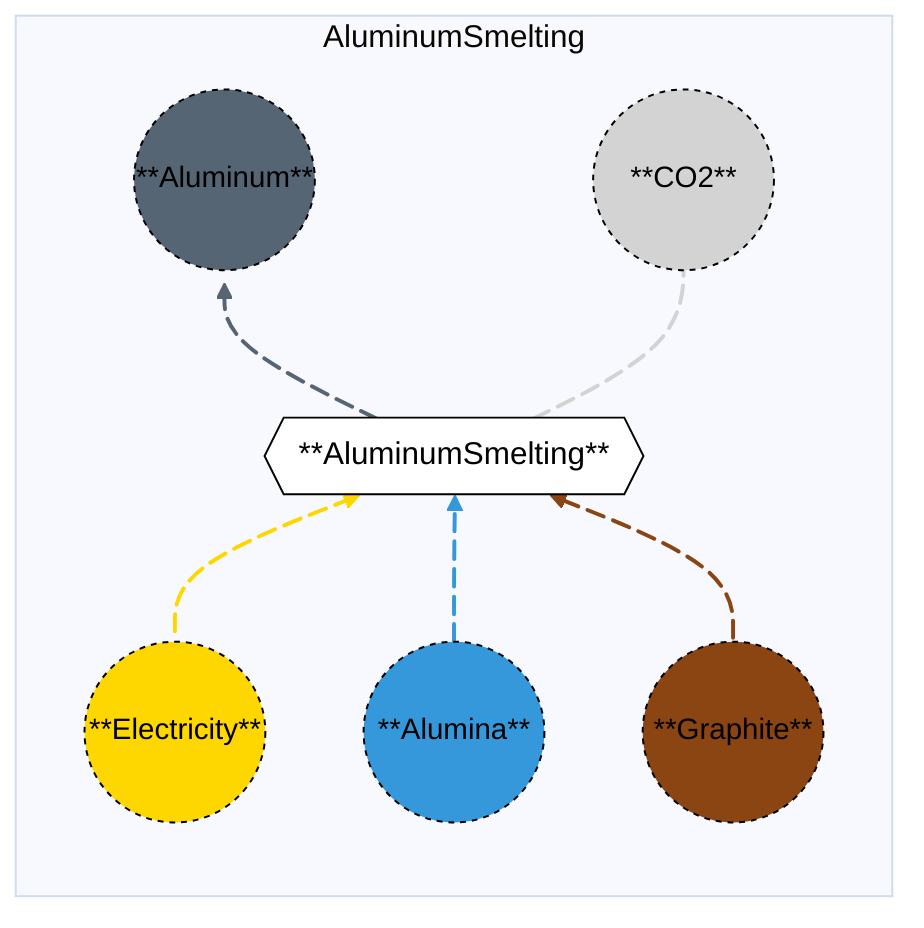

# Aluminum Smelting

## Contents

[Overview](@ref aluminumsmelting_overview) | [Asset Structure](@ref aluminumsmelting_asset_structure) | [Flow Equations](@ref aluminumsmelting_flow_equations) | [Input File (Standard Format)](@ref aluminumsmelting_input_file) | [Types - Asset Structure](@ref aluminumsmelting_type_definition) | [Constructors](@ref aluminumsmelting_constructors) | [Examples](@ref aluminumsmelting_examples)

## [Overview](@id aluminumsmelting_overview)

In Macro, the Aluminum Smelting asset represents an **energy-intensive** aluminum production facility using the Hall-Héroult process. This is the primary electrolytic process for producing aluminum from alumina. The process consumes large amounts of electricity (approximately 13.3 MWh per tonne of aluminum), making it one of the most energy-intensive industrial processes. The facility uses alumina and graphite as feedstocks, and produces aluminum and CO₂ emissions.

!!! note "Energy Intensity"
    Aluminum Smelting is the **primary energy-intensive** process in aluminum production. The other aluminum-related assets (Aluminum Refining and Alumina Plant) are less energy-intensive and are typically of secondary importance in energy system modeling.

These assets are defined using either JSON or CSV input files placed in the `assets` directory, typically named with descriptive identifiers like `aluminum_smelting.json` or `aluminum_smelting.csv`.

## [Asset Structure](@id aluminumsmelting_asset_structure)

An Aluminum Smelting plant is made of the following components:
- 1 `Transformation` component, representing the aluminum smelting process.
- 5 `Edge` components:
    - 1 **incoming** `Electricity Edge`, representing electricity consumption (approximately 13.3 MWh per tonne of aluminum).
    - 1 **incoming** `Alumina Edge`, representing alumina supply (approximately 1.93 tonnes per tonne of aluminum).
    - 1 **incoming** `Graphite Edge`, representing graphite supply (approximately 0.45 tonnes per tonne of aluminum).
    - 1 **outgoing** `Aluminum Edge`, representing aluminum production.
    - 1 **outgoing** `CO₂ Edge`, representing CO₂ emissions from graphite consumption.

Here is a graphical representation of the Aluminum Smelting asset:



## [Flow Equations](@id aluminumsmelting_flow_equations)

The Aluminum Smelting asset follows these stoichiometric relationships:

```math
\begin{aligned}
\phi_{elec} &= \phi_{aluminum} \cdot \epsilon_{elec\_aluminum\_rate} \\
\phi_{alumina} &= \phi_{aluminum} \cdot \epsilon_{alumina\_aluminum\_rate} \\
\phi_{graphite} &= \phi_{aluminum} \cdot \epsilon_{graphite\_aluminum\_rate} \\
\phi_{co2} &= \phi_{graphite} \cdot \epsilon_{graphite\_emissions\_rate} \\
\end{aligned}
```

Where:
- ``\phi`` represents the flow of each commodity
- ``\epsilon`` represents the stoichiometric coefficients defined in the [Conversion Process Parameters](@ref aluminumsmelting_conversion_process_parameters) section.
- Note: Aluminum, Alumina, and Graphite flows are in **tonnes**, while Electricity is in **MWh**.

## [Input File (Standard Format)](@id aluminumsmelting_input_file)

The easiest way to include an Aluminum Smelting asset in a model is to create a new file (either JSON or CSV) and place it in the `assets` directory together with the other assets. 

```
your_case/
├── assets/
│   ├── aluminum_smelting.json    # or aluminum_smelting.csv
│   ├── other_assets.json
│   └── ...
├── system/
├── settings/
└── ...
```

This file can either be created manually, or using the `template_asset` function, as shown in the [Adding an Asset to a System](@ref) section of the User Guide. The file will be automatically loaded when you run your Macro model. An example of an input JSON file is shown in the [Examples](@ref aluminumsmelting_examples) section.

The following tables outline the attributes that can be set for an Aluminum Smelting asset.

### Transform Attributes
#### Essential Attributes
| Field | Type | Description |
|--------------|---------|------------|
| `Type` | String | Asset type identifier: "AluminumSmelting" |
| `id` | String | Unique identifier for the asset instance |
| `location` | String | Geographic location/node identifier |
| `timedata` | String | Time resolution for the time series data linked to the transformation |

#### [Conversion Process Parameters](@id aluminumsmelting_conversion_process_parameters)
| Field | Type | Description | Units | Default |
|--------------|---------|------------|----------------|----------|
| `elec_aluminum_rate` | Float64 | Electricity consumption per tonne of aluminum output | $MWh_{elec}/t_{Al}$ | 13.3 |
| `alumina_aluminum_rate` | Float64 | Alumina consumption per tonne of aluminum output | $t_{Al_2O_3}/t_{Al}$ | 1.93 |
| `graphite_aluminum_rate` | Float64 | Graphite consumption per tonne of aluminum output | $t_{graphite}/t_{Al}$ | 0.45 |
| `graphite_emissions_rate` | Float64 | CO₂ emissions per tonne of graphite input | $t_{CO_2}/t_{graphite}$ | 3.67 |

#### General Attributes

| Field | Type | Values | Default | Description |
|:--------------| :------: |:------: | :------: |:-------|
| `type` | `String` | Any Macro commodity type matching the commodity of the edge | Required | Commodity of the edge. E.g. "Electricity". |
| `start_vertex` | `String` | Any node id present in the system matching the commodity of the edge | Required | ID of the starting vertex of the edge. The node must be present in the `nodes.json` file. E.g. "elec\_node\_1". |
| `end_vertex` | `String` | Any node id present in the system matching the commodity of the edge | Required | ID of the ending vertex of the edge. The node must be present in the `nodes.json` file. E.g. "aluminum\_node\_1". |
| `availability` | `Dict` | Availability file path and header | Empty | Path to the availability file and column name for the availability time series to link to the edge. E.g. `{"timeseries": {"path": "assets/availability.csv", "header": "AluminumSmelting"}}`.|
| `has_capacity` | `Bool` | `Bool` | `false` | Whether capacity variables are created for the edge. |
| `integer_decisions` | `Bool` | `Bool` | `false` | Whether capacity variables are integers. |
| `unidirectional` | `Bool` | `Bool` | `false` | Whether the edge is unidirectional. |

!!! warning "Asset expansion"
    As a modeling decision, only the `Aluminum` edge is allowed to expand. Therefore, both the `has_capacity` and `constraints` attributes can only be set for that edge. For all other edges, these attributes are pre-set to `false` and an empty list, respectively, to ensure the correct modeling of the asset. 

!!! warning "Unit Commitment"
    The `aluminum_edge` can optionally support unit commitment constraints. If `uc` is set to `true` in the edge data, the edge will be created as an `EdgeWithUC` type, and unit commitment constraints (MinUpTimeConstraint, MinDownTimeConstraint) will be automatically applied.

#### Investment Parameters
| Field | Type | Description | Units | Default |
|--------------|---------|------------|----------------|----------|
| `can_retire` | Boolean | Whether capacity can be retired | - | true |
| `can_expand` | Boolean | Whether capacity can be expanded | - | true |
| `existing_capacity` | Float64 | Initial installed capacity | t Al | 0.0 |

#### Economic Parameters
| Field | Type | Description | Units | Default |
|--------------|---------|------------|----------------|----------|
| `investment_cost` | Float64 | CAPEX per unit capacity | \$/MW | 12,000,000 |
| `fixed_om_cost` | Float64 | Fixed O&M costs | \$/MW-yr | 2,040,000 |
| `variable_om_cost` | Float64 | Variable O&M costs | \$/MWh Al | 62 |
| `lifetime` | Float64 | Asset lifetime | years | 20 |
| `wacc` | Float64 | Weighted average cost of capital | fraction | 0.039 |
| `capital_recovery_period` | Float64 | Capital recovery period | years | 20 |
| `startup_cost` | Float64 | Startup cost | \$ | 1,469,798 |

### [Constraints Configuration](@id aluminumsmelting_constraints)

Aluminum Smelting assets can have different constraints applied to them, and the user can configure them using the following fields:

| Field | Type | Description |
|--------------|---------|------------|
| `transform_constraints` | Dict{String,Bool} | List of constraints applied to the transformation component. |
| `output_constraints` | Dict{String,Bool} | List of constraints applied to the output edge component. |

For example, if the user wants to apply the [`BalanceConstraint`](@ref balance_constraint_ref) to the transformation component and the [`CapacityConstraint`](@ref capacity_constraint_ref) to the output edge, the constraints fields should be set as follows:

```json
{
    "transform_constraints": {
        "BalanceConstraint": true
    },
    "edges":{
        "aluminum_edge": {
            "constraints": {
                "CapacityConstraint": true
            }
        }
    }
}
```

Users can refer to the [Adding Asset Constraints to a System](@ref) section of the User Guide for a list of all the constraints that can be applied to the different components of an Aluminum Smelting asset.

#### Default constraints
To simplify the input file and the asset configuration, the following constraints are applied to the Aluminum Smelting asset by default:

- [Balance constraint](@ref balance_constraint_ref) (applied to the transformation component)
- [Capacity constraint](@ref capacity_constraint_ref) (applied to the output aluminum edge)

## [Types - Asset Structure](@id aluminumsmelting_type_definition)

The Aluminum Smelting asset is defined as follows:

```julia
struct AluminumSmelting <: AbstractAsset
    id::AssetId
    aluminumsmelting_transform::Transformation
    elec_edge::Edge{<:Electricity}
    alumina_edge::Edge{<:Alumina}
    graphite_edge::Edge{<:Graphite}
    aluminum_edge::Union{Edge{<:Aluminum},EdgeWithUC{<:Aluminum}}
    co2_edge::Edge{<:CO2}
end
```

## [Constructors](@id aluminumsmelting_constructors)

### Factory constructor
```julia
make(asset_type::Type{AluminumSmelting}, data::AbstractDict{Symbol,Any}, system::System)
```

| Field | Type | Description |
|--------------|---------|------------|
| `asset_type` | `Type{AluminumSmelting}` | Macro type of the asset |
| `data` | `AbstractDict{Symbol,Any}` | Dictionary containing the input data for the asset |
| `system` | `System` | System to which the asset belongs |

### Stoichiometry balance data

```julia
aluminumsmelting_transform.balance_data = Dict(
    :elec_to_aluminum => Dict(
        elec_edge.id => 1.0,
        alumina_edge.id => 0.0,
        graphite_edge.id => 0.0,
        aluminum_edge.id => get(transform_data, :elec_aluminum_rate, 13.3)
    ),
    :alumina_to_aluminum => Dict(
        elec_edge.id => 0.0,
        alumina_edge.id => 1.0,
        graphite_edge.id => 0.0,
        aluminum_edge.id => get(transform_data, :alumina_aluminum_rate, 1.93)
    ),
    :graphite_to_aluminum => Dict(
        elec_edge.id => 0.0,
        alumina_edge.id => 0.0,
        graphite_edge.id => 1.0,
        aluminum_edge.id => get(transform_data, :graphite_aluminum_rate, 0.45)
    ),
    :emissions => Dict(
        graphite_edge.id => get(transform_data, :graphite_emissions_rate, 3.67),
        co2_edge.id => 1.0
    )
)
```

!!! warning "Dictionary keys must match"
    In the code above, each `get` function call looks up a parameter in the `transform_data` dictionary using a symbolic key such as `:elec_aluminum_rate` or `:graphite_emissions_rate`.
    These keys **must exactly match** the corresponding field names in your input asset `.json` or `.csv` files. Mismatched key names between the constructor file and the asset input will result in missing or incorrect parameter values (defaulting to the values shown above).

## [Examples](@id aluminumsmelting_examples)

This example illustrates a basic Aluminum Smelting configuration in JSON format:

```json
{
    "AluminumSmelting": [
        {
            "type": "AluminumSmelting",
            "global_data":{
                "nodes": {},
                "transforms": {
                    "timedata": "Aluminum"
                },
                "edges":{
                    "aluminum_edge": {
                        "commodity": "Aluminum",
                        "unidirectional": true,
                        "has_capacity": true,
                        "can_retire": true,
                        "can_expand": true,
                        "integer_decisions": false
                    },
                    "elec_edge": {
                        "commodity": "Electricity",
                        "unidirectional": true,
                        "has_capacity": false
                    },
                    "alumina_edge": {
                        "commodity": "Alumina",
                        "unidirectional": true,
                        "has_capacity": false
                    },
                    "graphite_edge": {
                        "commodity": "Graphite",
                        "unidirectional": true,
                        "has_capacity": false
                    },
                    "co2_edge": {
                        "commodity": "CO2",
                        "unidirectional": true,
                        "has_capacity": false,
                        "end_vertex": "co2_sink"
                    }
                }
            },
            "instance_data":[
                {
                    "id": "aluminum_smelting_1",
                    "transforms":{
                        "elec_aluminum_rate": 13.3,
                        "alumina_aluminum_rate": 1.93,
                        "graphite_aluminum_rate": 0.45,
                        "graphite_emissions_rate": 3.67
                    },
                    "edges":{
                        "aluminum_edge": {
                            "end_vertex": "aluminum_node_1",
                            "existing_capacity": 0.0,
                            "investment_cost": 12000000,
                            "fixed_om_cost": 2040000,
                            "variable_om_cost": 62,
                            "startup_cost": 1469798
                        },
                        "elec_edge": {
                            "start_vertex": "elec_node_1"
                        },
                        "alumina_edge": {
                            "start_vertex": "alumina_node_1"
                        },
                        "graphite_edge": {
                            "start_vertex": "graphite_node_1"
                        },
                        "co2_edge": {
                            "end_vertex": "co2_sink"
                        }
                    }
                }
            ]
        }
    ]
}
```

## Related Assets

The following related assets are also available in Macro, though they are typically of secondary importance compared to Aluminum Smelting:

- **[Aluminum Refining](@ref aluminumrefining_overview)**: A facility that transforms electricity and aluminum scrap into refined aluminum. This process is less energy-intensive than smelting (approximately 2.0 MWh per tonne of aluminum).

- **[Alumina Plant](@ref aluminaplant_overview)**: A facility that produces alumina from bauxite using electricity and fuel. This process has relatively low electricity consumption (approximately 0.15 MWh per tonne of alumina) and is typically not the primary focus in energy system modeling.

## See Also

- [Edges](@ref) - Components that connect Vertices and carry flows
- [Transformations](@ref) - Processes that transform flows of several Commodities
- [Nodes](@ref) - Network nodes that allow for import and export of commodities
- [Vertices](@ref) - Network nodes that edges connect
- [Assets](@ref "Assets") - Higher-level components made from edges, nodes, storage, and transformations
- [Commodities](@ref) - Types of resources stored by Commodities
- [Time Data](@ref) - Temporal modeling framework
- [Constraints](@ref) - Additional constraints for Storage and other components

