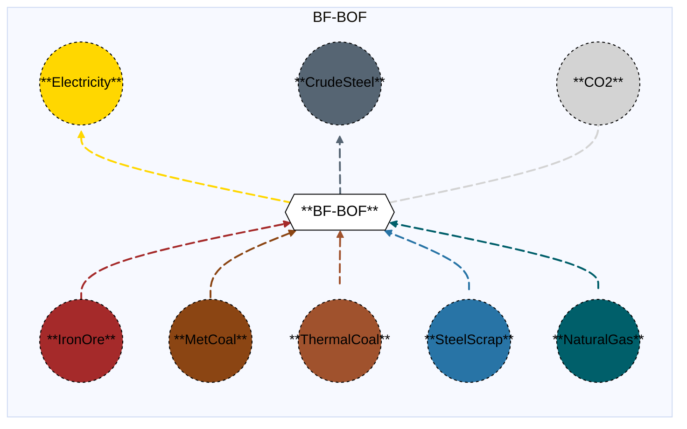

# Blast Furnace Basic Oxygen Furnace (with and without CCS)

## Contents

[Overview](@ref "bfbof_overview") | [Asset Structure](@ref "bfbof_asset_structure") | [Flow Equations](@ref "bfbof_flow_equations") | [Input File (Standard Format)](@ref "bfbof_input_file") | [Types - Asset Structure](@ref "bfbof_type_definition") | [Constructors](@ref "bfbof_constructors") | [Examples](@ref "bfbof_examples")

## [Overview](@id "bfbof_overview")

In Macro, Blast Furnace Basic Oxygen Furnace (BF-BOF) represents coal-based integrated blast furnace-basic oxygen furnace facilities that produce crude steel. These assets are defined using either JSON or CSV input files placed in the `assets` directory, typically named with descriptive identifiers like `integrated_blast_furnace_basic_oxygen_furnace.json` or `integrated_blast_furnace_basic_oxygen_furnace.csv`.

## [Asset Structure](@id "bfbof_asset_structure")

A BF-BOF plant (with and without CCS) is made of the following components:
- 1 `Transformation` component, representing the BF-BOF (with and without CCS).
- 9 `Edge` components:
    - 1 **incoming** `IronOre Edge`, representing the iron ore supply, represented by the IronOreBF subcommodity.  **(Macro distinguishes between two iron ore sub-commodities: IronOreBF, a blast-furnace-grade ore with approximately 65% iron content, and IronOreDR, a higher-purity ore (above ~67% iron) suitable for use in direct-reduction furnaces.)**
    - 1 **incoming** `MetCoal Edge`, representing metallurgical coal supply. 
    - 1 **incoming** `ThermalCoal Edge`, representing thermal coal supply.
    - 1 **incoming** `SteelScrap Edge`, representing merchant steel scrap supply. **(Steel scrap that is externally sourced, in contrast to home scrap, which is generated within the facility. Steel scrap is mainly used to limit overheating from the highly exothermic oxidation reactions in the BOF.)**
    - 1 **incoming** `NaturalGas Edge`, representing natural gas supply. **(Natural gas can serve as a supplemental reductant to lower coke consumption, or be blended with process off-gases to generate heat and electricity.)**
    - 1 **outgoing** `CrudeSteel Edge`, representing crude steel production.
    - 1 **outgoing** `Electricity Edge`, representing excess electricity production. **(if CCS is present, the BF-BOF-CCS facility is a net importer and the electricity edge is an incoming edge.)**.
    - 1 **outgoing** `CO2 Edge`, representing the CO2 that is emitted.
    - 1 **outgoing** `CO2Captured Edge`, representing the CO2 that is captured **(only if CCS is present)**.
      
Here is a graphical representation of the Blast Furnace Basic Oxygen Furnace asset without CCS:


## [Flow Equations](@id "bfbof_flow_equations")

The BlastFurnaceBasicOxygenFurnace asset follows these stoichiometric relationships:

```math
\begin{aligned}
\phi_{ironore} &= \phi_{crudesteel} \cdot \epsilon_{ironore\_consumption} \\
\phi_{metcoal} &= \phi_{crudesteel} \cdot \epsilon_{metcoal\_consumption} \\
\phi_{thermalcoal} &= \phi_{crudesteel} \cdot \epsilon_{thermalcoal\_consumption} \\
\phi_{steelscrap} &= \phi_{crudesteel} \cdot \epsilon_{steelscrap\_consumption} \\
\phi_{elec} &= \phi_{crudesteel} \cdot \epsilon_{elec\_consumption} \\
\phi_{natgas} &= \phi_{crudesteel} \cdot \epsilon_{natgas\_consumption} \\
\phi_{co2} &= \phi_{crudesteel} \cdot \epsilon_{emission\_rate} \\
\phi_{co2\_captured} &= \phi_{crudesteel} \cdot \epsilon_{co2\_capture\_rate} \quad \text{(if CCS)} \\
\end{aligned}
```
Where:
- $\phi$ represents the flow of each commodity
- $\epsilon$ represents the stoichiometric coefficients defined in the [Conversion Process Parameters](@ref "bfbof_conversion_process_parameters") section.

## [Input File (Standard Format)](@id "bfbof_input_file")

The easiest way to include an integrated BlastFurnaceBasicOxygenFurnace asset in a model is to create a new file (either JSON or CSV) and place it in the `assets` directory together with the other assets. 

```
your_case/
├── assets/
│   ├── integrated_blast_furnace_basic_oxygen_furnace.json    # or integrated_blast_furnace_basic_oxygen_furnace.csv
│   ├── other_assets.json
│   └── ...
├── system/
├── settings/
└── ...
```

This file can either be created manually, or using the `template_asset` function, as shown in the [Adding an Asset to a System](@ref) section of the User Guide. The file will be automatically loaded when you run your Macro model. An example of an input JSON file is shown in the [Examples](@ref "bfbof_examples") section.

The following tables outline the attributes that can be set for a BfBof.

### Transform Attributes
#### Essential Attributes
| Field | Type | Description |
|--------------|---------|------------|
| `Type` | String | Asset type identifier: "BlastFurnaceBasicOxygenFurnace" |
| `id` | String | Unique identifier for the asset instance |
| `location` | String | Geographic location/node identifier |
| `timedata` | String | Time resolution for the time series data linked to the transformation |

#### [Conversion Process Parameters](@id "bfbof_conversion_process_parameters")
| Field | Type | Description | Units | Default |
|--------------|---------|------------|----------------|----------|
| `ironore_consumption` | Float64 | iron ore consumption per ton of crude steel output | $t_{ironore}/t_{crudesteel}$ | 0.0 |
| `metcoal_consumption` | Float64 | metallurgical coal consumption per ton of crude steel output | $t_{metcoal}/t_{crudesteel}$ | 0.0 |
| `thermal_consumption` | Float64 | thermal coal consumption per ton of crude steel output | $MWh_{thermalcoal}/t_{crudesteel}$ | 0.0 |
| `steelscrap_consumption` | Float64 | steel scrap consumption per ton of crude steel output | $t_{steelscrap}/t_{crudesteel}$ | 0.0 |
| `electricity_production` | Float64 | electricity production per ton of crude steel output | $MWh_{elec}/t_{crudesteel}$ | 0.0 |
| `natgas_consumption` | Float64 | natural gas consumption per ton of crude steel output | $MWh_{natgas}/t_{crudesteel}$ | 0.0 |
| `emission_rate` | Float64 | CO2 emissions  per ton of crude steel output | $t_{CO2}/t_{crudesteel}$ | 0.0 |
| `capture_rate` | Float64 | captured CO2 emissions  per ton of crude steel output | $t_{CO2}/t_{crudesteel}$ | 0.0 |

### Edges

The definition of the `Edge` object can be found here [MacroEnergy.Edge](@ref).

#### General Attributes

| Field | Type | Values | Default | Description |
|:--------------| :------: |:------: | :------: |:-------|
| `type` | `String` | Any Macro commodity type matching the commodity of the edge | Required | Commodity of the edge. E.g. "Electricity". |
| `start_vertex` | `String` | Any node id present in the system matching the commodity of the edge | Required | ID of the starting vertex of the edge. The node must be present in the `nodes.json` file. E.g. "elec\_node\_1". |
| `end_vertex` | `String` | Any node id present in the system matching the commodity of the edge | Required | ID of the ending vertex of the edge. The node must be present in the `nodes.json` file. E.g. "crudesteel\_node\_1". |
| `availability` | `Dict` | Availability file path and header | Empty | Path to the availability file and column name for the availability time series to link to the edge. E.g. `{"timeseries": {"path": "assets/availability.csv", "header": "BlastFurnaceBasicOxygenFurnace"}}`.|
| `has_capacity` | `Bool` | `Bool` | `false` | Whether capacity variables are created for the edge. |
| `integer_decisions` | `Bool` | `Bool` | `false` | Whether capacity variables are integers. |
| `unidirectional` | `Bool` | `Bool` | `false` | Whether the edge is unidirectional. |

!!! warning "Asset expansion"
    As a modeling decision, only the `CrudeSteel` is allowed to expand. Therefore, both the `has_capacity` and `constraints` attributes can only be set for that edge. For all other edges, these attributes are pre-set to `false` and an empty list, respectively, to ensure the correct modeling of the asset. 

!!! warning "Directionality"
    The `unidirectional` attribute is set to `true` for all the edges.

#### Investment Parameters
| Field | Type | Description | Units | Default |
|--------------|---------|------------|----------------|----------|
| `can_retire` | Boolean | Whether capacity can be retired | - | true |
| `can_expand` | Boolean | Whether capacity can be expanded | - | true |
| `existing_capacity` | Float64 | Initial installed capacity | tCrudeSteel | 0.0 |

#### Economic Parameters
| Field | Type | Description | Units | Default |
|--------------|---------|------------|----------------|----------|
| `investment_cost` | Float64 | CAPEX per unit capacity | \$/tCrudeSteel/hr | 0.0 |
| `fixed_om_cost` | Float64 | Fixed O&M costs | \$/tCrudeSteel/hr | 0.0 |
| `variable_om_cost` | Float64 | Variable O&M costs | \$/tCrudeSteel | 0.0 |

### [Constraints Configuration](@id "bfbof_constraints")

BlastFurnaceBasicOxygenFurnace assets can have different constraints applied to them, and the user can configure them using the following fields:

| Field | Type | Description |
|--------------|---------|------------|
| `transform_constraints` | Dict{String,Bool} | List of constraints applied to the transformation component. |
| `output_constraints` | Dict{String,Bool} | List of constraints applied to the output edge component. |

For example, if the user wants to apply the [`BalanceConstraint`](@ref "balance_constraint_ref") to the transformation component and the [`MaxCapacityConstraint`](@ref "max_capacity_constraint_ref") to the output edge, the constraints fields should be set as follows:

```json
{
    "transform_constraints": {
        "BalanceConstraint": true
    },
    "edges":{
        "crudesteel_edge": {
            "constraints": {
                "MaxCapacityConstraint": true
            }
        }
}
```

Users can refer to the [Adding Asset Constraints to a System](@ref) section of the User Guide for a list of all the constraints that can be applied to the different components of a BfBof asset.

#### Default constraints
To simplify the input file and the asset configuration, the following constraints are applied to the BlastFurnaceBasicOxygenFurnace asset by default:

- [Balance constraint](@ref "balance_constraint_ref") (applied to the transformation component)
- [Capacity constraint](@ref "capacity_constraint_ref") (applied to the output crude steel edge)
- [MustRun constraint](@ref "mustrun_constraint_ref") (applied to the output crude steel edge)

## [Types - Asset Structure](@id "bfbof_type_definition")

The BlastFurnaceBasicOxygenFurnace asset is defined as follows:

```julia
struct BlastFurnaceBasicOxygenFurnace <: AbstractAsset
    id::AssetId
    bfbof_transform::Transformation
    ironore_edge::Edge{<:IronOre}
    metcoal_edge::Edge{<:Coal}
    thermalcoal_edge::Edge{<:Coal}
    steelscrap_edge::Edge{SteelScrap}
    natgas_edge::Edge{NaturalGas}
    crudesteel_edge::Edge{CrudeSteel}
    elec_edge::Edge{Electricity}
    co2_edge::Edge{CO2}
end
```

## [Constructors](@id "bfbof_constructors")

### Factory constructor
```julia
make(asset_type::Type{BlastFurnaceBasicOxygenFurnace}, data::AbstractDict{Symbol,Any}, system::System)
```

| Field | Type | Description |
|--------------|---------|------------|
| `asset_type` | `Type{BlastFurnaceBasicOxygenFurnace}` | Macro type of the asset |
| `data` | `AbstractDict{Symbol,Any}` | Dictionary containing the input data for the asset |
| `system` | `System` | System to which the asset belongs |

### Stochiometry balance data

```julia
bfbof_transform.balance_data = Dict(
    :ironore_consumption=> Dict(
        crudesteel_edge.id => get(transform_data, :ironore_consumption, 0.0),
        ironore_edge.id => 1.0
    ),
    :steelscrap_consumption=> Dict(
        crudesteel_edge.id => get(transform_data, :steelscrap_consumption, 0.0),
        steelscrap_edge.id => 1.0
    ),
    :electricity_production => Dict(
        crudesteel_edge.id => get(transform_data, :electricity_production, 0.0),
        elec_edge.id => -1.0
    ),
    :metcoal_consumption => Dict(
        crudesteel_edge.id => get(transform_data, :metcoal_consumption, 0.0),
        metcoal_edge.id => 1.0
    ),
    :thermalcoal_consumption => Dict(
        crudesteel_edge.id => get(transform_data, :thermalcoal_consumption, 0.0),
        thermalcoal_edge.id => 1.0
    ),
    :natgas_consumption => Dict(
        crudesteel_edge.id => get(transform_data, :natgas_consumption, 0.0),
        natgas_edge.id => 1.0
    ),
    :emissions => Dict(
        crudesteel_edge.id => get(transform_data, :emission_rate, 0.0),
        co2_edge.id => -1.0,
    )
)
```
!!! warning "Dictionary keys must match"
    In the code above, each `get` function call looks up a parameter in the `transform_data` dictionary using a symbolic key such as `:metcoal_consumption` or `:emission_rate`.
    These keys **must exactly match** the corresponding field names in your input asset `.json` or `.csv` files. Mismatched key names between the constructor file and the asset input will result in missing or incorrect parameter values (defaulting to `0.0`).


## [Examples](@ref "bfbof_examples")

This example illustrates a basic BlastFurnaceBasicOxygenFurnace configuration in JSON format, featuring standard parameters in a three-zone case.


```json
{
    "BlastFurnaceBasicOxygenFurnace": [
        {
            "type": "BlastFurnaceBasicOxygenFurnace",
            "global_data":{
                "nodes": {},
                "transforms": {
                    "timedata": "CrudeSteel"
                },
                "edges":{
                    "crudesteel_edge": {
                        "commodity": "CrudeSteel",
                        "unidirectional": true,
                        "has_capacity": true,
                        "can_retire": true,
                        "can_expand": true,
                        "integer_decisions": false
                    },
                    "ironore_edge":{
                        "commodity": "IronOreBF", 
                        "unidirectional": true,
                        "has_capacity": false
                    },
                    "metcoal_edge": {
                        "commodity": "MetCoal",
                        "unidirectional": true,
                        "has_capacity": false
                    },
                    "thermalcoal_edge": {
                        "commodity": "ThermalCoal",
                        "unidirectional": true,
                        "has_capacity": false
                    },
                    "steelscrap_edge":{
                        "commodity": "SteelScrap",
                        "unidirectional": true,
                        "has_capacity": false
                    },
                    "elec_edge":{
                        "commodity": "Electricity",
                        "unidirectional": true,
                        "has_capacity": false
                    },
                    "natgas_edge": {
                        "commodity": "NaturalGas",
                        "unidirectional": true,
                        "has_capacity": false
                    },
                    "co2_edge": {
                        "commodity": "CO2",
                        "unidirectional": true,
                        "has_capacity": false,
                        "end_vertex": "co2_sink_steel"
                    }
                }
            },
            "instance_data":[
                {
                    "id": "SE_bfbof",
                    "transforms":{
                        "ironore_consumption": 1.12,
                        "metcoal_consumption": 0.44,
                        "thermalcoal_consumption": 0.38,
                        "steelscrap_consumption": 0.26,
                        "electricity_production": 0.23,
                        "natgas_consumption": 0.06,
                        "emission_rate": 1.79
                    },
                    "edges":{
                            "crudesteel_edge": {
                                "end_vertex": "crudesteel_SE",
                                "existing_capacity": 0.0,
                                "investment_cost": 2846124,
                                "fixed_om_cost": 56922,
                                "variable_om_cost": 148
                            },
                            "metcoal_edge": {
                                "start_vertex": "metcoal_source"
                            },
                            "thermalcoal_edge": {
                                "start_vertex": "thermalcoal_source"
                            },
                            "elec_edge":{
                                "end_vertex": "elec_SE"
                            },
                            "natgas_edge":{
                                "start_vertex": "natgas_SE"
                            },
                            "ironore_edge":{
                                "start_vertex": "ironorebf_source"
                            },
                            "steelscrap_edge":{
                                "start_vertex": "steelscrap_source"
                            }

                        }
                },
                {
                    "id": "MIDAT_bfbof",
                    "transforms":{
                        "ironore_consumption": 1.12,
                        "metcoal_consumption": 0.44,
                        "thermalcoal_consumption": 0.38,
                        "steelscrap_consumption": 0.26,
                        "electricity_production": 0.23,
                        "natgas_consumption": 0.06,
                        "emission_rate": 1.79
                    },
                    "edges":{
                            "crudesteel_edge": {
                                "end_vertex": "crudesteel_MIDAT",
                                "existing_capacity": 0.0,
                                "investment_cost": 2846124,
                                "fixed_om_cost": 56922,
                                "variable_om_cost": 148
                            },
                            "metcoal_edge": {
                                "start_vertex": "metcoal_source"
                            },
                            "thermalcoal_edge": {
                                "start_vertex": "thermalcoal_source"
                            },
                            "elec_edge":{
                                "end_vertex": "elec_MIDAT"
                            },
                            "natgas_edge":{
                                "start_vertex": "natgas_MIDAT"
                            },
                            "ironore_edge":{
                                "start_vertex": "ironorebf_source"
                            },
                            "steelscrap_edge":{
                                "start_vertex": "steelscrap_source"
                            }
                        }
                },
                {
                    "id": "NE_bfbof",
                    "transforms":{
                        "ironore_consumption": 1.12,
                        "metcoal_consumption": 0.44,
                        "thermalcoal_consumption": 0.38,
                        "steelscrap_consumption": 0.26,
                        "electricity_production": 0.23,
                        "natgas_consumption": 0.06,
                        "emission_rate": 1.79
                    },
                    "edges":{
                            "crudesteel_edge": {
                                "end_vertex": "crudesteel_NE",
                                "existing_capacity": 0.0,
                                "investment_cost": 2846124,
                                "fixed_om_cost": 56922,
                                "variable_om_cost": 148
                            },
                            "metcoal_edge": {
                                "start_vertex": "metcoal_source"
                            },
                            "thermalcoal_edge": {
                                "start_vertex": "thermalcoal_source"
                            },
                            "elec_edge":{
                                "end_vertex": "elec_NE"
                            },
                            "natgas_edge":{
                                "start_vertex": "natgas_NE"
                            },
                            "ironore_edge":{
                                "start_vertex": "ironorebf_source"
                            },
                            "steelscrap_edge":{
                                "start_vertex": "steelscrap_source"
                            }
                        }
                }

            ]
        }
    ]
}
```
