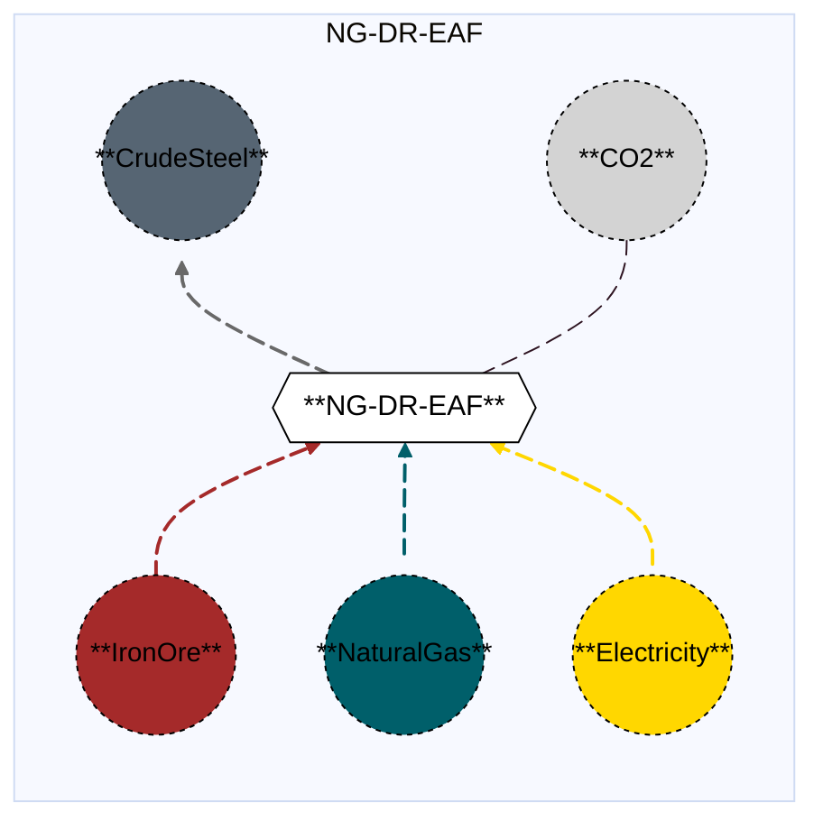

# Integrated Direct Reduction Electric Arc Furnace (with and without CCS)

## Contents

[Overview](@ref dreaf_overview) | [Asset Structure](@ref dreaf_asset_structure) | [Flow Equations](@ref dreaf_flow_equations) | [Input File (Standard Format)](@ref dreaf_input_file) | [Types - Asset Structure](@ref dreaf_type_definition) | [Constructors](@ref dreaf_constructors) | [Examples](@ref dreaf_examples)

## [Overview](@id dreaf_overview)

In Macro, the Integrated Direct Reduction–Electric Arc Furnace (DR-EAF) pathway represents integrated steelmaking facilities that combine direct reduction units with electric arc furnaces. In this configuration, iron ore is first reduced in a direct reduction reactor using natural gas or hydrogen as the reductant to produce hot direct reduced iron (hDRI), which is then melted in electric arc furnaces to produce crude steel.
These assets are specified via input files in JSON or CSV format, located in the assets directory, and are typically named with descriptive identifiers such as `integrated_hydrogen_direct_reduction_electric_arc_furnace.json` or `integrated_naturalgas_direct_reduction_electric_arc_furnace_ccs.csv`.

## [Asset Structure](@id dreaf_asset_structure)

A DR-EAF plant (with and without CCS) is made of the following components:
- 1 `Transformation` component, representing the DR-EAF (with and without CCS).
- 8 `Edge` components:
    - 1 **incoming** `IronOre Edge`, representing the iron ore supply in the form of the IronOreDR subcommodity. (Macro distinguishes between two iron ore sub-commodities: IronOreBF, a blast-furnace-grade ore with approximately 65% iron content, and IronOreDR, a higher-purity ore (above ~67% iron) suitable for use in direct-reduction furnaces.)
    - 1 **incoming** `Reductant Edge`, representing reductant supply, which can be natural gas or hydrogen.
    - 1 **incoming** `Electricity Edge`, representing electricity supply.
    - 1 **incoming** `CarbonSource Edge`, representing the carbon source supply. **(Applicable only when hydrogen is used as the reductant and not relevant for natural gas variants. The resulting DRI is carbon-free, and a carbon source—such as metallurgical coal, charcoal, or other carbon materials—is added to adjust the steel’s carbon content, minimize iron oxide losses, and supply additional chemical energy.)**.
    - 1 **outgoing** `CrudeSteel Edge`, representing the crude steel production.
    - 1 **outgoing** `CO2 Edge`, representing the CO2 that is emitted.
    - 1 **outgoing** `CO2Captured Edge`, representing the CO2 that is captured **(only if CCS is present)**.
      
Here is a graphical representation of a natural gas-based DR-EAF asset without CCS:


## [Flow Equations](@id dreaf_flow_equations)

The integrated DR-EAF asset follows these stoichiometric relationships:

```math
\begin{aligned}
\phi_{ironore} &= \phi_{crudesteel} \cdot \epsilon_{ironore\_consumption} \\
\phi_{fuel} &= \phi_{crudesteel} \cdot \epsilon_{fuel\_consumption} \\
\phi_{elec} &= \phi_{crudesteel} \cdot \epsilon_{elec\_consumption} \\
\phi_{carbonsource} &= \phi_{crudesteel} \cdot \epsilon_{carbonsource\_consumption} \quad \text{(non-zero when hydrogen is the reductant, not relevant for natural gas variants)} \\
\phi_{co2} &= \phi_{crudesteel} \cdot \epsilon_{emission\_rate} \\
\phi_{co2\_captured} &= \phi_{crudesteel} \cdot \epsilon_{co2\_capture\_rate} \quad \text{(if CCS)} \\
\end{aligned}
```
Where:
- ``\phi`` represents the flow of each commodity.
- ``\epsilon`` represents the stoichiometric coefficients defined in the [Conversion Process Parameters](@ref dreaf_conversion_process_parameters) section.

## [Input File (Standard Format)](@id dreaf_input_file)

The easiest way to include an integrated DirectReductionElectricArcFurnace asset in a model is to create a new file (either JSON or CSV) and place it in the `assets` directory together with the other assets. 

```
your_case/
├── assets/
│   ├── integrated_naturalgas_direct_reduction_electric_arc_furnace.json    # or integrated_naturalgas_direct_reduction_electric_arc_furnace.csv
│   ├── other_assets.json
│   └── ...
├── system/
├── settings/
└── ...
```

This file can either be created manually or using the `template_asset` function, as shown in the [Adding an Asset to a System](@ref) section of the User Guide. The file will be automatically loaded when you run your Macro model. An example of an input JSON file is shown in the [Examples](@ref dreaf_examples) section.

The following tables outline the attributes that can be set for a DirectReductionElectricArcFurnace.

### Transform Attributes
#### Essential Attributes
| Field | Type | Description |
|--------------|---------|------------|
| `type` | String | Asset type identifier: "DirectReductionElectricArcFurnace" |
| `id` | String | Unique identifier for the asset instance |
| `location` | String | Geographic location/node identifier |
| `timedata` | String | Time resolution for the time series data linked to the transformation |

#### [Conversion Process Parameters](@id dreaf_conversion_process_parameters)
| Field | Type | Description | Units | Default |
|--------------|---------|------------|----------------|----------|
| `ironore_consumption` | Float64 | iron ore consumption per ton of crude steel output | $t_{ironore}/t_{crudesteel}$ | 0.0 |
| `reductant_consumption` | Float64 | reductant consumption per ton of crude steel output | $MWh/t_{crudesteel}$ | 0.0 |
| `electricity_consumption` | Float64 | electricity consumption per ton of crude steel output | $MWh_{elec}/t_{crudesteel}$ | 0.0 |
| `carbonsource_consumption` | Float64 | carbon source (i.e., metallurgical coal, charcoal, etc.) consumption per ton of crude steel output	
 | $t/t_{crudesteel}$ | 0.0 |
| `emission_rate` | Float64 | CO2 emissions  per ton of crude steel output | $t_{CO2}/t_{crudesteel}$ | 0.0 |
| `capture_rate`| Float64 | captured CO2 emissions  per ton of crude steel output, only relevant for CCS variant. | $t_{CO2}/t_{crudesteel}$ | 0.0 |

#### General Attributes

| Field | Type | Values | Default | Description |
|:--------------| :------: |:------: | :------: |:-------|
| `type` | `String` | Any Macro commodity type matching the commodity of the edge | Required | Commodity of the edge. E.g. "Electricity". |
| `start_vertex` | `String` | Any node id present in the system matching the commodity of the edge | Required | ID of the starting vertex of the edge. The node must be present in the `nodes.json` file. E.g. "elec\_node\_1". |
| `end_vertex` | `String` | Any node id present in the system matching the commodity of the edge | Required | ID of the ending vertex of the edge. The node must be present in the `nodes.json` file. E.g. "crudesteel\_node\_1". |
| `availability` | `Dict` | Availability file path and header | Empty | Path to the availability file and column name for the availability time series to link to the edge. E.g. `{"timeseries": {"path": "assets/availability.csv", "header": "DirectReductionElectricArcFurnace"}}`.|
| `has_capacity` | `Bool` | `Bool` | `false` | Whether capacity variables are created for the edge. |
| `integer_decisions` | `Bool` | `Bool` | `false` | Whether capacity variables are integers. |
| `unidirectional` | `Bool` | `Bool` | `false` | Whether the edge is unidirectional. |

!!! warning "Asset expansion"
    As a modeling decision, only the `CrudeSteel` is allowed to expand. Therefore, both the `has_capacity` and `constraints` attributes can only be set for that edge. For all other edges, these attributes are pre-set to `false` and an empty list, respectively, to ensure the correct modeling of the asset. 

!!! warning "Directionality"
    The `unidirectional` attribute is set to `true` for all the edges.

#### Investment Parameters
| Field | Type | Description | Units | Default |
|--------------|---------|------------|----------------|----------|
| `can_retire` | Boolean | Whether capacity can be retired | - | true |
| `can_expand` | Boolean | Whether capacity can be expanded | - | true |
| `existing_capacity` | Float64 | Initial installed capacity | tCrudeSteel/hr | 0.0 |

#### Economic Parameters
| Field | Type | Description | Units | Default |
|--------------|---------|------------|----------------|----------|
| `investment_cost` | Float64 | CAPEX per unit capacity | \$/tCrudeSteel/hr | 0.0 |
| `fixed_om_cost` | Float64 | Fixed O&M costs | \$/tCrudeSteel/hr | 0.0 |
| `variable_om_cost` | Float64 | Variable O&M costs | \$/tCrudeSteel | 0.0 |

### [Constraints Configuration](@id dreaf_constraints)

DirectReductionElectricArcFurnace assets can have different constraints applied to them, and the user can configure them using the following fields:

| Field | Type | Description |
|--------------|---------|------------|
| `transform_constraints` | Dict{String,Bool} | List of constraints applied to the transformation component. |
| `output_constraints` | Dict{String,Bool} | List of constraints applied to the output edge component. |

For example, if the user wants to apply the [`BalanceConstraint`](@ref balance_constraint_ref) to the transformation component and the [`MaxCapacityConstraint`](@ref max_capacity_constraint_ref) to the output edge, the constraints fields should be set as follows:

```json
{
    "transform_constraints": {
        "BalanceConstraint": true
    },
    "edges":{
        "crudesteel_edge": {
            "constraints": {
                "MaxCapacityConstraint": true
            }
        }
}
```

Users can refer to the [Adding Asset Constraints to a System](@ref) section of the User Guide for a list of all the constraints that can be applied to the different components of a DirectReductionElectricArcFurnace asset.

#### Default constraints
To simplify the input file and the asset configuration, the following constraints are applied to the DrEaf asset by default:

- [Balance constraint](@ref balance_constraint_ref) (applied to the transformation component)
- [Capacity constraint](@ref capacity_constraint_ref) (applied to the output crude steel edge)
- [MustRun constraint](@ref must_run_constraint_ref) (applied to the output crude steel edge)

## [Types - Asset Structure](@id dreaf_type_definition)

The DirectReductionElectricArcFurnace asset is defined as follows:

```julia
struct DirectReductionElectricArcFurnace{T1 <: Commodity,T2 <: Commodity} <: AbstractAsset
    id::AssetId
    dreaf_transform::Transformation
    crudesteel_edge::Edge{CrudeSteel}
    reductant_edge::Edge{T1} # natural gas or hydrogen
    elec_edge::Edge{Electricity}
    carbonsource_edge::Edge{T2} # coal, charcoal, etc. 
    ironore_edge::Edge{<:IronOre}
    co2_edge::Edge{CO2}
end
```
Here, two of the asset edges are parameterized. T1 denotes the reductant, which may be either natural gas or hydrogen, while T2 denotes the carbon source, which may be coal, charcoal, or other carbon materials.

## [Constructors](@id dreaf_constructors)

### Factory constructor
```julia
make(asset_type::Type{DirectReductionElectricArcFurnace}, data::AbstractDict{Symbol,Any}, system::System)
```

| Field | Type | Description |
|--------------|---------|------------|
| `asset_type` | `Type{DirectReductionElectricArcFurnace}` | Macro type of the asset |
| `data` | `AbstractDict{Symbol,Any}` | Dictionary containing the input data for the asset |
| `system` | `System` | System to which the asset belongs |

### Stochiometry balance data
```julia
dreaf_transform.balance_data = Dict(
    :ironore_consumption=> Dict(
        crudesteel_edge.id => get(transform_data, :ironore_consumption, 0.0),
        ironore_edge.id => 1.0
    ),
    :electricity_consumption => Dict(
        crudesteel_edge.id => get(transform_data, :electricity_consumption, 0.0),
        elec_edge.id => 1.0
    ),
    :reductant_consumption => Dict(
        crudesteel_edge.id => get(transform_data, :reductant_consumption, 0.0),
        reductant_edge.id => 1.0
    ),
    :carbonsource_consumption => Dict(
        crudesteel_edge.id => get(transform_data, :carbonsource_consumption, 0.0),
        carbonsource_edge.id => 1.0
    ),
    :emissions => Dict(
        crudesteel_edge.id => get(transform_data, :emission_rate, 0.0),
        co2_edge.id => -1.0, 
    ),
)
```
!!! warning "Dictionary keys must match"
    In the code above, each `get` function call looks up a parameter in the `transform_data` dictionary using a symbolic key such as `:reductant_consumption` or `:emission_rate`.
    These keys **must exactly match** the corresponding field names in your input asset `.json` or `.csv` files. Mismatched key names between the constructor file and the asset input will result in missing or incorrect parameter values (defaulting to `0.0`).
    

## [Examples](@id dreaf_examples)

This example illustrates a basic DirectReductionElectricArcFurnace configuration using natural gas as a reductant and metallurgical coal as a carbon source in JSON format, featuring standard parameters in a three-zone case.


```json
{
    "IntegratedNaturalGasDirectReductionElectricArcFurnace": [
        {
            "type": "DirectReductionElectricArcFurnace",
            "global_data":{
                "nodes": {},
                "transforms": {
                    "timedata": "NaturalGas",
                    "constraints": {
                            "BalanceConstraint": true
                    }
                },
                "edges":{
                    "crudesteel_edge": {
                        "commodity": "CrudeSteel",
                        "unidirectional": true,
                        "has_capacity": true,
                        "can_retire": true,
                        "can_expand": true,
                        "constraints": {
                            "CapacityConstraint": true
                        }
                    },
                    "reductant_edge": {
                        "commodity": "NaturalGas",
                        "unidirectional": true,
                        "has_capacity": false
                    },
                    "ironore_edge":{
                        "commodity": "IronOreDR",
                        "unidirectional": true,
                        "has_capacity": false
                    },
                    "elec_edge":{
                        "commodity": "Electricity",
                        "unidirectional": true,
                        "has_capacity": false
                    },
                    "carbonsource_edge": {
                        "commodity": "MetCoal",
                        "unidirectional": true,
                        "has_capacity": false
                    },
                    "co2_edge": {
                        "commodity": "CO2",
                        "unidirectional": true,
                        "has_capacity": false,
                        "end_vertex": "co2_sink_steel"
                    }
                }
            },
            "instance_data":[
                {
                    "id": "SE_natural_gas_dr_eaf",
                    "transforms":{
                        "ironore_consumption": 1.59,
                        "reductant_consumption": 3.89,
                        "electricity_consumption": 0.6,
                        "emission_rate": 0.85
                    },
                    "edges":{
                            "crudesteel_edge": {
                                "end_vertex": "crudesteel_SE",
                                "existing_capacity": 0.0,
                                "investment_cost": 6973921,
                                "fixed_om_cost": 139478,
                                "variable_om_cost": 135
                            },
                            "reductant_edge": {
                                "start_vertex": "natgas_SE"
                            },
                            "elec_edge":{
                                "start_vertex": "elec_SE"
                            },
                            "ironore_edge":{
                                "start_vertex": "ironoredr_source"
                            },
                            "carbonsource_edge": {
                                "start_vertex": "metcoal_source"
                            }
                        }
                },
                {
                    "id": "MIDAT_natural_gas_dr_eaf",
                    "transforms":{
                        "ironore_consumption": 1.59,
                        "reductant_consumption": 3.89,
                        "electricity_consumption": 0.6,
                        "emission_rate": 0.85
                    },
                    "edges":{
                            "crudesteel_edge": {
                                "end_vertex": "crudesteel_MIDAT",
                                "existing_capacity": 0.0,
                                "investment_cost": 6973921,
                                "fixed_om_cost": 139478,
                                "variable_om_cost": 135
                            },
                            "reductant_edge": {
                                "start_vertex": "natgas_MIDAT"
                            },
                            "elec_edge":{
                                "start_vertex": "elec_MIDAT"
                            },
                            "ironore_edge":{
                                "start_vertex": "ironoredr_source"
                            },
                            "carbonsource_edge": {
                                "start_vertex": "metcoal_source"
                            }
                        }
                },
                {
                    "id": "NE_natural_gas_dr_eaf",
                    "transforms":{
                        "ironore_consumption": 1.59,
                        "reductant_consumption": 3.89,
                        "electricity_consumption": 0.6,
                        "emission_rate": 0.85
                    },
                    "edges":{
                            "crudesteel_edge": {
                                "end_vertex": "crudesteel_NE",
                                "existing_capacity": 0.0,
                                "investment_cost": 6973921,
                                "fixed_om_cost": 139478,
                                "variable_om_cost": 135
                            },
                            "reductant_edge": {
                                "start_vertex": "natgas_NE"
                            },
                            "elec_edge":{
                                "start_vertex": "elec_NE"
                            },
                            "ironore_edge":{
                                "start_vertex": "ironoredr_source"
                            },
                            "carbonsource_edge": {
                                "start_vertex": "metcoal_source"
                            }
                        }
                }

            ]
        }
    ]
}
```

## See Also

- [Edges](@ref) - Components that connect Vertices and carry flows
- [Transformations](@ref) - Processes that transform flows of several Commodities
- [Nodes](@ref) - Network nodes that allow for import and export of commodities
- [Vertices](@ref) - Network nodes that edges connect
- [Assets](@ref "Assets") - Higher-level components made from edges, nodes, storage, and transformations
- [Commodities](@ref) - Types of resources stored by Commodities
- [Time Data](@ref) - Temporal modeling framework
- [Constraints](@ref) - Additional constraints for Storage and other components
