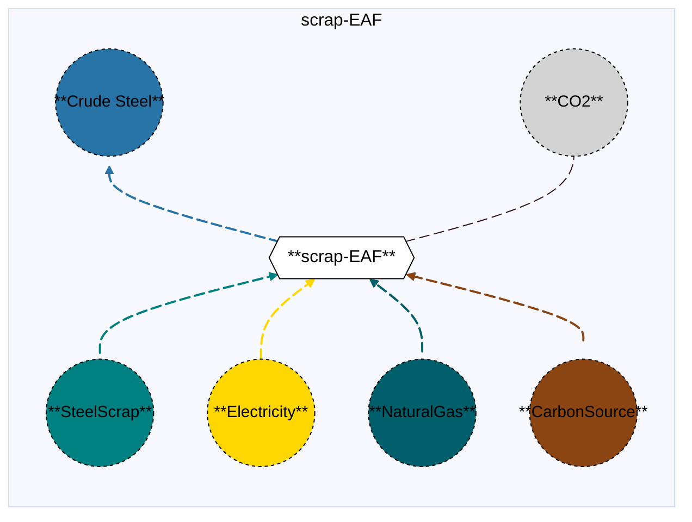

# Electric Arc Furnace

## Contents

[Overview](@ref "eaf_overview") | [Asset Structure](@ref "eaf_asset_structure") | [Flow Equations](@ref "eaf_flow_equations") | [Input File (Standard Format)](@ref "eaf_input_file") | [Types - Asset Structure](@ref "eaf_type_definition") | [Constructors](@ref "eaf_constructors") | [Examples](@ref "eaf_examples")

## [Overview](@id "eaf_overview")

In Macro, Electric Arc Furnace (EAF) refers to standalone steelmaking facilities where steel scrap is melted and refined into crude steel using electric arc furnaces. These assets are specified via input files in JSON or CSV format, located in the assets directory, and are typically named with descriptive identifiers such as scrap_eaf.json or scrap_eaf.csv.

## [Asset Structure](@id "eaf_asset_structure")

An EAF plant is made of the following components:
- 1 `Transformation` component, representing the electric arc furnace.
- 6 `Edge` components:
    - 1 **incoming** `SteelScrap Edge`, representing the steel scrap supply. 
    - 1 **incoming** `Electricity Edge`, representing the electricity supply.
    - 1 **incoming** `NaturalGas Edge`, representing the natural gas supply.
    - 1 **incoming** `CarbonSource Edge`, representing the carbon source supply. **(minimal amount added to adjust the carbon content of the steel, reduce iron oxide losses, and add chemical energy. The carbon source can be metallurgical coal, charcoal, etc.)**.
    - 1 **outgoing** `CrudeSteel Edge`, representing  crude steel production.
    - 1 **outgoing** `CO2 Edge`, representing CO2 emitted into the atmosphere.
      
Here is a graphical representation of a scrap-fed EAF asset:


## [Flow Equations](@id "dreaf_flow_equations")

The EAF asset follows these stoichiometric relationships:

```math
\begin{aligned}
\phi_{feedstock} &= \phi_{crudesteel} \cdot \epsilon_{feedstock\_consumption} \\
\phi_{elec} &= \phi_{crudesteel} \cdot \epsilon_{elec\_consumption} \\
\phi_{elec} &= \phi_{crudesteel} \cdot \epsilon_{natgas\_consumption} \\
\phi_{elec} &= \phi_{crudesteel} \cdot \epsilon_{carbonsource\_consumption} \\
\phi_{co2} &= \phi_{crudesteel} \cdot \epsilon_{emission\_rate} \\
\end{aligned}
```
Where:
- $\phi$ represents the flow of each commodity.
- $\epsilon$ represents the stoichiometric coefficients defined in the [Conversion Process Parameters](@ref "eaf_conversion_process_parameters") section.

## [Input File (Standard Format)](@id "eaf_input_file")

The easiest way to include an integrated DR-EAF asset in a model is to create a new file (either JSON or CSV) and place it in the `assets` directory together with the other assets. 

```
your_case/
├── assets/
│   ├── scrap_eaf.json    # or scrap_eaf.csv
│   ├── other_assets.json
│   └── ...
├── system/
├── settings/
└── ...
```

This file can either be created manually or using the `template_asset` function, as shown in the [Adding an Asset to a System](@ref) section of the User Guide. The file will be automatically loaded when you run your Macro model. An example of an input JSON file is shown in the [Examples](@ref "eaf_examples") section.

The following tables outline the attributes that can be set for a DrEaf.

### Transform Attributes
#### Essential Attributes
| Field | Type | Description |
|--------------|---------|------------|
| `Type` | String | Asset type identifier: "Eaf" |
| `id` | String | Unique identifier for the asset instance |
| `location` | String | Geographic location/node identifier |
| `timedata` | String | Time resolution for the time series data linked to the transformation |

#### [Conversion Process Parameters](@id "dreaf_conversion_process_parameters")
| Field | Type | Description | Units | Default |
|--------------|---------|------------|----------------|----------|
| `ironore_consumption` | Float64 | iron ore consumption per ton of crude steel output | $t_{ironore}/t_{crudesteel}$ | 0.0 |
| `steelscrap_consumption` | Float64 | steel scrap consumption per ton of crude steel output | $t_{steelscrap}/t_{crudesteel}$ | 0.0 |
| `electricity_consumption` | Float64 | electricity consumption per ton of crude steel output | $MWh_{elec}/t_{crudesteel}$ | 0.0 |
| `natgas_consumption` | Float64 | natural gas consumption per ton of crude steel output | $MWh/t_{crudesteel}$ | 0.0 |
| `carbonsource_consumption` | Float64 | carbon source (i.e. metallurgical coal, charcoal, biomass, etc.) consumption per ton of crude steel output | $t/t_{crudesteel}$ | 0.0 |
| `emission_rate` | Float64 | CO2 emissions  per ton of crude steel output | $t_{CO2}/t_{crudesteel}$ | 0.0 |

### Edges

The definition of the `Edge` object can be found here [MacroEnergy.Edge](@ref).

#### General Attributes

| Field | Type | Values | Default | Description |
|:--------------| :------: |:------: | :------: |:-------|
| `type` | `String` | Any Macro commodity type matching the commodity of the edge | Required | Commodity of the edge. E.g. "Electricity". |
| `start_vertex` | `String` | Any node id present in the system matching the commodity of the edge | Required | ID of the starting vertex of the edge. The node must be present in the `nodes.json` file. E.g. "elec\_node\_1". |
| `end_vertex` | `String` | Any node id present in the system matching the commodity of the edge | Required | ID of the ending vertex of the edge. The node must be present in the `nodes.json` file. E.g. "crudesteel\_node\_1". |
| `availability` | `Dict` | Availability file path and header | Empty | Path to the availability file and column name for the availability time series to link to the edge. E.g. `{"timeseries": {"path": "assets/availability.csv", "header": "Eaf"}}`.|
| `has_capacity` | `Bool` | `Bool` | `false` | Whether capacity variables are created for the edge. |
| `integer_decisions` | `Bool` | `Bool` | `false` | Whether capacity variables are integers. |
| `unidirectional` | `Bool` | `Bool` | `false` | Whether the edge is unidirectional. |

!!! warning "Asset expansion"
    As a modeling decision, only the `CrudeSteel` is allowed to expand. Therefore, both the `has_capacity` and `constraints` attributes can only be set for that edge. For all other edges, these attributes are pre-set to `false` and an empty list, respectively, to ensure the correct modeling of the asset. 

!!! warning "Directionality"
    The `unidirectional` attribute is set to `true` for all the edges.

#### Investment Parameters
| Field | Type | Description | Units | Default |
|--------------|---------|------------|----------------|----------|
| `can_retire` | Boolean | Whether capacity can be retired | - | true |
| `can_expand` | Boolean | Whether capacity can be expanded | - | true |
| `existing_capacity` | Float64 | Initial installed capacity | tCrudeSteel/hr | 0.0 |

#### Economic Parameters
| Field | Type | Description | Units | Default |
|--------------|---------|------------|----------------|----------|
| `investment_cost` | Float64 | CAPEX per unit capacity | \$/tCrudeSteel/hr | 0.0 |
| `fixed_om_cost` | Float64 | Fixed O&M costs | \$/tCrudeSteel/hr | 0.0 |
| `variable_om_cost` | Float64 | Variable O&M costs | \$/tCrudeSteel | 0.0 |

### [Constraints Configuration](@id "dreaf_constraints")

ElectricArcFurnance assets can have different constraints applied to them, and the user can configure them using the following fields:

| Field | Type | Description |
|--------------|---------|------------|
| `transform_constraints` | Dict{String,Bool} | List of constraints applied to the transformation component. |
| `output_constraints` | Dict{String,Bool} | List of constraints applied to the output edge component. |

For example, if the user wants to apply the [`BalanceConstraint`](@ref "balance_constraint_ref") to the transformation component and the [`MaxCapacityConstraint`](@ref "max_capacity_constraint_ref") to the output edge, the constraints fields should be set as follows:

```json
{
    "transform_constraints": {
        "BalanceConstraint": true
    },
    "edges":{
        "crudesteel_edge": {
            "constraints": {
                "MaxCapacityConstraint": true
            }
        }
}
```

Users can refer to the [Adding Asset Constraints to a System](@ref) section of the User Guide for a list of all the constraints that can be applied to the different components of a DrEaf asset.

#### Default constraints
To simplify the input file and the asset configuration, the following constraints are applied to the DrEaf asset by default:

- [Balance constraint](@ref "balance_constraint_ref") (applied to the transformation component)
- [Capacity constraint](@ref "capacity_constraint_ref") (applied to the output crude steel edge)
- [MustRun constraint](@ref "mustrun_constraint_ref") (applied to the output crude steel edge)

## [Types - Asset Structure](@id "eaf_type_definition")

The ElectricArcFurnace asset is defined as follows:

```julia
struct ElectricArcFurnace{T <: Commodity} <: AbstractAsset
    id::AssetId
    eaf_transform::Transformation
    crudesteel_edge::Edge{CrudeSteel}
    elec_edge::Edge{Electricity}
    steelscrap_edge::Edge{SteelScrap} 
    naturalgas_edge::Edge{NaturalGas}
    carbonsource_edge::Edge{T}
    co2_edge::Edge{CO2}
end
```
Here, T denotes the carbon source, which may be metallurgical coal, charcoal, etc.

## [Constructors](@id "eaf_constructors")

### Factory constructor
```julia
make(asset_type::Type{ElectricArcFurnace}, data::AbstractDict{Symbol,Any}, system::System)
```

| Field | Type | Description |
|--------------|---------|------------|
| `asset_type` | `Type{ElectricArcFurnace}` | Macro type of the asset |
| `data` | `AbstractDict{Symbol,Any}` | Dictionary containing the input data for the asset |
| `system` | `System` | System to which the asset belongs |

### Stochiometry balance data
```julia
eaf_transform.balance_data = Dict(
    :electricity_consumption => Dict(
        crudesteel_edge.id => get(transform_data, :electricity_consumption, 1.0),
        elec_edge.id => 1.0,
    ),
    :steelscrap_consumption => Dict(
        crudesteel_edge.id => get(transform_data, :steelscrap_consumption, 1.0),
        steelscrap_edge.id => 1.0
    ),
    :naturalgas_consumption => Dict(
        crudesteel_edge.id => get(transform_data, :naturalgas_consumption, 1.0),
        naturalgas_edge.id => 1.0,
    ),
    :carbonsource_consumption => Dict(
        crudesteel_edge.id => get(transform_data, :carbonsource_consumption, 0.0),
        carbonsource_edge.id => 1.0,
    ),
    :emissions => Dict(
        crudesteel_edge.id => get(transform_data, :emission_rate, 0.0),
        co2_edge.id => -1.0,
    ) 
)
```
!!! warning "Dictionary keys must match"
    In the code above, each `get` function call looks up a parameter in the `transform_data` dictionary using a symbolic key such as `:steelscrap_consumption` or `:emission_rate`.
    These keys **must exactly match** the corresponding field names in your input asset `.json` or `.csv` files. Mismatched key names between the constructor file and the asset input will result in missing or incorrect parameter values (defaulting to `0.0`).
    

## [Examples](@ref "eaf_examples")

This example illustrates a basic standalone electric arc furnace configuration in JSON format, featuring standard parameters in a three-zone case. In the example below, the carbon source is assumed to be metallurgical coal.


```json 
{
    "StandaloneScrapElectricArcFurnace": [
        {
            "type": "ElectricArcFurnace",
            "global_data":{
                "transforms": {
                    "timedata": "Electricity",
                    "constraints": {
                            "BalanceConstraint": true
                    }
                },
                "edges":{
                    "crudesteel_edge":{
                        "type": "CrudeSteel",
                        "unidirectional": true,
                        "has_capacity": true,
                        "can_expand": true,
                        "can_retire": true,
                        "integer_decisions": false,
                        "constraints": {
                            "CapacityConstraint": true
                        }
                    },
                    "steelscrap_edge":{
                        "commodity": "SteelScrap",
                        "unidirectional": true,
                        "has_capacity": false
                    },
                    "elec_edge":{
                        "commodity": "Electricity",
                        "unidirectional": true,
                        "has_capacity": false
                    },
                    "naturalgas_edge": {
                        "commodity": "NaturalGas",
                        "unidirectional": true,
                        "has_capacity": false
                    },
                    "carbonsource_edge": {
                        "commodity": "MetCoal",
                        "unidirectional": true,
                        "has_capacity": false
                    },
                    "co2_edge": {
                        "commodity": "CO2",
                        "unidirectional": true,
                        "has_capacity": false,
                        "end_vertex": "co2_sink"
                    }
                }
            },
            "instance_data":[
                {
                    "id": "SE_scrap_eaf",
                    "transforms": {
                        "steelscrap_consumption": 1.14,
                        "electricity_consumption": 0.63,
                        "naturalgas_consumption": 0.41,
                        "carbonsource_consumption": 0.02,
                        "emission_rate": 0.16
                    },
                    "edges": {
                        "crudesteel_edge": {
                            "end_vertex": "crudesteel_SE",
                            "existing_capacity": 0.0,
                            "investment_cost": 2097144,
                            "fixed_om_cost": 41943,
                            "variable_om_cost": 72
                        },
                        "steelscrap_edge": {
                            "start_vertex": "steelscrap_source"
                        },
                        "elec_edge": {
                            "start_vertex": "elec_SE"
                        },
                        "naturalgas_edge": {
                            "start_vertex": "natgas_SE"
                        },
                        "carbonsource_edge": {
                            "start_vertex": "metcoal_source"
                        }
                    }
                },
                {
                    "id": "MIDAT_scrap_eaf",
                    "transforms": {
                        "steelscrap_consumption": 1.14,
                        "electricity_consumption": 0.63,
                        "naturalgas_consumption": 0.41,
                        "carbonsource_consumption": 0.02,
                        "emission_rate": 0.16   
                    },
                    "edges": {
                        "crudesteel_edge": {
                            "end_vertex": "crudesteel_MIDAT",
                            "existing_capacity": 0.0,
                            "investment_cost": 2097144,
                            "fixed_om_cost": 41943,
                            "variable_om_cost": 72
                        },
                        "steelscrap_edge": {
                            "start_vertex": "steelscrap_source"
                        },
                        "elec_edge": {
                            "start_vertex": "elec_MIDAT"
                        },
                        "naturalgas_edge": {
                            "start_vertex": "natgas_MIDAT"
                        },
                        "carbonsource_edge": {
                            "start_vertex": "metcoal_source"
                        }
                    }
                },
                {
                    "id": "NE_scrap_eaf",
                    "transforms": {
                        "steelscrap_consumption": 1.14,
                        "electricity_consumption": 0.63,
                        "naturalgas_consumption": 0.41,
                        "carbonsource_consumption": 0.02,
                        "emission_rate": 0.16
                    },
                    "edges": {
                        "crudesteel_edge": {
                            "end_vertex": "crudesteel_NE",
                            "existing_capacity": 0.0,
                            "investment_cost": 2097144,
                            "fixed_om_cost": 41943,
                            "variable_om_cost": 72
                        },
                        "steelscrap_edge": {
                            "start_vertex": "steelscrap_source"
                        },
                        "elec_edge": {
                            "start_vertex": "elec_NE"
                        },
                        "naturalgas_edge": {
                            "start_vertex": "natgas_NE"
                        },
                        "carbonsource_edge": {
                            "start_vertex": "metcoal_source"
                        }
                    }
                }
            ]
        }
    ]
}
```
