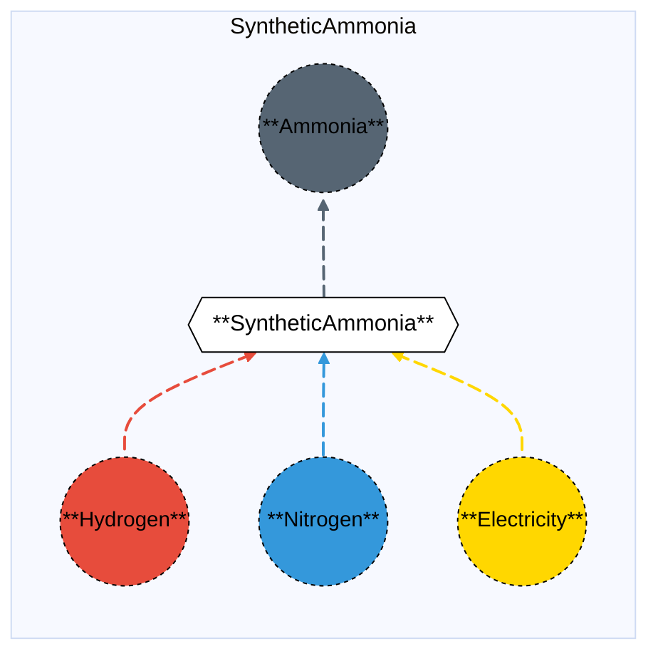

# Synthetic Ammonia (Electrochemical)

## Contents

[Overview](@ref syntheticammonia_overview) | [Asset Structure](@ref syntheticammonia_asset_structure) | [Flow Equations](@ref syntheticammonia_flow_equations) | [Input File (Standard Format)](@ref syntheticammonia_input_file) | [Types - Asset Structure](@ref syntheticammonia_type_definition) | [Constructors](@ref syntheticammonia_constructors) | [Examples](@ref syntheticammonia_examples)

## [Overview](@id syntheticammonia_overview)

In Macro, the Synthetic Ammonia asset represents an electrochemical ammonia production facility that uses hydrogen and nitrogen as feedstocks. This technology produces ammonia through electrochemical synthesis, typically using renewable electricity. Unlike thermal ammonia production, this process has zero direct CO₂ emissions if green hydrogen is used as the feedstock.

These assets are defined using either JSON or CSV input files placed in the `assets` directory, typically named with descriptive identifiers like `synthetic_ammonia.json` or `synthetic_ammonia.csv`.

## [Asset Structure](@id syntheticammonia_asset_structure)

A Synthetic Ammonia plant is made of the following components:
- 1 `Transformation` component, representing the electrochemical ammonia synthesis process.
- 4 `Edge` components:
    - 1 **incoming** `Hydrogen Edge`, representing hydrogen supply.
    - 1 **incoming** `Nitrogen Edge`, representing nitrogen supply.
    - 1 **incoming** `Electricity Edge`, representing electricity consumption.
    - 1 **outgoing** `Ammonia Edge`, representing ammonia production.

Here is a graphical representation of the Synthetic Ammonia asset:



## [Flow Equations](@id syntheticammonia_flow_equations)

The Synthetic Ammonia asset follows these stoichiometric relationships:

```math
\begin{aligned}
\phi_{h2} &= \phi_{nh3} \cdot \epsilon_{h2\_consumption} \\
\phi_{n2} &= \phi_{nh3} \cdot \epsilon_{n2\_consumption} \\
\phi_{elec} &= \phi_{nh3} \cdot \epsilon_{electricity\_consumption} \\
\end{aligned}
```

Where:
- ``\phi`` represents the flow of each commodity
- ``\epsilon`` represents the stoichiometric coefficients defined in the [Conversion Process Parameters](@ref syntheticammonia_conversion_process_parameters) section.

## [Input File (Standard Format)](@id syntheticammonia_input_file)

The easiest way to include a Synthetic Ammonia asset in a model is to create a new file (either JSON or CSV) and place it in the `assets` directory together with the other assets. 

```
your_case/
├── assets/
│   ├── synthetic_ammonia.json    # or synthetic_ammonia.csv
│   ├── other_assets.json
│   └── ...
├── system/
├── settings/
└── ...
```

This file can either be created manually, or using the `template_asset` function, as shown in the [Adding an Asset to a System](@ref) section of the User Guide. The file will be automatically loaded when you run your Macro model. An example of an input JSON file is shown in the [Examples](@ref syntheticammonia_examples) section.

The following tables outline the attributes that can be set for a Synthetic Ammonia asset.

### Transform Attributes
#### Essential Attributes
| Field | Type | Description |
|--------------|---------|------------|
| `Type` | String | Asset type identifier: "SyntheticAmmonia" |
| `id` | String | Unique identifier for the asset instance |
| `location` | String | Geographic location/node identifier |
| `timedata` | String | Time resolution for the time series data linked to the transformation |

#### [Conversion Process Parameters](@id syntheticammonia_conversion_process_parameters)
| Field | Type | Description | Units | Default |
|--------------|---------|------------|----------------|----------|
| `h2_consumption` | Float64 | Hydrogen consumption per MWh of ammonia output | $MWh_{H_2}/MWh_{NH_3}$ | 1.1484 |
| `n2_consumption` | Float64 | Nitrogen consumption per MWh of ammonia output | $t_{N_2}/MWh_{NH_3}$ | 0.1597 |
| `electricity_consumption` | Float64 | Electricity consumption per MWh of ammonia output | $MWh_{elec}/MWh_{NH_3}$ | 0.2473 |

#### General Attributes

| Field | Type | Values | Default | Description |
|:--------------| :------: |:------: | :------: |:-------|
| `type` | `String` | Any Macro commodity type matching the commodity of the edge | Required | Commodity of the edge. E.g. "Electricity". |
| `start_vertex` | `String` | Any node id present in the system matching the commodity of the edge | Required | ID of the starting vertex of the edge. The node must be present in the `nodes.json` file. E.g. "elec\_node\_1". |
| `end_vertex` | `String` | Any node id present in the system matching the commodity of the edge | Required | ID of the ending vertex of the edge. The node must be present in the `nodes.json` file. E.g. "nh3\_node\_1". |
| `availability` | `Dict` | Availability file path and header | Empty | Path to the availability file and column name for the availability time series to link to the edge. E.g. `{"timeseries": {"path": "assets/availability.csv", "header": "SyntheticAmmonia"}}`.|
| `has_capacity` | `Bool` | `Bool` | `false` | Whether capacity variables are created for the edge. |
| `integer_decisions` | `Bool` | `Bool` | `false` | Whether capacity variables are integers. |
| `unidirectional` | `Bool` | `Bool` | `false` | Whether the edge is unidirectional. |

!!! warning "Asset expansion"
    As a modeling decision, only the `Ammonia` edge is allowed to expand. Therefore, both the `has_capacity` and `constraints` attributes can only be set for that edge. For all other edges, these attributes are pre-set to `false` and an empty list, respectively, to ensure the correct modeling of the asset. 

#### Investment Parameters
| Field | Type | Description | Units | Default |
|--------------|---------|------------|----------------|----------|
| `can_retire` | Boolean | Whether capacity can be retired | - | true |
| `can_expand` | Boolean | Whether capacity can be expanded | - | true |
| `existing_capacity` | Float64 | Initial installed capacity | MWh NH₃ | 0.0 |

#### Economic Parameters
| Field | Type | Description | Units | Default |
|--------------|---------|------------|----------------|----------|
| `investment_cost` | Float64 | CAPEX per unit capacity | \$/MW | 1,461,749.91 |
| `fixed_om_cost` | Float64 | Fixed O&M costs | \$/MW-yr | 2,512.7481 |
| `variable_om_cost` | Float64 | Variable O&M costs | \$/MWh NH₃ | 0.02027 |
| `lifetime` | Float64 | Asset lifetime | years | 30 |

### [Constraints Configuration](@id syntheticammonia_constraints)

Synthetic Ammonia assets can have different constraints applied to them, and the user can configure them using the following fields:

| Field | Type | Description |
|--------------|---------|------------|
| `transform_constraints` | Dict{String,Bool} | List of constraints applied to the transformation component. |
| `output_constraints` | Dict{String,Bool} | List of constraints applied to the output edge component. |

For example, if the user wants to apply the [`BalanceConstraint`](@ref balance_constraint_ref) to the transformation component and the [`CapacityConstraint`](@ref capacity_constraint_ref) to the output edge, the constraints fields should be set as follows:

```json
{
    "transform_constraints": {
        "BalanceConstraint": true
    },
    "edges":{
        "nh3_edge": {
            "constraints": {
                "CapacityConstraint": true
            }
        }
    }
}
```

Users can refer to the [Adding Asset Constraints to a System](@ref) section of the User Guide for a list of all the constraints that can be applied to the different components of a Synthetic Ammonia asset.

#### Default constraints
To simplify the input file and the asset configuration, the following constraints are applied to the Synthetic Ammonia asset by default:

- [Balance constraint](@ref balance_constraint_ref) (applied to the transformation component)
- [Capacity constraint](@ref capacity_constraint_ref) (applied to the output ammonia edge)

## [Types - Asset Structure](@id syntheticammonia_type_definition)

The Synthetic Ammonia asset is defined as follows:

```julia
struct SyntheticAmmonia <: AbstractAsset
    id::AssetId
    synthetic_ammonia_transform::Transformation
    h2_edge::Edge{<:Hydrogen}
    n2_edge::Edge{<:Nitrogen}
    elec_edge::Edge{<:Electricity}
    nh3_edge::Edge{<:Ammonia}
end
```

## [Constructors](@id syntheticammonia_constructors)

### Factory constructor
```julia
make(asset_type::Type{SyntheticAmmonia}, data::AbstractDict{Symbol,Any}, system::System)
```

| Field | Type | Description |
|--------------|---------|------------|
| `asset_type` | `Type{SyntheticAmmonia}` | Macro type of the asset |
| `data` | `AbstractDict{Symbol,Any}` | Dictionary containing the input data for the asset |
| `system` | `System` | System to which the asset belongs |

### Stoichiometry balance data

```julia
synthetic_ammonia_transform.balance_data = Dict(
    :hydrogen => Dict(
        nh3_edge.id => get(transform_data, :h2_consumption, 1.1484),
        h2_edge.id => 1.0,
    ),
    :nitrogen => Dict(
        nh3_edge.id => get(transform_data, :n2_consumption, 0.1597),
        n2_edge.id => 1.0,
    ),
    :electricity => Dict(
        nh3_edge.id => get(transform_data, :electricity_consumption, 0.2473),
        elec_edge.id => 1.0
    ),
)
```

!!! warning "Dictionary keys must match"
    In the code above, each `get` function call looks up a parameter in the `transform_data` dictionary using a symbolic key such as `:h2_consumption` or `:n2_consumption`.
    These keys **must exactly match** the corresponding field names in your input asset `.json` or `.csv` files. Mismatched key names between the constructor file and the asset input will result in missing or incorrect parameter values (defaulting to the values shown above).

## [Examples](@id syntheticammonia_examples)

This example illustrates a basic Synthetic Ammonia configuration in JSON format:

```json
{
    "SyntheticAmmonia": [
        {
            "type": "SyntheticAmmonia",
            "global_data":{
                "nodes": {},
                "transforms": {
                    "timedata": "Ammonia"
                },
                "edges":{
                    "nh3_edge": {
                        "commodity": "Ammonia",
                        "unidirectional": true,
                        "has_capacity": true,
                        "can_retire": true,
                        "can_expand": true,
                        "integer_decisions": false
                    },
                    "h2_edge": {
                        "commodity": "Hydrogen",
                        "unidirectional": true,
                        "has_capacity": false
                    },
                    "n2_edge": {
                        "commodity": "Nitrogen",
                        "unidirectional": true,
                        "has_capacity": false
                    },
                    "elec_edge": {
                        "commodity": "Electricity",
                        "unidirectional": true,
                        "has_capacity": false
                    }
                }
            },
            "instance_data":[
                {
                    "id": "synthetic_ammonia_1",
                    "transforms":{
                        "h2_consumption": 1.1484,
                        "n2_consumption": 0.1597,
                        "electricity_consumption": 0.2473
                    },
                    "edges":{
                        "nh3_edge": {
                            "end_vertex": "nh3_node_1",
                            "existing_capacity": 0.0,
                            "investment_cost": 1461749.91,
                            "fixed_om_cost": 2512.7481,
                            "variable_om_cost": 0.02027
                        },
                        "h2_edge": {
                            "start_vertex": "h2_node_1"
                        },
                        "n2_edge": {
                            "start_vertex": "n2_node_1"
                        },
                        "elec_edge": {
                            "start_vertex": "elec_node_1"
                        }
                    }
                }
            ]
        }
    ]
}
```

## See Also

- [Edges](@ref) - Components that connect Vertices and carry flows
- [Transformations](@ref) - Processes that transform flows of several Commodities
- [Nodes](@ref) - Network nodes that allow for import and export of commodities
- [Vertices](@ref) - Network nodes that edges connect
- [Assets](@ref "Assets") - Higher-level components made from edges, nodes, storage, and transformations
- [Commodities](@ref) - Types of resources stored by Commodities
- [Time Data](@ref) - Temporal modeling framework
- [Constraints](@ref) - Additional constraints for Storage and other components
- [Thermal Ammonia](@ref thermalammonia_overview) - Thermal ammonia production without CCS
- [Thermal Ammonia](@ref thermalammonia_overview) - Thermal ammonia production (with and without CCS)

