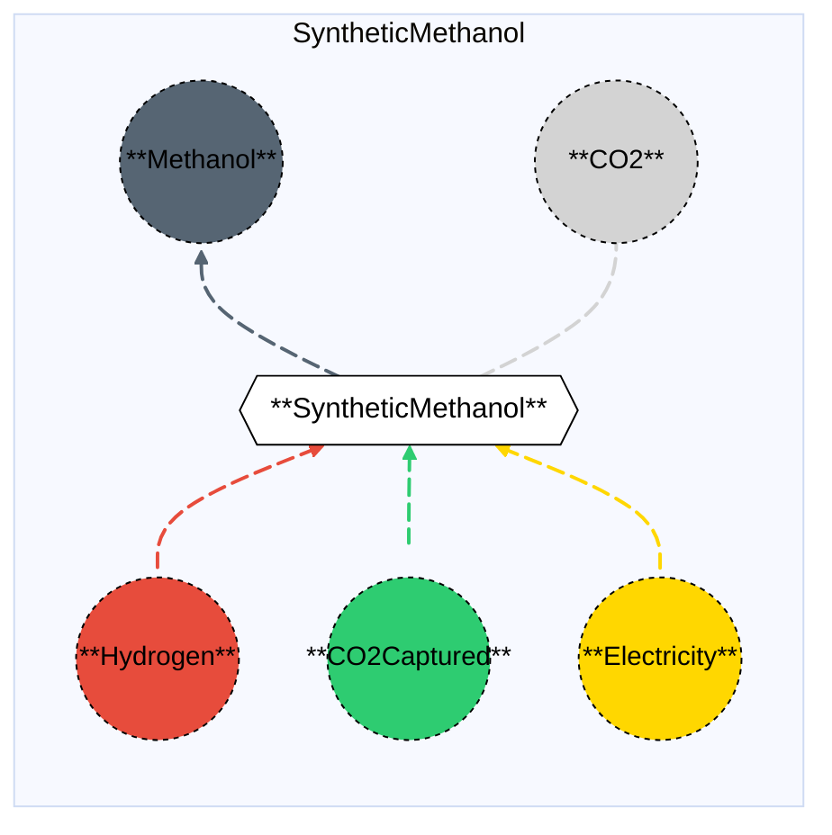

# Synthetic Methanol (Electrochemical)

## Contents

[Overview](@ref syntheticmethanol_overview) | [Asset Structure](@ref syntheticmethanol_asset_structure) | [Flow Equations](@ref syntheticmethanol_flow_equations) | [Input File (Standard Format)](@ref syntheticmethanol_input_file) | [Types - Asset Structure](@ref syntheticmethanol_type_definition) | [Constructors](@ref syntheticmethanol_constructors) | [Examples](@ref syntheticmethanol_examples)

## [Overview](@id syntheticmethanol_overview)

In Macro, the Synthetic Methanol asset represents an electrochemical methanol production facility that uses hydrogen and captured CO₂ as feedstocks. This technology produces methanol through electrochemical synthesis, typically using renewable electricity. The process uses CO₂ as a feedstock (carbon utilization), with approximately 10% of the consumed CO₂ being emitted during the process.

These assets are defined using either JSON or CSV input files placed in the `assets` directory, typically named with descriptive identifiers like `synthetic_methanol.json` or `synthetic_methanol.csv`.

## [Asset Structure](@id syntheticmethanol_asset_structure)

A Synthetic Methanol plant is made of the following components:
- 1 `Transformation` component, representing the electrochemical methanol synthesis process.
- 5 `Edge` components:
    - 1 **incoming** `Hydrogen Edge`, representing hydrogen supply.
    - 1 **incoming** `CO₂Captured Edge`, representing captured CO₂ supply (used as feedstock).
    - 1 **incoming** `Electricity Edge`, representing electricity consumption.
    - 1 **outgoing** `Methanol Edge`, representing methanol production.
    - 1 **outgoing** `CO₂ Edge`, representing CO₂ emissions (approximately 10% of consumed CO₂).

Here is a graphical representation of the Synthetic Methanol asset:



## [Flow Equations](@id syntheticmethanol_flow_equations)

The Synthetic Methanol asset follows these stoichiometric relationships:

```math
\begin{aligned}
\phi_{h2} &= \phi_{ch3oh} \cdot \epsilon_{h2\_consumption} \\
\phi_{co2\_captured} &= \phi_{ch3oh} \cdot \epsilon_{co2\_consumption} \\
\phi_{elec} &= \phi_{ch3oh} \cdot \epsilon_{electricity\_consumption} \\
\phi_{co2} &= \phi_{co2\_captured} \cdot \epsilon_{emission\_rate} \\
\end{aligned}
```

Where:
- ``\phi`` represents the flow of each commodity
- ``\epsilon`` represents the stoichiometric coefficients defined in the [Conversion Process Parameters](@ref syntheticmethanol_conversion_process_parameters) section.

## [Input File (Standard Format)](@id syntheticmethanol_input_file)

The easiest way to include a Synthetic Methanol asset in a model is to create a new file (either JSON or CSV) and place it in the `assets` directory together with the other assets. 

```
your_case/
├── assets/
│   ├── synthetic_methanol.json    # or synthetic_methanol.csv
│   ├── other_assets.json
│   └── ...
├── system/
├── settings/
└── ...
```

This file can either be created manually, or using the `template_asset` function, as shown in the [Adding an Asset to a System](@ref) section of the User Guide. The file will be automatically loaded when you run your Macro model. An example of an input JSON file is shown in the [Examples](@ref syntheticmethanol_examples) section.

The following tables outline the attributes that can be set for a Synthetic Methanol asset.

### Transform Attributes
#### Essential Attributes
| Field | Type | Description |
|--------------|---------|------------|
| `Type` | String | Asset type identifier: "SyntheticMethanol" |
| `id` | String | Unique identifier for the asset instance |
| `location` | String | Geographic location/node identifier |
| `timedata` | String | Time resolution for the time series data linked to the transformation |

#### [Conversion Process Parameters](@id syntheticmethanol_conversion_process_parameters)
| Field | Type | Description | Units | Default |
|--------------|---------|------------|----------------|----------|
| `h2_consumption` | Float64 | Hydrogen consumption per MWh of methanol output | $MWh_{H_2}/MWh_{CH_3OH}$ | 1.138 |
| `co2_consumption` | Float64 | Captured CO₂ consumption per MWh of methanol output | $t_{CO_2}/MWh_{CH_3OH}$ | 0.248 |
| `electricity_consumption` | Float64 | Electricity consumption per MWh of methanol output | $MWh_{elec}/MWh_{CH_3OH}$ | 0.271 |
| `emission_rate` | Float64 | CO₂ emission rate (as fraction of consumed CO₂) | - | 0.10 |

#### General Attributes

| Field | Type | Values | Default | Description |
|:--------------| :------: |:------: | :------: |:-------|
| `type` | `String` | Any Macro commodity type matching the commodity of the edge | Required | Commodity of the edge. E.g. "Electricity". |
| `start_vertex` | `String` | Any node id present in the system matching the commodity of the edge | Required | ID of the starting vertex of the edge. The node must be present in the `nodes.json` file. E.g. "elec\_node\_1". |
| `end_vertex` | `String` | Any node id present in the system matching the commodity of the edge | Required | ID of the ending vertex of the edge. The node must be present in the `nodes.json` file. E.g. "ch3oh\_node\_1". |
| `availability` | `Dict` | Availability file path and header | Empty | Path to the availability file and column name for the availability time series to link to the edge. E.g. `{"timeseries": {"path": "assets/availability.csv", "header": "SyntheticMethanol"}}`.|
| `has_capacity` | `Bool` | `Bool` | `false` | Whether capacity variables are created for the edge. |
| `integer_decisions` | `Bool` | `Bool` | `false` | Whether capacity variables are integers. |
| `unidirectional` | `Bool` | `Bool` | `false` | Whether the edge is unidirectional. |

!!! warning "Asset expansion"
    As a modeling decision, only the `Methanol` edge is allowed to expand. Therefore, both the `has_capacity` and `constraints` attributes can only be set for that edge. For all other edges, these attributes are pre-set to `false` and an empty list, respectively, to ensure the correct modeling of the asset. 

#### Investment Parameters
| Field | Type | Description | Units | Default |
|--------------|---------|------------|----------------|----------|
| `can_retire` | Boolean | Whether capacity can be retired | - | true |
| `can_expand` | Boolean | Whether capacity can be expanded | - | true |
| `existing_capacity` | Float64 | Initial installed capacity | MWh CH₃OH | 0.0 |

#### Economic Parameters
| Field | Type | Description | Units | Default |
|--------------|---------|------------|----------------|----------|
| `investment_cost` | Float64 | CAPEX per unit capacity | \$/MW | 685,961.676 |
| `fixed_om_cost` | Float64 | Fixed O&M costs | \$/MW-yr | 1,175.6697 |
| `variable_om_cost` | Float64 | Variable O&M costs | \$/MWh CH₃OH | 0.0121 |
| `lifetime` | Float64 | Asset lifetime | years | 20 |

### [Constraints Configuration](@id syntheticmethanol_constraints)

Synthetic Methanol assets can have different constraints applied to them, and the user can configure them using the following fields:

| Field | Type | Description |
|--------------|---------|------------|
| `transform_constraints` | Dict{String,Bool} | List of constraints applied to the transformation component. |
| `output_constraints` | Dict{String,Bool} | List of constraints applied to the output edge component. |

For example, if the user wants to apply the [`BalanceConstraint`](@ref balance_constraint_ref) to the transformation component and the [`CapacityConstraint`](@ref capacity_constraint_ref) to the output edge, the constraints fields should be set as follows:

```json
{
    "transform_constraints": {
        "BalanceConstraint": true
    },
    "edges":{
        "ch3oh_edge": {
            "constraints": {
                "CapacityConstraint": true
            }
        }
    }
}
```

Users can refer to the [Adding Asset Constraints to a System](@ref) section of the User Guide for a list of all the constraints that can be applied to the different components of a Synthetic Methanol asset.

#### Default constraints
To simplify the input file and the asset configuration, the following constraints are applied to the Synthetic Methanol asset by default:

- [Balance constraint](@ref balance_constraint_ref) (applied to the transformation component)
- [Capacity constraint](@ref capacity_constraint_ref) (applied to the output methanol edge)

## [Types - Asset Structure](@id syntheticmethanol_type_definition)

The Synthetic Methanol asset is defined as follows:

```julia
struct SyntheticMethanol <: AbstractAsset
    id::AssetId
    synthetic_methanol_transform::Transformation
    co2_captured_edge::Edge{<:CO2Captured}
    ch3oh_edge::Edge{<:Methanol}
    elec_edge::Edge{<:Electricity}
    h2_edge::Edge{<:Hydrogen}
    co2_emission_edge::Edge{<:CO2}
end
```

## [Constructors](@id syntheticmethanol_constructors)

### Factory constructor
```julia
make(asset_type::Type{SyntheticMethanol}, data::AbstractDict{Symbol,Any}, system::System)
```

| Field | Type | Description |
|--------------|---------|------------|
| `asset_type` | `Type{SyntheticMethanol}` | Macro type of the asset |
| `data` | `AbstractDict{Symbol,Any}` | Dictionary containing the input data for the asset |
| `system` | `System` | System to which the asset belongs |

### Stoichiometry balance data

```julia
synthetic_methanol_transform.balance_data = Dict(
    :co2_consumption => Dict(
        ch3oh_edge.id => get(transform_data, :co2_consumption, 0.248),
        co2_captured_edge.id => 1.0,
    ),
    :elec_consumption => Dict(
        ch3oh_edge.id => get(transform_data, :electricity_consumption, 0.271),
        elec_edge.id => 1.0,
    ),
    :h2_consumption => Dict(
        ch3oh_edge.id => get(transform_data, :h2_consumption, 1.138),
        h2_edge.id => 1.0,
    ),
    :emissions => Dict(
        co2_captured_edge.id => get(transform_data, :emission_rate, 0.10),
        co2_emission_edge.id => 1.0
    )
)
```

!!! warning "Dictionary keys must match"
    In the code above, each `get` function call looks up a parameter in the `transform_data` dictionary using a symbolic key such as `:h2_consumption` or `:co2_consumption`.
    These keys **must exactly match** the corresponding field names in your input asset `.json` or `.csv` files. Mismatched key names between the constructor file and the asset input will result in missing or incorrect parameter values (defaulting to the values shown above).

## [Examples](@id syntheticmethanol_examples)

This example illustrates a basic Synthetic Methanol configuration in JSON format:

```json
{
    "SyntheticMethanol": [
        {
            "type": "SyntheticMethanol",
            "global_data":{
                "nodes": {},
                "transforms": {
                    "timedata": "Methanol"
                },
                "edges":{
                    "ch3oh_edge": {
                        "commodity": "Methanol",
                        "unidirectional": true,
                        "has_capacity": true,
                        "can_retire": true,
                        "can_expand": true,
                        "integer_decisions": false
                    },
                    "h2_edge": {
                        "commodity": "Hydrogen",
                        "unidirectional": true,
                        "has_capacity": false
                    },
                    "co2_captured_edge": {
                        "commodity": "CO2Captured",
                        "unidirectional": true,
                        "has_capacity": false
                    },
                    "elec_edge": {
                        "commodity": "Electricity",
                        "unidirectional": true,
                        "has_capacity": false
                    },
                    "co2_emission_edge": {
                        "commodity": "CO2",
                        "unidirectional": true,
                        "has_capacity": false,
                        "end_vertex": "co2_sink"
                    }
                }
            },
            "instance_data":[
                {
                    "id": "synthetic_methanol_1",
                    "transforms":{
                        "h2_consumption": 1.138,
                        "co2_consumption": 0.248,
                        "electricity_consumption": 0.271,
                        "emission_rate": 0.10
                    },
                    "edges":{
                        "ch3oh_edge": {
                            "end_vertex": "ch3oh_node_1",
                            "existing_capacity": 0.0,
                            "investment_cost": 685961.676,
                            "fixed_om_cost": 1175.6697,
                            "variable_om_cost": 0.0121
                        },
                        "h2_edge": {
                            "start_vertex": "h2_node_1"
                        },
                        "co2_captured_edge": {
                            "start_vertex": "co2_captured_node_1"
                        },
                        "elec_edge": {
                            "start_vertex": "elec_node_1"
                        },
                        "co2_emission_edge": {
                            "end_vertex": "co2_sink"
                        }
                    }
                }
            ]
        }
    ]
}
```

## See Also

- [Edges](@ref) - Components that connect Vertices and carry flows
- [Transformations](@ref) - Processes that transform flows of several Commodities
- [Nodes](@ref) - Network nodes that allow for import and export of commodities
- [Vertices](@ref) - Network nodes that edges connect
- [Assets](@ref "Assets") - Higher-level components made from edges, nodes, storage, and transformations
- [Commodities](@ref) - Types of resources stored by Commodities
- [Time Data](@ref) - Temporal modeling framework
- [Constraints](@ref) - Additional constraints for Storage and other components
- [Thermal Methanol](@ref thermalmethanol_overview) - Thermal methanol production without CCS
- [Thermal Methanol with CCS](@ref thermalmethanolccs_overview) - Thermal methanol production with CCS

