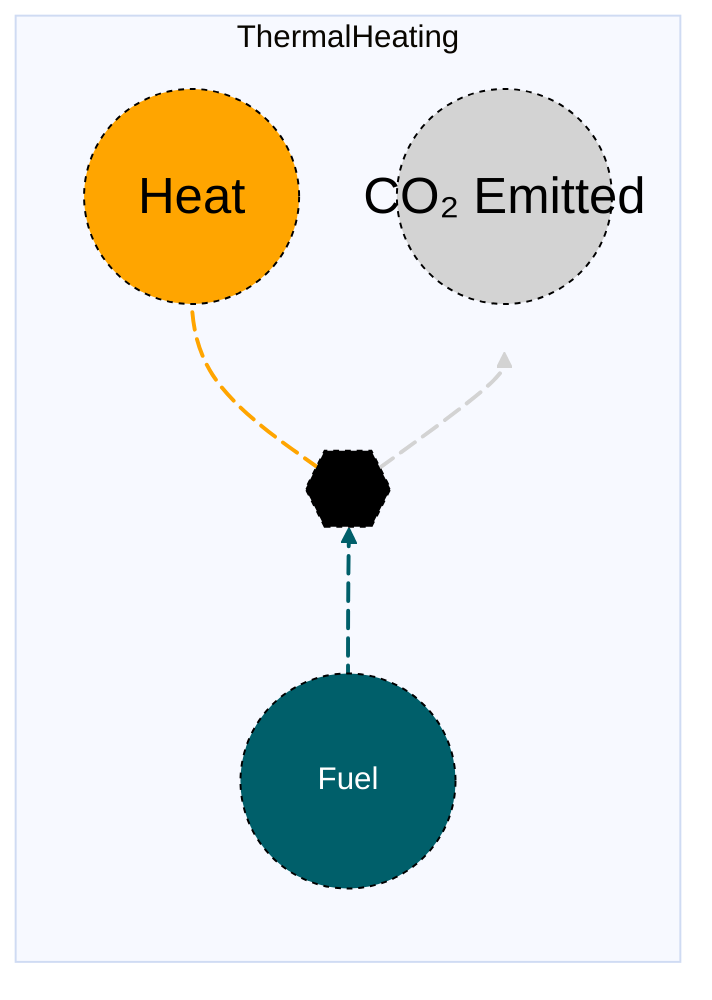

# Thermal Heating

## Contents

[Overview](@ref thermalheating_overview) | [Asset Structure](@ref thermalheating_asset_structure) | [Flow Equations](@ref thermalheating_flow_equations) | [Input File (Standard Format)](@ref thermalheating_input_file) | [Types - Asset Structure](@ref thermalheating_type_definition) | [Constructors](@ref thermalheating_constructors) | [Examples](@ref thermalheating_examples) | [Best Practices](@ref thermalheating_best_practices) | [Input File (Advanced Format)](@ref thermalheating_advanced_json_csv_input_format)

## [Overview](@id thermalheating_overview)

Thermal Heating assets in MacroEnergy.jl represent combustion-based heating technologies that convert fuel (such as natural gas, or other fuels) into heat for district or building heating systems. These assets can represent boilers or furnaces supplying district networks. They are defined using either JSON or CSV input files placed in the `assets` directory, typically named with descriptive identifiers like `gas_heating.json`, or `fuel_heating.json`.

## [Asset Structure](@id thermalheating_asset_structure)

A thermal heating plant asset consists of four main components:

1. **Transformation Component**: Balances the fuel and heat flows
2. **Fuel Edge**: Represents the fuel supply to the heating unit
3. **Heat Edge**: Represents the heat production (can have unit commitment operations)
4. **CO₂ Edge**: Represents the CO₂ emissions

Here is a graphical representation of the thermal heating asset:



## [Flow Equations](@id thermalheating_flow_equations)
The thermal heating asset follows these stoichiometric relationships:

```math
\begin{aligned}
\phi_{fuel} &= \phi_{heat} \cdot \epsilon_{fuel\_consumption} \\
\phi_{co2} &= \phi_{fuel} \cdot \epsilon_{emission\_rate} \\
\end{aligned}
```

Where:
- ``\phi`` represents the flow of each commodity
- ``\epsilon`` represents the stoichiometric coefficients defined in the [Conversion Process Parameters](@ref thermalheating_conversion_process_parameters) section.

## [Input File (Standard Format)](@id thermalheating_input_file)

!!! note "Techno-Economic Analysis"
    Techno-economic analysis background is recommended for updating or adding conversion process parameters. For users not familiar with TEA, they can refer to [this guide](@ref tea). 

The easiest way to include a thermal heating asset in a model is to create a new file (either JSON or CSV) and place it in the `assets` directory together with the other assets. 

```
your_case/
├── assets/
│   ├── fuel_heating.json    # or fuel_heating.csv
│   ├── other_assets.json
│   └── ...
├── system/
├── settings/
└── ...
```

This file can either be created manually, or using the `template_asset` function, as shown in the [Adding an Asset to a System](@ref) section of the User Guide. The file will be automatically loaded when you run your Macro model. 

The following is an example of a natural gas heating asset input file:
```json
{
    "NaturalGasHeating": [
        {
            "type": "ThermalHeating",
            "instance_data": [
                {
                    "id": "SE_natgas_boiler_1",
                    "location": "SE",
                    "fuel_commodity": "NaturalGas",
                    "co2_sink": "co2_sink",
                    "capacity_size": 50,
                    "fuel_consumption": 1.15,
                    "emission_rate": 0.18,
                    "investment_cost": 20000,
                    "fixed_om_cost": 1200,
                    "variable_om_cost": 2.0,
                    "uc": false,
                    "ramp_up_fraction": 0.8,
                    "ramp_down_fraction": 0.8
                }
            ]
        }
    ]
}

```

!!! tip "Global Data vs Instance Data"
    When working with JSON input files, the `global_data` field can be used to group data that is common to all instances of the same asset type. This is useful for setting constraints that are common to all instances of the same asset type and avoid repeating the same data for each instance. See the [Examples](@ref "thermalheating_examples") section below for an example.

The following tables outline the attributes that can be set for a thermal heating asset.

### Essential Attributes
| Field | Type | Description |
|--------------|---------|------------|
| `Type` | String | Asset type identifier: `"ThermalHeating"` |
| `id` | String | Unique identifier for the heating unit instance |
| `location` | String | Geographic location/node identifier |
| `fuel_commodity` | String | Fuel commodity identifier |
| `uc` | Boolean | Whether unit commitment is enabled (default: false) |
| `timedata` | String | Time resolution for time series data (default: `"Heat"`) |
| `co2_sink` | String | CO₂ sink identifier |
| `fuel_start_vertex` | String | Fuel start vertex identifier. This is **not required** if the fuel commodity is present in the location. |

### [Conversion Process Parameters](@id thermalheating_conversion_process_parameters)
The following set of parameters control the conversion process and stoichiometry of the thermal heating asset (see [Flow Equations](@ref thermalheating_flow_equations) for more details).

| Field | Type | Description | Units | Default |
|--------------|---------|------------|----------------|----------|
| `fuel_consumption` | Float64 | Fuel consumption rate | $MWh_{fuel}/MWh_{heat}$ | 1.0 |
| `emission_rate` | Float64 | CO₂ emission rate | $t_{CO₂}/MWh_{fuel}$ | 0.0 |

### [Constraints Configuration](@id "thermalheating_constraints")
Thermal Heating assets can have different constraints applied to them, and the user can configure them using the following fields:

| Field | Type | Description |
|--------------|---------|------------|
| `transform_constraints` | Dict{String,Bool} | List of constraints applied to the transformation component. |
| `heat_constraints` | Dict{String,Bool} | List of constraints applied to the heat edge. |
| `fuel_constraints` | Dict{String,Bool} | List of constraints applied to the fuel edge. |
| `co2_constraints` | Dict{String,Bool} | List of constraints applied to the CO₂ edge. |

For example, if the user wants to apply the [`BalanceConstraint`](@ref balance_constraint_ref) to the transformation component and the [`CapacityConstraint`](@ref capacity_constraint_ref) to the heat edge, the constraints fields should be set as follows:

```json
{
    "transform_constraints": {
        "BalanceConstraint": true
    },
    "heat_constraints": {
        "CapacityConstraint": true
    }
}
```

Users can refer to the [Adding Asset Constraints to a System](@ref) section of the User Guide for a list of all the constraints that can be applied to the different components of a thermal heating asset.

#### Default constraints
To simplify the input file and the asset configuration, the following constraints are applied to the thermal heating asset by default:

- [Balance constraint](@ref balance_constraint_ref) (applied to the transformation component)
- [Capacity constraint](@ref capacity_constraint_ref) (applied to the heat edge)
- [Ramping limits constraint](@ref ramping_limits_constraint_ref) (applied to the heat edge)

**Unit commitment constraints** (when `uc` is set to `true`):
- [Minimum up and down time constraint](@ref min_up_and_down_time_constraint_ref) (applied to the heat edge)

### Investment Parameters
| Field | Type | Description | Units | Default |
|--------------|---------|------------|----------------|----------|
| `can_retire` | Boolean | Whether capacity can be retired | - | true |
| `can_expand` | Boolean | Whether capacity can be expanded | - | true |
| `existing_capacity` | Float64 | Initial installed capacity | MW | 0.0 |
| `capacity_size` | Float64 | Unit size for capacity decisions | - | 1.0 |

#### Additional Investment Parameters

**Maximum and minimum capacity constraints**

If [`MaxCapacityConstraint`](@ref max_capacity_constraint_ref) or [`MinCapacityConstraint`](@ref min_capacity_constraint_ref) are added to the constraints dictionary for the heat edge, the following parameters are used by Macro:

| Field | Type | Description | Units | Default |
|--------------|---------|------------|----------------|----------|
| `max_capacity` | Float64 | Maximum allowed capacity | MW | Inf |
| `min_capacity` | Float64 | Minimum allowed capacity | MW | 0.0 |

### Economic Parameters
| Field | Type | Description | Units | Default |
|--------------|---------|------------|----------------|----------|
| `investment_cost` | Float64 | CAPEX per unit capacity | \$/MW | 0.0 |
| `annualized_investment_cost` | Union{Nothing,Float64} | Annualized CAPEX | \$/MW/yr | calculated |
| `fixed_om_cost` | Float64 | Fixed O&M costs | \$/MW/yr | 0.0 |
| `variable_om_cost` | Float64 | Variable O&M costs | \$/MWh | 0.0 |
| `startup_cost` | Float64 | Cost per MW of capacity to start a generator | \$/MW per start | 0.0 |
| `wacc` | Float64 | Weighted average cost of capital | fraction | 0.0 |
| `lifetime` | Int | Asset lifetime in years | years | 1 |
| `capital_recovery_period` | Int | Investment recovery period | years | 1 |
| `retirement_period` | Int | Retirement period | years | 0 |

### Operational Parameters
| Field | Type | Description | Units | Default |
|--------------|---------|------------|----------------|----------|
| `availability` | Dict | Availability file path and header | - | Empty |

#### Additional Operational Parameters

**Unit commitment parameters** (when `uc` is set to `true`)

| Field | Type | Description | Units | Default |
|--------------|---------|------------|----------------|----------|
| `startup_fuel_consumption` | Float64 | Fuel consumption per unit heat to start the plant | $MWh_{fuel}/MWh_{elec}$ | 0.0 |

**Minimum flow constraint**

If [`MinFlowConstraint`](@ref min_flow_constraint_ref) is added to the constraints dictionary for the heat edge, the following parameter is used:

| Field | Type | Description | Units | Default |
|--------------|---------|------------|----------------|----------|
| `min_flow_fraction` | Float64 | Minimum flow as fraction of capacity | fraction | 0.0 |

**Ramping limit constraint**

If [`RampingLimitConstraint`](@ref ramping_limits_constraint_ref) is added to the constraints dictionary for the heat edge, the following parameters are used:

| Field | Type | Description | Units | Default |
|--------------|---------|------------|----------------|----------|
| `ramp_up_fraction` | Float64 | Maximum increase in flow between timesteps | fraction | 1.0 |
| `ramp_down_fraction` | Float64 | Maximum decrease in flow between timesteps | fraction | 1.0 |

**Minimum up and down time constraints**

If [`MinUpTimeConstraint`](@ref min_up_and_down_time_constraint_ref) or [`MinDownTimeConstraint`](@ref min_up_and_down_time_constraint_ref) are added to the constraints dictionary for the heat edge, the following parameters are used:

| Field | Type | Description | Units | Default |
|--------------|---------|------------|----------------|----------|
| `min_up_time` | Int64 | Minimum time the plant must remain committed | hours | 0 |
| `min_down_time` | Int64 | Minimum time the plant must remain shutdown | hours | 0 |

## [Types - Asset Structure](@id thermalheating_type_definition)

The `ThermalHeating` asset is defined as follows:

```julia
struct ThermalHeating{T} <: AbstractAsset
    id::AssetId
    heating_transform::Transformation
    heat_edge::Union{Edge{<:Heat},EdgeWithUC{<:Heat}}
    fuel_edge::Edge{<:T}
    co2_edge::Edge{<:CO2}
end
```

## [Constructors](@id thermalheating_constructors)

### Default constructor

```julia
ThermalHeating(id::AssetId, heating_transform::Transformation, heat_edge::Union{Edge{<:Heat},EdgeWithUC{<:Heat}}, fuel_edge::Edge{<:Fuel}, co2_edge::Edge{<:CO2})
```

### Factory constructor
```julia
make(asset_type::Type{ThermalHeating}, data::AbstractDict{Symbol,Any}, system::System)
```

| Field | Type | Description |
|--------------|---------|------------|
| `asset_type` | `Type{ThermalHeating}` | Macro type of the asset |
| `data` | `AbstractDict{Symbol,Any}` | Dictionary containing the input data for the asset |
| `system` | `System` | System to which the asset belongs |

## [Examples](@id thermalheating_examples)
This section contains examples of how to use the thermal heating asset in a Macro model.

### Gas Heat Pump

This example shows a gas heat pump using natural gas as fuel. The asset has an existing capacity that is only allowed to be retired. A `MinFlowConstraint` constraint is applied to the heat edge with a minimum flow fraction of 0.5. The asset has an availability time series loaded from a CSV file.

**JSON Format:**

Note that the `global_data` field is used to set the fields and constraints that are common to all instances of the same asset type.

```json
{
    "GasHeatPump": [
        {
            "type": "ThermalHeating",
            "instance_data": [
                {
                    "id": "SE_natural_gas_heating_1",
                    "location": "SE",
                    "timedata": "NaturalGas",
                    "fuel_commodity": "NaturalGas",
                    "fuel_start_vertex": "natgas_source",
                    "co2_sink": "co2_sink",
                    "uc": false,
                    "can_retire": true,
                    "can_expand": false,
                    "existing_capacity": 500.0,
                    "capacity_size": 50.0,
                    "fuel_consumption": 1.2,
                    "emission_rate": 0.18,
                    "fixed_om_cost": 6000,
                    "variable_om_cost": 5.0,
                }
            ]
        }
    ]
}
```

**CSV Format:**

| Type | id | location | time\_data | fuel\_commodity | fuel\_start\_vertex | co2\_sink | uc | can\_retire | can\_expand | existing\_capacity | capacity\_size | heat\_constraints--MinFlowConstraint | fuel\_consumption | emission\_rate | fixed\_om\_cost | variable\_om\_cost |
|------|----|-----------|------------|----------------|---------------------|-----------|----|--------------|--------------|--------------------|----------------|-------------------------------------|------------------|---------------|----------------|------------------|
| ThermalHeating | SE\_natural\_gas\_heating\_1 | SE | NaturalGas | NaturalGas | natgas\_source | co2\_sink | false | true | false | 500.0 | 50.0 | true | 1.2 | 0.18 | 6000 | 5.0 |

### Multiple Natural Gas Heating Units in Different Zones

This example shows three natural gas–fired heating units using natural gas as fuel. Each asset has an existing capacity that is only allowed to be retired. The assets are configured without unit commitment variables.

**JSON Format:**

```json
{
    "NaturalGasHeating": [
        {
            "type": "ThermalHeating",
            "global_data": {
                "timedata": "NaturalGas",
                "fuel_commodity": "NaturalGas",
                "co2_sink": "co2_sink",
                "heat_constraints": {
                    "MinFlowConstraint": true
                }
            },
            "instance_data": [
                {
                    "id": "MIDAT_natural_gas_heating_1",
                    "location": "MIDAT",
                    "emission_rate": 0.181048235160161,
                    "fuel_consumption": 1.85,
                    "can_retire": true,
                    "can_expand": false,
                    "existing_capacity": 4000.0,
                    "investment_cost": 0.0,
                    "fixed_om_cost": 8000,
                    "variable_om_cost": 4.5,
                    "capacity_size": 100.0,
                },
                {
                    "id": "NE_natural_gas_heating_1",
                    "location": "NE",
                    "emission_rate": 0.181048235160161,
                    "fuel_consumption": 1.90,
                    "can_retire": true,
                    "can_expand": false,
                    "existing_capacity": 6000.0,
                    "investment_cost": 0.0,
                    "fixed_om_cost": 8200,
                    "variable_om_cost": 4.7,
                    "capacity_size": 120.0,
                },
                {
                    "id": "SE_natural_gas_heating_1",
                    "location": "SE",
                    "emission_rate": 0.181048235160161,
                    "fuel_consumption": 1.75,
                    "can_retire": true,
                    "can_expand": false,
                    "existing_capacity": 25000.0,
                    "investment_cost": 0.0,
                    "fixed_om_cost": 7000,
                    "variable_om_cost": 3.9,
                    "capacity_size": 500.0,
                }
            ]
        }
    ]
}
```

**CSV Format:**

| Type | id | location | time\_data | fuel\_commodity | co2\_sink | can\_retire | can\_expand | existing\_capacity | capacity\_size | heat\_constraints--MinFlowConstraint | fuel\_consumption | emission\_rate | fixed\_om\_cost | variable\_om\_cost |
|------|----|-----------|------------|----------------|-----------|-------------|-------------|--------------------|----------------|-------------------------------------|------------------|---------------|----------------|------------------|
| ThermalHeating | MIDAT\_natural\_gas\_heating\_1 | MIDAT | NaturalGas | NaturalGas | co2\_sink | true | false | 4000.0 | 100.0 | true | 1.85 | 0.181 | 8000 | 4.5 |
| ThermalHeating | NE\_natural\_gas\_heating\_1 | NE | NaturalGas | NaturalGas | co2\_sink | true | false | 6000.0 | 120.0 | true | 1.90 | 0.181 | 8200 | 4.7 |
| ThermalHeating | SE\_natural\_gas\_heating\_1 | SE | NaturalGas | NaturalGas | co2\_sink | true | false | 25000.0 | 500.0 | true | 1.75 | 0.181 | 7000 | 3.9 |


## [Best Practices](@id thermalheating_best_practices)

1. **Use global data for common parameters**: Use the `global_data` field to set the fields and constraints that are common to all instances of the same asset type.
2. **Set realistic efficiency parameters**: Ensure fuel consumption, emission rates, and capture rates are accurate for the technology being modeled
3. **Use meaningful IDs**: Choose descriptive identifiers that indicate location and technology type
4. **Consider unit commitment carefully**: Enable unit commitment only when detailed operational modeling is needed
5. **Use constraints selectively**: Only enable constraints that are necessary for your modeling needs
6. **Validate costs**: Ensure investment and O&M costs are in appropriate units and time periods
7. **Test configurations**: Start with simple configurations and gradually add complexity
8. **Set appropriate ramp rates**: Consider the actual operational characteristics of the technology

## [Input File (Advanced Format)](@id thermalheating_advanced_json_csv_input_format)

Macro provides an advanced format for defining thermal heating assets, offering users and modelers detailed control over asset specifications. This format builds upon the standard format and is ideal for those who need more comprehensive customization.

To understand the advanced format, consider the [graph representation](@ref thermalheating_asset_structure) and the [type definition](@ref thermalheating_type_definition) of a thermal heating asset. The input file mirrors this hierarchical structure.

A thermal heating asset in Macro is composed of a transformation component, represented by a `Transformation` object, and multiple edges (fuel, heat, CO2), each represented by an `Edge` object. The input file for a thermal heating asset is therefore organized as follows:

```json
{
    "transforms":{
        // ... transformation-specific attributes ...
    },
    "edges":{
        "fuel_edge": {
            // ... fuel_edge-specific attributes ...
        },
        "heat_edge": {
            // ... heat_edge-specific attributes ...
        },
        "co2_edge": {
            // ... co2_edge-specific attributes ...
        }
    }
}
```

Each top-level key (e.g., "transforms" or "edges") denotes a component type. The second-level keys either specify the attributes of the component (when there is a single instance) or identify the instances of the component when there are multiple instances.

Below is an example of an input file for a thermal heating asset that sets up multiple thermal heating plants across different regions:

```json
{
    "NaturalGasHeating": [
        {
            "type": "ThermalHeating",
            "global_data": {
                "transforms": {
                    "timedata": "NaturalGas",
                    "constraints": {
                        "BalanceConstraint": true
                    }
                },
                "edges": {
                    "heat_edge": {
                        "commodity": "Heat",
                        "unidirectional": true,
                        "has_capacity": true,
                        "constraints": {
                            "CapacityConstraint": true,
                            "RampingLimitConstraint": true,
                            "MinFlowConstraint": true
                        }
                    },
                    "fuel_edge": {
                        "commodity": "NaturalGas",
                        "unidirectional": true,
                        "has_capacity": false
                    },
                    "co2_edge": {
                        "commodity": "CO2",
                        "unidirectional": true,
                        "has_capacity": false,
                        "end_vertex": "co2_sink"
                    }
                }
            },
            "instance_data": [
                {
                    "id": "MIDAT_natural_gas_heating_1",
                    "transforms": {
                        "emission_rate": 0.181048235160161,
                        "fuel_consumption": 1.85
                    },
                    "edges": {
                        "heat_edge": {
                            "end_vertex": "heat_MIDAT",
                            "can_retire": true,
                            "can_expand": false,
                            "existing_capacity": 4000.0,
                            "investment_cost": 0.0,
                            "fixed_om_cost": 8000,
                            "variable_om_cost": 4.5,
                            "capacity_size": 100.0,
                        },
                        "fuel_edge": {
                            "start_vertex": "natgas_MIDAT"
                        }
                    }
                },
                {
                    "id": "NE_natural_gas_heating_1",
                    "transforms": {
                        "emission_rate": 0.181048235160161,
                        "fuel_consumption": 1.90
                    },
                    "edges": {
                        "heat_edge": {
                            "end_vertex": "heat_NE",
                            "can_retire": true,
                            "can_expand": false,
                            "existing_capacity": 6000.0,
                            "investment_cost": 0.0,
                            "fixed_om_cost": 8200,
                            "variable_om_cost": 4.7,
                            "capacity_size": 120.0,
                        },
                        "fuel_edge": {
                            "start_vertex": "natgas_NE"
                        }
                    }
                },
                {
                    "id": "SE_natural_gas_heating_1",
                    "transforms": {
                        "emission_rate": 0.181048235160161,
                        "fuel_consumption": 1.75
                    },
                    "edges": {
                        "heat_edge": {
                            "end_vertex": "heat_SE",
                            "can_retire": true,
                            "can_expand": false,
                            "existing_capacity": 25000.0,
                            "investment_cost": 0.0,
                            "fixed_om_cost": 7000,
                            "variable_om_cost": 3.9,
                            "capacity_size": 500.0,
                        },
                        "fuel_edge": {
                            "start_vertex": "natgas_SE"
                        }
                    }
                }
            ]
        }
    ]
}
```

### Key Points

- The `global_data` field is utilized to define attributes and constraints that apply universally to all instances of a particular asset type.
- The `start_vertex` and `end_vertex` fields indicate the nodes to which the edges are connected. These nodes must be defined in the `nodes.json` file.
- By default, only the heat edge is allowed to expand as a modeling decision (*see note below*)
- The heat edge can have unit commitment operations enabled by setting the `uc` attribute to `true`.
- For a comprehensive list of attributes that can be configured for the transformation and edge components, refer to the [transformation](@ref manual-transformation-fields) and [edges](@ref manual-edges-fields) pages of the Macro manual. 

!!! note "The `has_capacity` Edge Attribute"
    The `has_capacity` attribute is a flag that indicates whether a specific edge of an asset has a capacity variable, allowing it to be expanded or retired. Typically, users do not need to manually adjust this flag, as the asset creators in Macro have already configured it correctly for each edge. However, advanced users can use this flag to override the default settings for each edge if needed.

!!! tip "Prefixes"
    Users can apply prefixes to adjust parameters for the components of a thermal heating asset, even when using the standard format. For instance, `co2_can_retire` will adjust the `can_retire` parameter for the CO2 edge, and `co2_existing_capacity` will adjust the `existing_capacity` parameter for the CO2 edge.
    Below are the prefixes available for modifying parameters for the components of a thermal heating asset:
    - `transform_` for the transformation component
    - `heat_` for the heat edge
    - `co2_` for the CO2 edge
    - `fuel_` for the fuel edge