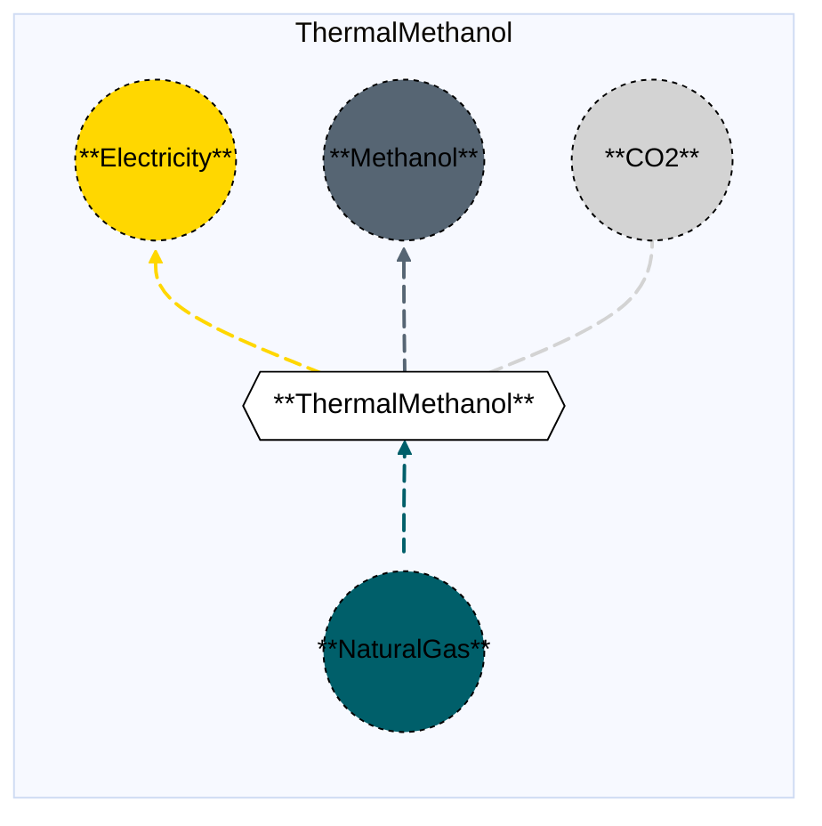
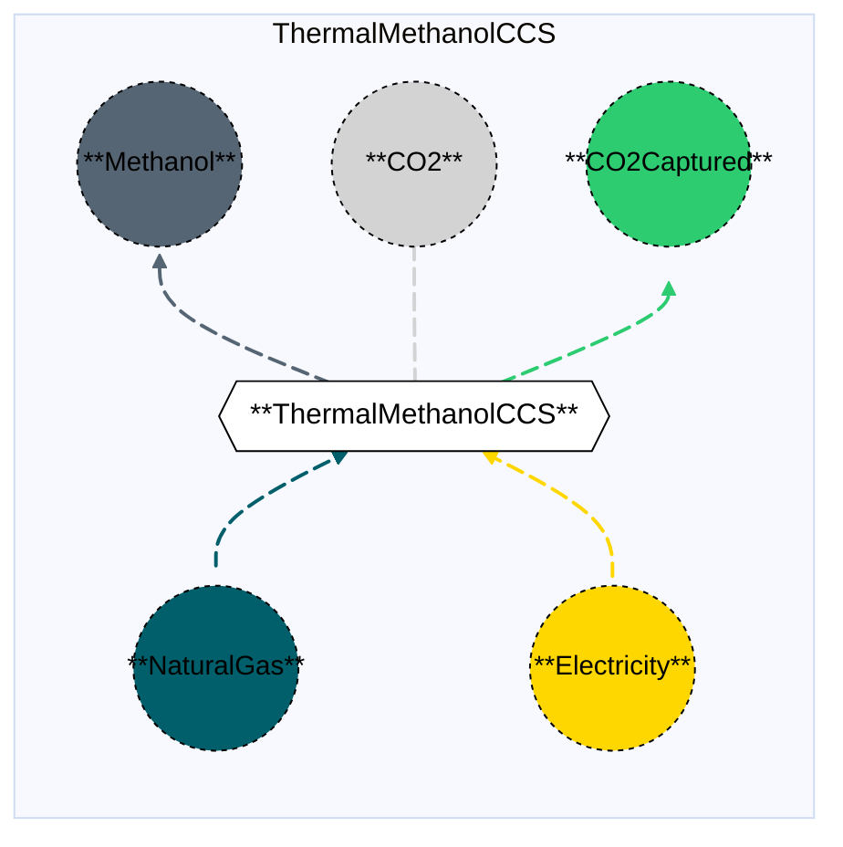

# Thermal Methanol (with and without CCS)

## Contents

[Overview](@ref thermalmethanol_overview) | [Asset Structure](@ref thermalmethanol_asset_structure) | [Flow Equations](@ref thermalmethanol_flow_equations) | [Input File (Standard Format)](@ref thermalmethanol_input_file) | [Types - Asset Structure](@ref thermalmethanol_type_definition) | [Constructors](@ref thermalmethanol_constructors) | [Examples](@ref thermalmethanol_examples)

## [Overview](@id thermalmethanol_overview)

In Macro, the Thermal Methanol pathway represents natural gas-based methanol production facilities using steam methane reforming. This technology uses natural gas (or other fossil fuels) as a feedstock to produce methanol.

Two variants are available:
- **Thermal Methanol (without CCS)**: Standard thermal methanol production with direct CO₂ emissions. The process is a net electricity producer due to co-generation, meaning it produces more electricity than it consumes.
- **Thermal Methanol with CCS**: Thermal methanol production with carbon capture and storage (CCS) technology, capturing approximately 90% of CO₂ emissions. Unlike the version without CCS, this facility does not produce net electricity due to the energy requirements of the capture process.

These assets are defined using either JSON or CSV input files placed in the `assets` directory, typically named with descriptive identifiers like `thermal_methanol.json` or `thermal_methanol_ccs.json`.

## [Asset Structure](@id thermalmethanol_asset_structure)

A Thermal Methanol plant (with and without CCS) is made of the following components:
- 1 `Transformation` component, representing the thermal methanol production process (with or without CCS).
- 4-5 `Edge` components (depending on CCS variant):
    - 1 **incoming** `Fuel Edge`, representing natural gas (or other fuel) supply. The fuel commodity type can be specified (e.g., NaturalGas, Hydrogen).
    - 1 **outgoing/incoming** `Electricity Edge`, representing electricity production (without CCS) or consumption (with CCS).
    - 1 **outgoing** `Methanol Edge`, representing methanol production.
    - 1 **outgoing** `CO₂ Edge`, representing CO₂ emissions (residual emissions for CCS variant).
    - 1 **outgoing** `CO₂Captured Edge`, representing captured CO₂ **(only if CCS is present)**.

Here is a graphical representation of the Thermal Methanol asset without CCS:



Here is a graphical representation of the Thermal Methanol asset with CCS:



## [Flow Equations](@id thermalmethanol_flow_equations)

The Thermal Methanol asset (with and without CCS) follows these stoichiometric relationships:

**Without CCS:**
```math
\begin{aligned}
\phi_{fuel} &= \phi_{ch3oh} \cdot \epsilon_{fuel\_consumption} \\
\phi_{elec} &= \phi_{ch3oh} \cdot \epsilon_{electricity\_consumption} \quad \text{(negative = production)} \\
\phi_{co2} &= \phi_{ch3oh} \cdot \epsilon_{emission\_rate} \\
\end{aligned}
```

**With CCS:**
```math
\begin{aligned}
\phi_{fuel} &= \phi_{ch3oh} \cdot \epsilon_{fuel\_consumption} \\
\phi_{elec} &= \phi_{ch3oh} \cdot \epsilon_{electricity\_consumption} \\
\phi_{co2} &= \phi_{ch3oh} \cdot \epsilon_{emission\_rate} \\
\phi_{co2\_captured} &= \phi_{fuel} \cdot \epsilon_{capture\_rate} \\
\end{aligned}
```

Where:
- ``\phi`` represents the flow of each commodity
- ``\epsilon`` represents the stoichiometric coefficients defined in the [Conversion Process Parameters](@ref thermalmethanol_conversion_process_parameters) section.
- Note: For the version without CCS, `electricity_consumption` is negative (-0.10), indicating net electricity production.

## [Input File (Standard Format)](@id thermalmethanol_input_file)

The easiest way to include a Thermal Methanol asset in a model is to create a new file (either JSON or CSV) and place it in the `assets` directory together with the other assets. 

```
your_case/
├── assets/
│   ├── thermal_methanol.json    # or thermal_methanol.csv (without CCS)
│   ├── thermal_methanol_ccs.json    # or thermal_methanol_ccs.csv (with CCS)
│   ├── other_assets.json
│   └── ...
├── system/
├── settings/
└── ...
```

This file can either be created manually, or using the `template_asset` function, as shown in the [Adding an Asset to a System](@ref) section of the User Guide. The file will be automatically loaded when you run your Macro model. Examples of input JSON files are shown in the [Examples](@ref thermalmethanol_examples) section.

The following tables outline the attributes that can be set for a Thermal Methanol asset.

### Transform Attributes
#### Essential Attributes
| Field | Type | Description |
|--------------|---------|------------|
| `Type` | String | Asset type identifier: "ThermalMethanol" or "ThermalMethanolCCS" |
| `id` | String | Unique identifier for the asset instance |
| `location` | String | Geographic location/node identifier |
| `timedata` | String | Time resolution for the time series data linked to the transformation |

#### [Conversion Process Parameters](@id thermalmethanol_conversion_process_parameters)
| Field | Type | Description | Units | Default (without CCS) | Default (with CCS) |
|--------------|---------|------------|----------------|----------------------|-------------------|
| `fuel_consumption` | Float64 | Fuel consumption per MWh of methanol output | $MWh_{fuel}/MWh_{CH_3OH}$ | 1.66586 | 1.7158 |
| `electricity_consumption` | Float64 | Net electricity production (negative) or consumption per MWh of methanol output | $MWh_{elec}/MWh_{CH_3OH}$ | -0.10 | 0.0 |
| `emission_rate` | Float64 | CO₂ emissions per MWh of methanol output (without CCS) or residual emissions (with CCS) | $t_{CO_2}/MWh_{CH_3OH}$ | 0.110645539 | 0.0110645539 |
| `capture_rate` | Float64 | CO₂ capture rate per MWh of fuel input **(CCS only)** | $t_{CO_2}/MWh_{fuel}$ | - | 0.099576 |

#### General Attributes

| Field | Type | Values | Default | Description |
|:--------------| :------: |:------: | :------: |:-------|
| `type` | `String` | Any Macro commodity type matching the commodity of the edge | Required | Commodity of the edge. E.g. "Electricity". |
| `start_vertex` | `String` | Any node id present in the system matching the commodity of the edge | Required | ID of the starting vertex of the edge. The node must be present in the `nodes.json` file. E.g. "elec\_node\_1". |
| `end_vertex` | `String` | Any node id present in the system matching the commodity of the edge | Required | ID of the ending vertex of the edge. The node must be present in the `nodes.json` file. E.g. "ch3oh\_node\_1". |
| `availability` | `Dict` | Availability file path and header | Empty | Path to the availability file and column name for the availability time series to link to the edge. E.g. `{"timeseries": {"path": "assets/availability.csv", "header": "ThermalMethanol"}}`.|
| `has_capacity` | `Bool` | `Bool` | `false` | Whether capacity variables are created for the edge. |
| `integer_decisions` | `Bool` | `Bool` | `false` | Whether capacity variables are integers. |
| `unidirectional` | `Bool` | `Bool` | `false` | Whether the edge is unidirectional. |

!!! warning "Asset expansion"
    As a modeling decision, only the `Methanol` edge is allowed to expand. Therefore, both the `has_capacity` and `constraints` attributes can only be set for that edge. For all other edges, these attributes are pre-set to `false` and an empty list, respectively, to ensure the correct modeling of the asset. 

!!! warning "Unit Commitment"
    The `ch3oh_edge` can optionally support unit commitment constraints. If `uc` is set to `true` in the edge data, the edge will be created as an `EdgeWithUC` type, and unit commitment constraints (MinUpTimeConstraint, MinDownTimeConstraint) will be automatically applied.

!!! warning "Electricity Edge Direction"
    For the version **without CCS**, the electricity edge is an **outgoing** edge (produces electricity). For the version **with CCS**, the electricity edge is an **incoming** edge (consumes electricity).

#### Investment Parameters
| Field | Type | Description | Units | Default |
|--------------|---------|------------|----------------|----------|
| `can_retire` | Boolean | Whether capacity can be retired | - | true |
| `can_expand` | Boolean | Whether capacity can be expanded | - | true |
| `existing_capacity` | Float64 | Initial installed capacity | MWh CH₃OH | 0.0 |

#### Economic Parameters
| Field | Type | Description | Units | Default (without CCS) | Default (with CCS) |
|--------------|---------|------------|----------------|----------------------|-------------------|
| `investment_cost` | Float64 | CAPEX per unit capacity | \$/MW | 934,641.774 | 981,373.863 |
| `fixed_om_cost` | Float64 | Fixed O&M costs | \$/MW-yr | 37,456.44 | 39,328.8 |
| `variable_om_cost` | Float64 | Variable O&M costs | \$/MWh CH₃OH | 1.8325 | 1.924125 |
| `lifetime` | Float64 | Asset lifetime | years | 30 | 30 |

### [Constraints Configuration](@id thermalmethanol_constraints)

Thermal Methanol assets can have different constraints applied to them, and the user can configure them using the following fields:

| Field | Type | Description |
|--------------|---------|------------|
| `transform_constraints` | Dict{String,Bool} | List of constraints applied to the transformation component. |
| `output_constraints` | Dict{String,Bool} | List of constraints applied to the output edge component. |

For example, if the user wants to apply the [`BalanceConstraint`](@ref balance_constraint_ref) to the transformation component and the [`CapacityConstraint`](@ref capacity_constraint_ref) to the output edge, the constraints fields should be set as follows:

```json
{
    "transform_constraints": {
        "BalanceConstraint": true
    },
    "edges":{
        "ch3oh_edge": {
            "constraints": {
                "CapacityConstraint": true,
                "RampingLimitConstraint": true
            }
        }
    }
}
```

Users can refer to the [Adding Asset Constraints to a System](@ref) section of the User Guide for a list of all the constraints that can be applied to the different components of a Thermal Methanol asset.

#### Default constraints
To simplify the input file and the asset configuration, the following constraints are applied to the Thermal Methanol asset by default:

- [Balance constraint](@ref balance_constraint_ref) (applied to the transformation component)
- [Capacity constraint](@ref capacity_constraint_ref) (applied to the output methanol edge)
- [Ramping limit constraint](@ref ramping_limit_constraint_ref) (applied to the output methanol edge)

## [Types - Asset Structure](@id thermalmethanol_type_definition)

The Thermal Methanol asset (without CCS) is defined as follows:

```julia
struct ThermalMethanol{T} <: AbstractAsset
    id::AssetId
    thermalmethanol_transform::Transformation
    ch3oh_edge::Union{Edge{<:Methanol},EdgeWithUC{<:Methanol}}
    elec_edge::Edge{<:Electricity}
    fuel_edge::Edge{<:T}
    co2_edge::Edge{<:CO2}
end
```

The Thermal Methanol with CCS asset is defined as follows:

```julia
struct ThermalMethanolCCS{T} <: AbstractAsset
    id::AssetId
    thermalmethanolccs_transform::Transformation
    ch3oh_edge::Union{Edge{<:Methanol},EdgeWithUC{<:Methanol}}
    elec_edge::Edge{<:Electricity}
    fuel_edge::Edge{<:T}
    co2_edge::Edge{<:CO2}
    co2_captured_edge::Edge{<:CO2Captured}
end
```

Where `T` is a generic type parameter that can be any `Commodity` type (typically `NaturalGas`).

## [Constructors](@id thermalmethanol_constructors)

### Factory constructor (without CCS)
```julia
make(asset_type::Type{ThermalMethanol}, data::AbstractDict{Symbol,Any}, system::System)
```

### Factory constructor (with CCS)
```julia
make(asset_type::Type{ThermalMethanolCCS}, data::AbstractDict{Symbol,Any}, system::System)
```

| Field | Type | Description |
|--------------|---------|------------|
| `asset_type` | `Type{ThermalMethanol}` or `Type{ThermalMethanolCCS}` | Macro type of the asset |
| `data` | `AbstractDict{Symbol,Any}` | Dictionary containing the input data for the asset |
| `system` | `System` | System to which the asset belongs |

### Stoichiometry balance data (without CCS)

```julia
thermalmethanol_transform.balance_data = Dict(
    :energy => Dict(
        ch3oh_edge.id => get(transform_data, :fuel_consumption, 1.66586),
        fuel_edge.id => 1.0,
    ),
    :electricity => Dict(
        ch3oh_edge.id => get(transform_data, :electricity_consumption, -0.10),
        elec_edge.id => 1.0
    ),
    :emissions => Dict(
        fuel_edge.id => get(transform_data, :emission_rate, 0.110645539),
        co2_edge.id => 1.0,
    ),
)
```

### Stoichiometry balance data (with CCS)

```julia
thermalmethanolccs_transform.balance_data = Dict(
    :energy => Dict(
        ch3oh_edge.id => get(transform_data, :fuel_consumption, 1.7158),
        fuel_edge.id => 1.0,
    ),
    :electricity => Dict(
        ch3oh_edge.id => get(transform_data, :electricity_consumption, 0.0),
        elec_edge.id => 1.0
    ),
    :emissions => Dict(
        fuel_edge.id => get(transform_data, :emission_rate, 0.0110645539),
        co2_edge.id => 1.0,
    ),
    :capture => Dict(
        fuel_edge.id => get(transform_data, :capture_rate, 0.099576),
        co2_captured_edge.id => 1.0,
    ),
)
```

!!! warning "Dictionary keys must match"
    In the code above, each `get` function call looks up a parameter in the `transform_data` dictionary using a symbolic key such as `:fuel_consumption` or `:capture_rate`.
    These keys **must exactly match** the corresponding field names in your input asset `.json` or `.csv` files. Mismatched key names between the constructor file and the asset input will result in missing or incorrect parameter values (defaulting to the values shown above).

## [Examples](@id thermalmethanol_examples)

### Example 1: Thermal Methanol without CCS

This example illustrates a basic Thermal Methanol configuration (without CCS) in JSON format:

```json
{
    "ThermalMethanol": [
        {
            "type": "ThermalMethanol",
            "global_data":{
                "nodes": {},
                "transforms": {
                    "timedata": "Methanol"
                },
                "edges":{
                    "ch3oh_edge": {
                        "commodity": "Methanol",
                        "unidirectional": true,
                        "has_capacity": true,
                        "can_retire": true,
                        "can_expand": true,
                        "integer_decisions": false
                    },
                    "elec_edge": {
                        "commodity": "Electricity",
                        "unidirectional": true,
                        "has_capacity": false
                    },
                    "fuel_edge": {
                        "commodity": "NaturalGas",
                        "unidirectional": true,
                        "has_capacity": false
                    },
                    "co2_edge": {
                        "commodity": "CO2",
                        "unidirectional": true,
                        "has_capacity": false,
                        "end_vertex": "co2_sink"
                    }
                }
            },
            "instance_data":[
                {
                    "id": "thermal_methanol_1",
                    "transforms":{
                        "fuel_consumption": 1.66586,
                        "electricity_consumption": -0.10,
                        "emission_rate": 0.110645539
                    },
                    "edges":{
                        "ch3oh_edge": {
                            "end_vertex": "ch3oh_node_1",
                            "existing_capacity": 0.0,
                            "investment_cost": 934641.774,
                            "fixed_om_cost": 37456.44,
                            "variable_om_cost": 1.8325
                        },
                        "elec_edge": {
                            "end_vertex": "elec_node_1"
                        },
                        "fuel_edge": {
                            "start_vertex": "natgas_node_1"
                        },
                        "co2_edge": {
                            "end_vertex": "co2_sink"
                        }
                    }
                }
            ]
        }
    ]
}
```

### Example 2: Thermal Methanol with CCS

This example illustrates a basic Thermal Methanol with CCS configuration in JSON format:

```json
{
    "ThermalMethanolCCS": [
        {
            "type": "ThermalMethanolCCS",
            "global_data":{
                "nodes": {},
                "transforms": {
                    "timedata": "Methanol"
                },
                "edges":{
                    "ch3oh_edge": {
                        "commodity": "Methanol",
                        "unidirectional": true,
                        "has_capacity": true,
                        "can_retire": true,
                        "can_expand": true,
                        "integer_decisions": false
                    },
                    "elec_edge": {
                        "commodity": "Electricity",
                        "unidirectional": true,
                        "has_capacity": false
                    },
                    "fuel_edge": {
                        "commodity": "NaturalGas",
                        "unidirectional": true,
                        "has_capacity": false
                    },
                    "co2_edge": {
                        "commodity": "CO2",
                        "unidirectional": true,
                        "has_capacity": false,
                        "end_vertex": "co2_sink"
                    },
                    "co2_captured_edge": {
                        "commodity": "CO2Captured",
                        "unidirectional": true,
                        "has_capacity": false
                    }
                }
            },
            "instance_data":[
                {
                    "id": "thermal_methanol_ccs_1",
                    "transforms":{
                        "fuel_consumption": 1.7158,
                        "electricity_consumption": 0.0,
                        "emission_rate": 0.0110645539,
                        "capture_rate": 0.099576
                    },
                    "edges":{
                        "ch3oh_edge": {
                            "end_vertex": "ch3oh_node_1",
                            "existing_capacity": 0.0,
                            "investment_cost": 981373.863,
                            "fixed_om_cost": 39328.8,
                            "variable_om_cost": 1.924125
                        },
                        "elec_edge": {
                            "start_vertex": "elec_node_1"
                        },
                        "fuel_edge": {
                            "start_vertex": "natgas_node_1"
                        },
                        "co2_edge": {
                            "end_vertex": "co2_sink"
                        },
                        "co2_captured_edge": {
                            "end_vertex": "co2_captured_node_1"
                        }
                    }
                }
            ]
        }
    ]
}
```

## See Also

- [Edges](@ref) - Components that connect Vertices and carry flows
- [Transformations](@ref) - Processes that transform flows of several Commodities
- [Nodes](@ref) - Network nodes that allow for import and export of commodities
- [Vertices](@ref) - Network nodes that edges connect
- [Assets](@ref "Assets") - Higher-level components made from edges, nodes, storage, and transformations
- [Commodities](@ref) - Types of resources stored by Commodities
- [Time Data](@ref) - Temporal modeling framework
- [Constraints](@ref) - Additional constraints for Storage and other components
- [Synthetic Methanol](@ref syntheticmethanol_overview) - Electrochemical methanol production
