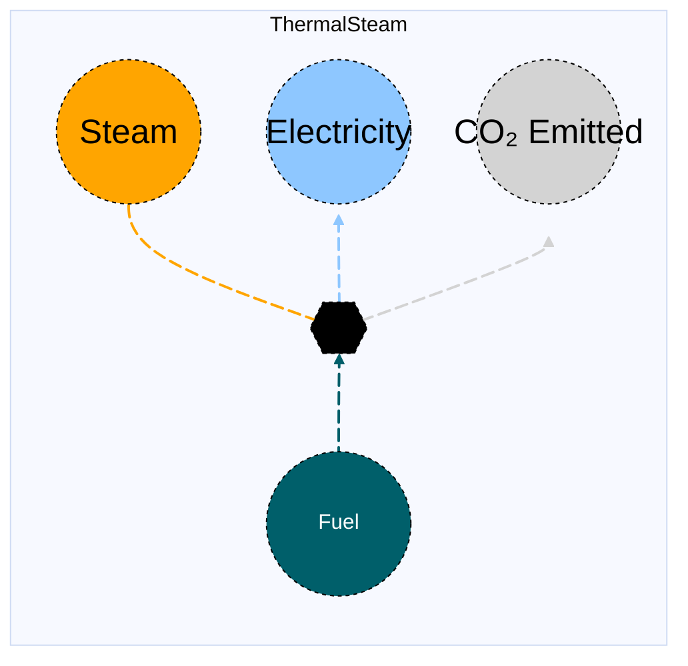

# Thermal Steam

## Contents

[Overview](@ref thermalsteam_overview) | [Asset Structure](@ref thermalsteam_asset_structure) | [Flow Equations](@ref thermalsteam_flow_equations) | [Input File (Standard Format)](@ref thermalsteam_input_file) | [Types - Asset Structure](@ref thermalsteam_type_definition) | [Constructors](@ref thermalsteam_constructors) | [Examples](@ref thermalsteam_examples) | [Best Practices](@ref thermalsteam_best_practices) | [Input File (Advanced Format)](@ref thermalsteam_advanced_json_csv_input_format)

## [Overview](@id thermalsteam_overview)

Thermal Steam assets in MacroEnergy.jl represent **combined steam and power** or **co-generation** systems that convert a primary fuel (such as natural gas) into **steam** and **electricity** simultaneously. These assets are typically used in industrial plants or district energy systems where waste steam recovery is desirable. 

They are defined using JSON or CSV input files placed in the `assets` directory, usually named with descriptive identifiers such as `gas_cogen.json`, `fuel_steam.json`, or `gas_steam.json`.

## [Asset Structure](@id thermalsteam_asset_structure)

A thermal steam asset consists of five main components:

1. **Transformation Component**: Balances the energy conversion process among fuel, steam, electricity, and CO₂ flows  
2. **Fuel Edge**: Represents the primary fuel input to the co-generation unit  
3. **Steam Edge**: Represents the production of process steam (may include unit commitment operations)  
4. **Electricity Edge**: Represents the co-generated electricity output  
5. **CO₂ Edge**: Represents the emissions produced by the combustion process

Below is a schematic representation of the thermal steam asset:



## [Flow Equations](@id thermalsteam_flow_equations)

The thermal steam asset follows the following stoichiometric and co-generation relationships:

```math
\begin{aligned}
\phi_{fuel} &= \phi_{steam} \cdot \epsilon_{fuel\_consumption} \\
\phi_{elec} &= \phi_{fuel} \cdot \epsilon_{elec\_cogen\_rate} \\
\phi_{co2} &= \phi_{fuel} \cdot \epsilon_{emission\_rate} \\
\end{aligned}
```

Where:
- ``\phi`` represents the flow of each commodity
- ``\epsilon`` represents the stoichiometric coefficients defined in the [Conversion Process Parameters](@ref thermalsteam_conversion_process_parameters) section.

## [Input File (Standard Format)](@id thermalsteam_input_file)

!!! note "Techno-Economic Analysis"
    Techno-economic analysis background is recommended for updating or adding conversion process parameters. For users not familiar with TEA, they can refer to [this guide](@ref tea). 

The easiest way to include a thermal steam asset in a model is to create a new file (either JSON or CSV) and place it in the `assets` directory together with the other assets. 

```
your_case/
├── assets/
│   ├── fuel_steam.json    # or fuel_steam.csv
│   ├── other_assets.json
│   └── ...
├── system/
├── settings/
└── ...
```

This file can either be created manually, or using the `template_asset` function, as shown in the [Adding an Asset to a System](@ref) section of the User Guide. The file will be automatically loaded when you run your Macro model. 

The following is an example of a natural gas co-generation (thermal steam) asset input file:
```json
{
    "NaturalGasSteam": [
        {
            "type": "ThermalSteam",
            "instance_data": [
                {
                    "id": "SE_natgas_cogen_steam_1",
                    "location": "SE",
                    "fuel_commodity": "NaturalGas",
                    "co2_sink": "co2_sink",
                    "capacity_size": 80,
                    "fuel_consumption": 1.20,
                    "emission_rate": 0.18,
                    "elec_cogen_rate": 0.15,
                    "investment_cost": 30000,
                    "fixed_om_cost": 2500,
                    "variable_om_cost": 3.5,
                    "uc": false,
                    "ramp_up_fraction": 0.8,
                    "ramp_down_fraction": 0.8
                }
            ]
        }
    ]
}

```

!!! tip "Global Data vs Instance Data"
    When working with JSON input files, the `global_data` field can be used to group data that is common to all instances of the same asset type. This is useful for setting constraints that are common to all instances of the same asset type and avoid repeating the same data for each instance. See the [Examples](@ref "thermalsteam_examples") section below for an example.

The following tables outline the attributes that can be set for a thermal steam (co-generation) asset.

### Essential Attributes
| Field | Type | Description |
|--------------|---------|------------|
| `Type` | String | Asset type identifier: `"ThermalSteam"` |
| `id` | String | Unique identifier for the co-generation unit instance |
| `location` | String | Geographic location or node identifier |
| `fuel_commodity` | String | Primary fuel commodity identifier |
| `uc` | Boolean | Whether unit commitment is enabled (default: false) |
| `timedata` | String | Time resolution for time series data (default: `"Steam"`) |
| `co2_sink` | String | CO₂ sink identifier |
| `fuel_start_vertex` | String | Fuel start vertex identifier. This is **not required** if the fuel commodity is present in the location. |

### [Conversion Process Parameters](@id thermalsteam_conversion_process_parameters)

The following parameters control the conversion process and stoichiometric relationships of the thermal steam asset (see [Flow Equations](@ref thermalsteam_flow_equations) for more details).

| Field | Type | Description | Units | Default |
|--------------|---------|------------|----------------|----------|
| `fuel_consumption` | Float64 | Fuel consumption rate per unit of steam output | $MWh_{fuel}/MWh_{steam}$ | 1.0 |
| `elec_cogen_rate` | Float64 | Electricity co-generation rate per unit of fuel input | $MWh_{elec}/MWh_{fuel}$ | 0.0 |
| `emission_rate` | Float64 | CO₂ emission rate per unit of fuel input | $t_{CO₂}/MWh_{fuel}$ | 0.0 |

### [Constraints Configuration](@id "thermalsteam_constraints")

Thermal Steam assets can have different constraints applied to their transformation and edges. Users can configure these using the following fields:

| Field | Type | Description |
|--------------|---------|------------|
| `transform_constraints` | Dict{String,Bool} | List of constraints applied to the transformation component. |
| `steam_constraints` | Dict{String,Bool} | List of constraints applied to the steam edge. |
| `elec_constraints` | Dict{String,Bool} | List of constraints applied to the electricity edge. |
| `fuel_constraints` | Dict{String,Bool} | List of constraints applied to the fuel edge. |
| `co2_constraints` | Dict{String,Bool} | List of constraints applied to the CO₂ edge. |

For example, if the user wants to apply the [`BalanceConstraint`](@ref balance_constraint_ref) to the transformation component and the [`CapacityConstraint`](@ref capacity_constraint_ref) to the steam edge, the constraints fields should be set as follows:

```json
{
    "transform_constraints": {
        "BalanceConstraint": true
    },
    "steam_constraints": {
        "CapacityConstraint": true
    }
}
```

Users can refer to the [Adding Asset Constraints to a System](@ref) section of the User Guide for a list of all the constraints that can be applied to the different components of a thermal steam asset.

#### Default constraints
To simplify the input file and configuration, the following constraints are applied to the thermal steam (co-generation) asset by default:

- [Balance constraint](@ref balance_constraint_ref) — applied to the transformation component  
- [Capacity constraint](@ref capacity_constraint_ref) — applied to the steam edge  
- [Ramping limits constraint](@ref ramping_limits_constraint_ref) — applied to the steam edge  

**Unit commitment constraints** (when `uc` is set to `true`):
- [Minimum up and down time constraint](@ref min_up_and_down_time_constraint_ref) — applied to the steam edge  

### Investment Parameters
| Field | Type | Description | Units | Default |
|--------------|---------|------------|----------------|----------|
| `can_retire` | Boolean | Whether the steam generation capacity can be retired | - | true |
| `can_expand` | Boolean | Whether the steam generation capacity can be expanded | - | true |
| `existing_capacity` | Float64 | Installed capacity of the steam edge | MW | 0.0 |
| `capacity_size` | Float64 | Unit size for capacity decision variables | - | 1.0 |

#### Additional Investment Parameters

**Maximum and minimum capacity constraints**

If [`MaxCapacityConstraint`](@ref max_capacity_constraint_ref) or [`MinCapacityConstraint`](@ref min_capacity_constraint_ref) are added to the constraints dictionary for the **steam edge**, the following parameters are used by Macro:

| Field | Type | Description | Units | Default |
|--------------|---------|------------|----------------|----------|
| `max_capacity` | Float64 | Maximum allowed steam capacity | MW | Inf |
| `min_capacity` | Float64 | Minimum allowed steam capacity | MW | 0.0 |

### Economic Parameters
| Field | Type | Description | Units | Default |
|--------------|---------|------------|----------------|----------|
| `investment_cost` | Float64 | CAPEX per unit of installed steam capacity | \$/MW | 0.0 |
| `annualized_investment_cost` | Union{Nothing,Float64} | Annualized CAPEX for steam capacity | \$/MW/yr | calculated |
| `fixed_om_cost` | Float64 | Fixed O&M costs for steam generation | \$/MW/yr | 0.0 |
| `variable_om_cost` | Float64 | Variable O&M costs per unit of steam produced | \$/MWh | 0.0 |
| `startup_cost` | Float64 | Cost per MW of capacity to start the co-generation unit | \$/MW per start | 0.0 |
| `wacc` | Float64 | Weighted average cost of capital | fraction | 0.0 |
| `lifetime` | Int | Asset lifetime in years | years | 1 |
| `capital_recovery_period` | Int | Investment recovery period | years | 1 |
| `retirement_period` | Int | Retirement period | years | 0 |

### Operational Parameters
| Field | Type | Description | Units | Default |
|--------------|---------|------------|----------------|----------|
| `availability` | Dict | Availability file path and header | - | Empty |

#### Additional Operational Parameters

**Unit commitment parameters** (when `uc` is set to `true`)

| Field | Type | Description | Units | Default |
|--------------|---------|------------|----------------|----------|
| `startup_fuel_consumption` | Float64 | Fuel consumption per unit steam output to start the co-generation unit | $MWh_{fuel}/MWh_{steam}$ | 0.0 |

**Minimum flow constraint**

If [`MinFlowConstraint`](@ref min_flow_constraint_ref) is added to the constraints dictionary for the **steam edge**, the following parameter is used:

| Field | Type | Description | Units | Default |
|--------------|---------|------------|----------------|----------|
| `min_flow_fraction` | Float64 | Minimum steam flow as a fraction of installed capacity | fraction | 0.0 |

**Ramping limit constraint**

If [`RampingLimitConstraint`](@ref ramping_limits_constraint_ref) is added to the constraints dictionary for the **steam edge**, the following parameters are used:

| Field | Type | Description | Units | Default |
|--------------|---------|------------|----------------|----------|
| `ramp_up_fraction` | Float64 | Maximum increase in steam flow between timesteps | fraction | 1.0 |
| `ramp_down_fraction` | Float64 | Maximum decrease in steam flow between timesteps | fraction | 1.0 |

**Minimum up and down time constraints**

If [`MinUpTimeConstraint`](@ref min_up_and_down_time_constraint_ref) or [`MinDownTimeConstraint`](@ref min_up_and_down_time_constraint_ref) are added to the constraints dictionary for the **steam edge**, the following parameters are used:

| Field | Type | Description | Units | Default |
|--------------|---------|------------|----------------|----------|
| `min_up_time` | Int64 | Minimum time the co-generation unit must remain operational once started | hours | 0 |
| `min_down_time` | Int64 | Minimum time the co-generation unit must remain offline once shut down | hours | 0 |

## [Types - Asset Structure](@id thermalsteam_type_definition)

The `ThermalSteam` asset is defined as follows:

```julia
struct ThermalSteam{T} <: AbstractAsset
    id::AssetId
    steam_transform::Transformation
    steam_edge::Union{Edge{<:Steam},EdgeWithUC{<:Steam}}
    fuel_edge::Edge{<:T}
    elec_edge::Edge{<:Electricity}
    co2_edge::Edge{<:CO2}
end
```

## [Constructors](@id thermalsteam_constructors)

### Default constructor

```julia
ThermalSteam(
    id::AssetId,
    steam_transform::Transformation,
    steam_edge::Union{Edge{<:Steam},EdgeWithUC{<:Steam}},
    fuel_edge::Edge{<:Fuel},
    elec_edge::Edge{<:Electricity},
    co2_edge::Edge{<:CO2}
)
```

### Factory constructor
```julia
make(asset_type::Type{ThermalSteam}, data::AbstractDict{Symbol,Any}, system::System)
```

| Field | Type | Description |
|--------------|---------|------------|
| `asset_type` | `Type{Thermalsteam}` | Macro type of the asset |
| `data` | `AbstractDict{Symbol,Any}` | Dictionary containing the input data for the asset |
| `system` | `System` | System to which the asset belongs |

## [Examples](@id thermalsteam_examples)
This section contains examples of how to use the **thermal steam (co-generation)** asset in a Macro model.

### Natural Gas Steam Boiler with Electricity Co-generation

This example shows a natural-gas-fired boiler that produces both steam and electricity.  
The asset has an existing capacity that is only allowed to be retired.  
A `MinFlowConstraint` constraint is applied to the steam edge with a minimum flow fraction of 0.5.  
The asset co-generates electricity according to the `elec_cogen_rate` parameter and includes unit-commitment operation with startup cost, startup fuel consumption, and ramping limits.

**JSON Format:**

```json
{
    "GasSteamBoiler": [
        {
            "type": "ThermalSteam",
            "instance_data": [
                {
                    "id": "SE_natgas_steam_cogen_1",
                    "location": "SE",
                    "timedata": "Steam",
                    "fuel_commodity": "NaturalGas",
                    "fuel_start_vertex": "natgas_source",
                    "co2_sink": "co2_sink",
                    "uc": true,
                    "can_retire": true,
                    "can_expand": false,
                    "existing_capacity": 800.0,
                    "capacity_size": 100.0,
                    "steam_constraints": {
                        "MinFlowConstraint": true,
                        "MinUpTimeConstraint": true,
                        "MinDownTimeConstraint": true,
                        "RampingLimitConstraint": true
                    },
                    "fuel_consumption": 1.3,
                    "emission_rate": 0.18,
                    "elec_cogen_rate": 0.25,
                    "fixed_om_cost": 7000,
                    "variable_om_cost": 5.5,
                    "startup_cost": 60.0,
                    "startup_fuel_consumption": 0.25,
                    "min_up_time": 6,
                    "min_down_time": 6,
                    "ramp_up_fraction": 0.7,
                    "ramp_down_fraction": 0.7,
                    "min_flow_fraction": 0.5
                }
            ]
        }
    ]
}
```

**CSV Format:**

| Type | id | location | time\_data | fuel\_commodity | fuel\_start\_vertex | co2\_sink | uc | can\_retire | can\_expand | existing\_capacity | capacity\_size | steam\_constraints--MinFlowConstraint | steam\_constraints--MinUpTimeConstraint | steam\_constraints--MinDownTimeConstraint | steam\_constraints--RampingLimitConstraint | fuel\_consumption | emission\_rate | elec\_cogen\_rate | fixed\_om\_cost | variable\_om\_cost | startup\_cost | startup\_fuel\_consumption | min\_up\_time | min\_down\_time | ramp\_up\_fraction | ramp\_down\_fraction | min\_flow\_fraction |
|------|----|-----------|------------|----------------|---------------------|-----------|----|--------------|--------------|--------------------|----------------|--------------------------------------|-----------------------------------------|-------------------------------------------|--------------------------------------------|------------------|----------------|------------------|----------------|------------------|----------------|----------------------------|---------------|----------------|-------------------|--------------------|--------------------|
| ThermalSteam | SE\_natgas\_steam\_cogen\_1 | SE | Steam | NaturalGas | natgas\_source | co2\_sink | true | true | false | 800.0 | 100.0 | true | true | true | true | 1.3 | 0.18 | 0.25 | 7000 | 5.5 | 60.0 | 0.25 | 6 | 6 | 0.7 | 0.7 | 0.5 |


### Multiple Natural Gas Steam Cogeneration Units in Different Zones

This example shows three natural gas–fired cogeneration (steam) units using natural gas as fuel. Each asset produces both steam and electricity (via the `elec_cogen_rate` parameter). All units have existing capacity that is only allowed to be retired. A `MinFlowConstraint` constraint is applied to the steam edge with a minimum flow fraction of 0.444, 0.526, and 0.41. A `MinUpTimeConstraint` and `MinDownTimeConstraint` constraint is applied to the steam edge with a minimum up and down time of 6 hours. A `RampingLimitConstraint` constraint is applied to the steam edge with a ramping limit of 0.64.

**JSON Format:**

```json
{
    "NaturalGasSteam": [
        {
            "type": "ThermalSteam",
            "global_data": {
                "timedata": "Steam",
                "fuel_commodity": "NaturalGas",
                "co2_sink": "co2_sink",
                "uc": true,
                "steam_constraints": {
                    "MinFlowConstraint": true,
                    "MinUpTimeConstraint": true,
                    "MinDownTimeConstraint": true
                }
            },
            "instance_data": [
                {
                    "id": "MIDAT_natgas_steam_cogen_1",
                    "location": "MIDAT",
                    "emission_rate": 0.181048235160161,
                    "fuel_consumption": 1.9,
                    "elec_cogen_rate": 0.25,
                    "can_retire": true,
                    "can_expand": false,
                    "existing_capacity": 4000.0,
                    "investment_cost": 0.0,
                    "fixed_om_cost": 8500,
                    "variable_om_cost": 4.8,
                    "capacity_size": 100.0,
                    "startup_cost": 50.0,
                    "startup_fuel_consumption": 0.2,
                    "min_up_time": 6,
                    "min_down_time": 6,
                    "ramp_up_fraction": 0.64,
                    "ramp_down_fraction": 0.64,
                    "min_flow_fraction": 0.444
                },
                {
                    "id": "NE_natgas_steam_cogen_1",
                    "location": "NE",
                    "emission_rate": 0.181048235160161,
                    "fuel_consumption": 2.0,
                    "elec_cogen_rate": 0.22,
                    "can_retire": true,
                    "can_expand": false,
                    "existing_capacity": 6000.0,
                    "investment_cost": 0.0,
                    "fixed_om_cost": 8700,
                    "variable_om_cost": 4.9,
                    "capacity_size": 120.0,
                    "startup_cost": 50.0,
                    "startup_fuel_consumption": 0.2,
                    "min_up_time": 6,
                    "min_down_time": 6,
                    "ramp_up_fraction": 0.64,
                    "ramp_down_fraction": 0.64,
                    "min_flow_fraction": 0.526
                },
                {
                    "id": "SE_natgas_steam_cogen_1",
                    "location": "SE",
                    "emission_rate": 0.181048235160161,
                    "fuel_consumption": 1.8,
                    "elec_cogen_rate": 0.27,
                    "can_retire": true,
                    "can_expand": false,
                    "existing_capacity": 25000.0,
                    "investment_cost": 0.0,
                    "fixed_om_cost": 7800,
                    "variable_om_cost": 4.1,
                    "capacity_size": 500.0,
                    "startup_cost": 50.0,
                    "startup_fuel_consumption": 0.2,
                    "min_up_time": 6,
                    "min_down_time": 6,
                    "ramp_up_fraction": 0.64,
                    "ramp_down_fraction": 0.64,
                    "min_flow_fraction": 0.41
                }
            ]
        }
    ]
}
```

**CSV Format:**

| Type | id | location | time\_data | fuel\_commodity | co2\_sink | uc | can\_retire | can\_expand | existing\_capacity | capacity\_size | steam\_constraints--MinFlowConstraint | steam\_constraints--MinUpTimeConstraint | steam\_constraints--MinDownTimeConstraint | fuel\_consumption | emission\_rate | elec\_cogen\_rate | fixed\_om\_cost | variable\_om\_cost | startup\_cost | startup\_fuel\_consumption | min\_up\_time | min\_down\_time | ramp\_up\_fraction | ramp\_down\_fraction | min\_flow\_fraction |
|------|----|-----------|------------|----------------|-----------|----|-------------|-------------|--------------------|----------------|---------------------------------------|-------------------------------------------|-------------------------------------------|------------------|---------------|------------------|----------------|------------------|----------------|---------------------------|----------------|----------------|------------------|------------------|-------------------|
| ThermalSteam | MIDAT\_natgas\_steam\_cogen\_1 | MIDAT | Steam | NaturalGas | co2\_sink | true | true | false | 4000.0 | 100.0 | true | true | true | 1.9 | 0.181 | 0.25 | 8500 | 4.8 | 50.0 | 0.2 | 6 | 6 | 0.64 | 0.64 | 0.444 |
| ThermalSteam | NE\_natgas\_steam\_cogen\_1 | NE | Steam | NaturalGas | co2\_sink | true | true | false | 6000.0 | 120.0 | true | true | true | 2.0 | 0.181 | 0.22 | 8700 | 4.9 | 50.0 | 0.2 | 6 | 6 | 0.64 | 0.64 | 0.526 |
| ThermalSteam | SE\_natgas\_steam\_cogen\_1 | SE | Steam | NaturalGas | co2\_sink | true | true | false | 25000.0 | 500.0 | true | true | true | 1.8 | 0.181 | 0.27 | 7800 | 4.1 | 50.0 | 0.2 | 6 | 6 | 0.64 | 0.64 | 0.41 |


## [Best Practices](@id thermalsteam_best_practices)

1. **Use global data for common parameters**: Use the `global_data` field to set the fields and constraints that are common to all instances of the same asset type.
2. **Set realistic efficiency parameters**: Ensure fuel consumption, emission rates, and capture rates are accurate for the technology being modeled
3. **Use meaningful IDs**: Choose descriptive identifiers that indicate location and technology type
4. **Consider unit commitment carefully**: Enable unit commitment only when detailed operational modeling is needed
5. **Use constraints selectively**: Only enable constraints that are necessary for your modeling needs
6. **Validate costs**: Ensure investment and O&M costs are in appropriate units and time periods
7. **Test configurations**: Start with simple configurations and gradually add complexity
8. **Set appropriate ramp rates**: Consider the actual operational characteristics of the technology

## [Input File (Advanced Format)](@id thermalsteam_advanced_json_csv_input_format)

Macro provides an advanced format for defining thermal steam assets, offering users and modelers detailed control over asset specifications. This format builds upon the standard format and is ideal for those who need more comprehensive customization.

To understand the advanced format, consider the [graph representation](@ref thermalsteam_asset_structure) and the [type definition](@ref thermalsteam_type_definition) of a thermal steam asset. The input file mirrors this hierarchical structure.

A thermal steam asset in Macro is composed of a transformation component, represented by a `Transformation` object, and multiple edges (fuel, steam, CO2), each represented by an `Edge` object. The input file for a thermal steam asset is therefore organized as follows:

```json
{
    "transforms": {
        // ... transformation-specific attributes ...
    },
    "edges": {
        "fuel_edge": {
            // ... fuel_edge-specific attributes ...
        },
        "steam_edge": {
            // ... steam_edge-specific attributes ...
        },
        "elec_edge": {
            // ... elec_edge-specific attributes ...
        },
        "co2_edge": {
            // ... co2_edge-specific attributes ...
        }
    }
}
```

Each top-level key (e.g., "transforms" or "edges") denotes a component type. The second-level keys either specify the attributes of the component (when there is a single instance) or identify the instances of the component when there are multiple instances.

Below is an example of an input file for a thermal steam asset that sets up multiple thermal steam plants across different regions:

```json
{
    "NaturalGasSteam": [
        {
            "type": "ThermalSteam",
            "global_data": {
                "transforms": {
                    "timedata": "Steam",
                    "constraints": {
                        "BalanceConstraint": true
                    }
                },
                "edges": {
                    "steam_edge": {
                        "commodity": "Steam",
                        "unidirectional": true,
                        "has_capacity": true,
                        "uc": true,
                        "integer_decisions": false,
                        "constraints": {
                            "CapacityConstraint": true,
                            "RampingLimitConstraint": true,
                            "MinFlowConstraint": true,
                            "MinUpTimeConstraint": true,
                            "MinDownTimeConstraint": true
                        }
                    },
                    "fuel_edge": {
                        "commodity": "NaturalGas",
                        "unidirectional": true,
                        "has_capacity": false
                    },
                    "elec_edge": {
                        "commodity": "Electricity",
                        "unidirectional": true,
                        "has_capacity": false
                    },
                    "co2_edge": {
                        "commodity": "CO2",
                        "unidirectional": true,
                        "has_capacity": false,
                        "end_vertex": "co2_sink"
                    }
                }
            },
            "instance_data": [
                {
                    "id": "MIDAT_natgas_steam_cogen_1",
                    "transforms": {
                        "emission_rate": 0.181048235160161,
                        "fuel_consumption": 1.9,
                        "elec_cogen_rate": 0.25
                    },
                    "edges": {
                        "steam_edge": {
                            "end_vertex": "steam_MIDAT",
                            "can_retire": true,
                            "can_expand": false,
                            "existing_capacity": 4000.0,
                            "investment_cost": 0.0,
                            "fixed_om_cost": 8500,
                            "variable_om_cost": 4.8,
                            "capacity_size": 100.0,
                            "startup_cost": 50.0,
                            "startup_fuel_consumption": 0.2,
                            "min_up_time": 6,
                            "min_down_time": 6,
                            "ramp_up_fraction": 0.64,
                            "ramp_down_fraction": 0.64,
                            "min_flow_fraction": 0.444
                        },
                        "fuel_edge": {
                            "start_vertex": "natgas_MIDAT"
                        },
                        "elec_edge": {
                            "end_vertex": "elec_MIDAT"
                        }
                    }
                },
                {
                    "id": "NE_natgas_steam_cogen_1",
                    "transforms": {
                        "emission_rate": 0.181048235160161,
                        "fuel_consumption": 2.0,
                        "elec_cogen_rate": 0.22
                    },
                    "edges": {
                        "steam_edge": {
                            "end_vertex": "steam_NE",
                            "can_retire": true,
                            "can_expand": false,
                            "existing_capacity": 6000.0,
                            "investment_cost": 0.0,
                            "fixed_om_cost": 8700,
                            "variable_om_cost": 4.9,
                            "capacity_size": 120.0,
                            "startup_cost": 50.0,
                            "startup_fuel_consumption": 0.2,
                            "min_up_time": 6,
                            "min_down_time": 6,
                            "ramp_up_fraction": 0.64,
                            "ramp_down_fraction": 0.64,
                            "min_flow_fraction": 0.526
                        },
                        "fuel_edge": {
                            "start_vertex": "natgas_NE"
                        },
                        "elec_edge": {
                            "end_vertex": "elec_NE"
                        }
                    }
                },
                {
                    "id": "SE_natgas_steam_cogen_1",
                    "transforms": {
                        "emission_rate": 0.181048235160161,
                        "fuel_consumption": 1.8,
                        "elec_cogen_rate": 0.27
                    },
                    "edges": {
                        "steam_edge": {
                            "end_vertex": "steam_SE",
                            "can_retire": true,
                            "can_expand": false,
                            "existing_capacity": 25000.0,
                            "investment_cost": 0.0,
                            "fixed_om_cost": 7800,
                            "variable_om_cost": 4.1,
                            "capacity_size": 500.0,
                            "startup_cost": 50.0,
                            "startup_fuel_consumption": 0.2,
                            "min_up_time": 6,
                            "min_down_time": 6,
                            "ramp_up_fraction": 0.64,
                            "ramp_down_fraction": 0.64,
                            "min_flow_fraction": 0.41
                        },
                        "fuel_edge": {
                            "start_vertex": "natgas_SE"
                        },
                        "elec_edge": {
                            "end_vertex": "elec_SE"
                        }
                    }
                }
            ]
        }
    ]
}
```

### Key Points

- The `global_data` field is utilized to define attributes and constraints that apply universally to all instances of a particular asset type.
- The `start_vertex` and `end_vertex` fields indicate the nodes to which the edges are connected. These nodes must be defined in the `nodes.json` file.
- By default, only the steam edge is allowed to expand as a modeling decision (*see note below*)
- The steam edge can have unit commitment operations enabled by setting the `uc` attribute to `true`.
- For a comprehensive list of attributes that can be configured for the transformation and edge components, refer to the [transformation](@ref manual-transformation-fields) and [edges](@ref manual-edges-fields) pages of the Macro manual. 

!!! note "The `has_capacity` Edge Attribute"
    The `has_capacity` attribute is a flag that indicates whether a specific edge of an asset has a capacity variable, allowing it to be expanded or retired. Typically, users do not need to manually adjust this flag, as the asset creators in Macro have already configured it correctly for each edge. However, advanced users can use this flag to override the default settings for each edge if needed.

!!! tip "Prefixes"
    Users can apply prefixes to adjust parameters for the components of a thermal steam asset, even when using the standard format. For instance, `co2_can_retire` will adjust the `can_retire` parameter for the CO2 edge, and `co2_existing_capacity` will adjust the `existing_capacity` parameter for the CO2 edge.
    Below are the prefixes available for modifying parameters for the components of a thermal steam asset:
    - `transform_` for the transformation component
    - `steam_` for the steam edge
    - `elec_` for the elec edge
    - `co2_` for the CO2 edge
    - `fuel_` for the fuel edge